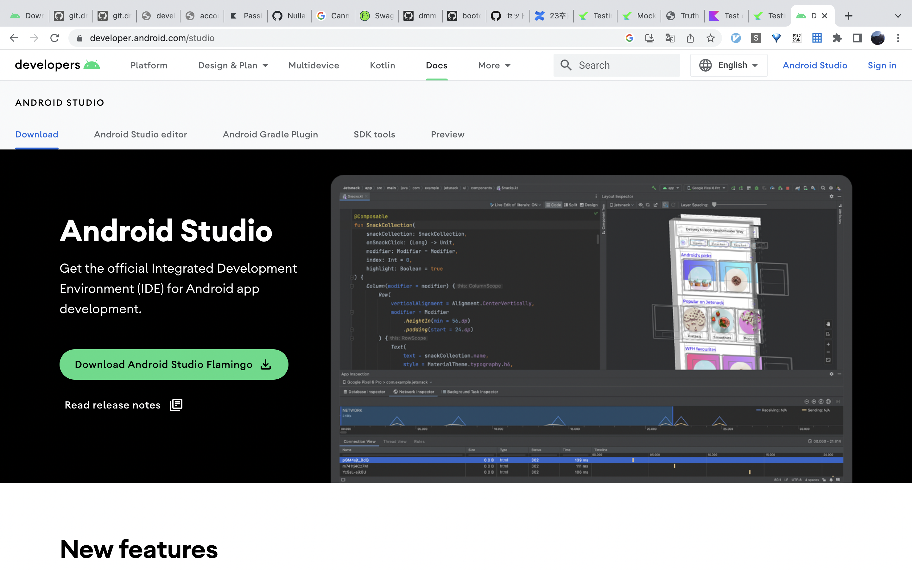
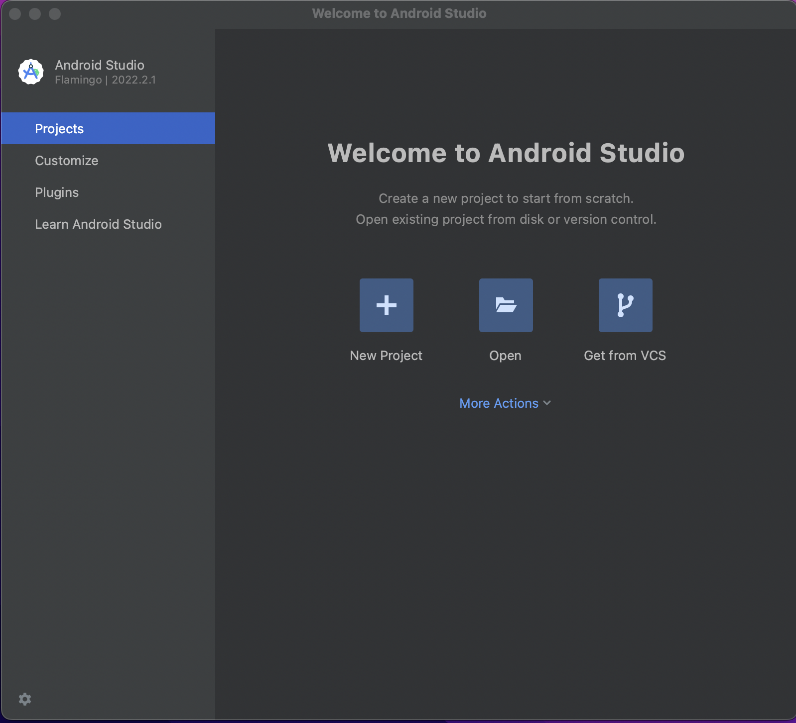
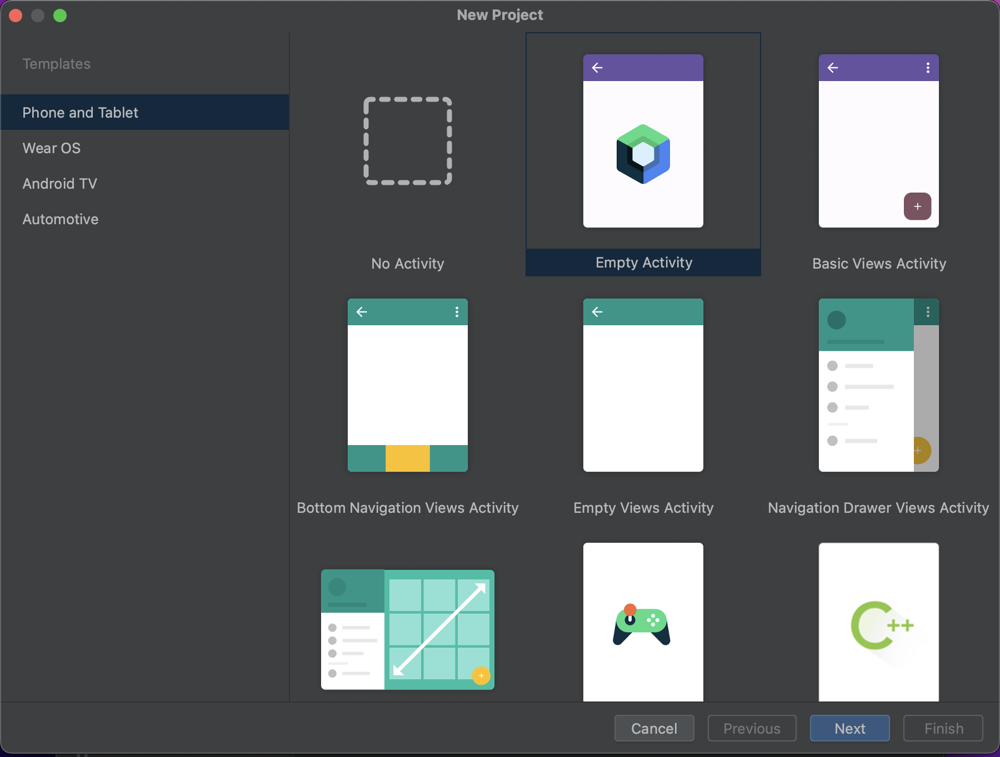
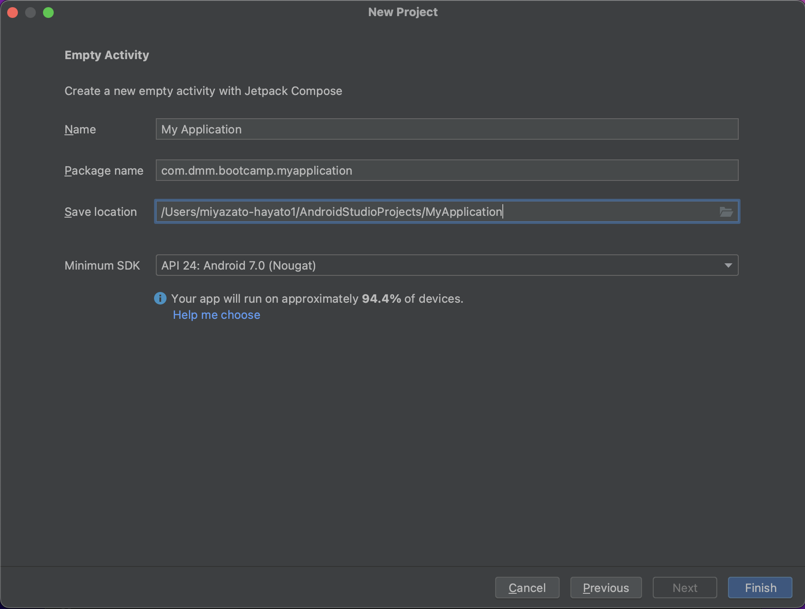
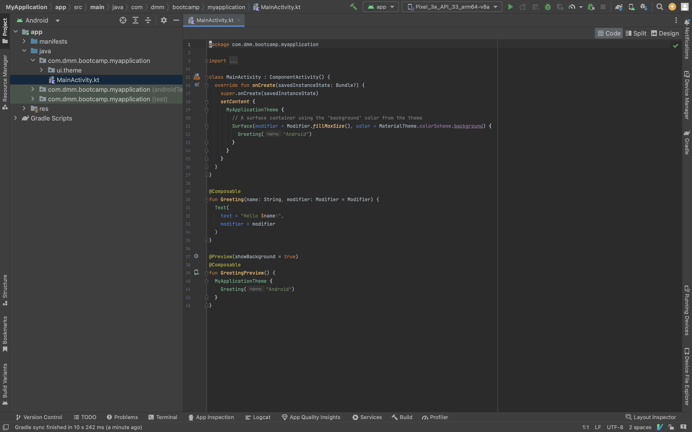
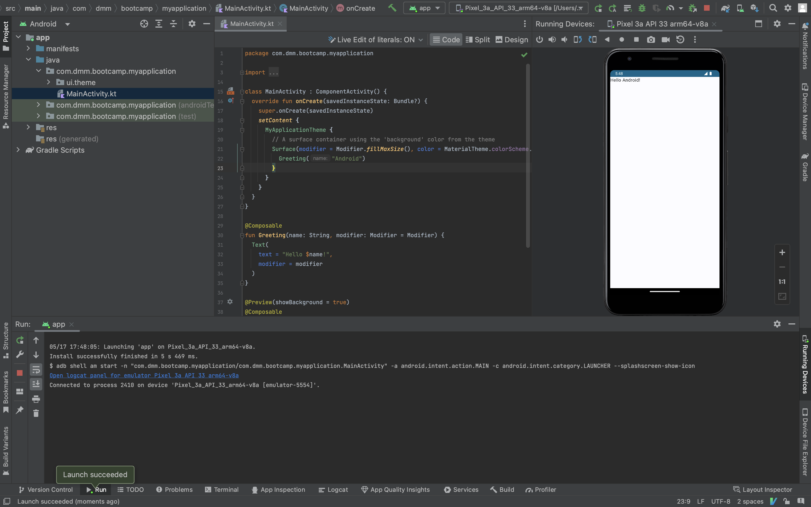
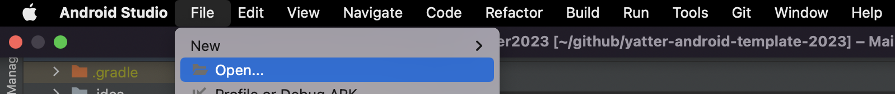
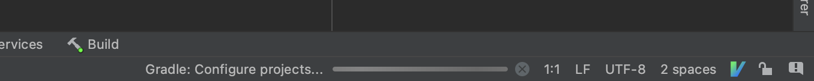

# 環境セットアップ
本章では、Yatterアプリを開発するために必要なセットアップを行います。

## Android Studioのインストール
Androidアプリを実装するにはAndroid StudioというIDEを用います。  
Android StudioはIntellij IDEAをベースにしたIDEで、ショートカットや操作感も同様なためJetbrains製IDEの利用経験がある方は利用しやすいかもしれません。  

Android Studioは次のページからダウンロードが可能です。  
https://developer.android.com/studio



「Download Android Studio Flamingo」と記載されているボタンを押し、利用規約を確認します。  
利用しているMacがIntelプロセッサであれば、「Mac with Intel chip」、Appleシリコンであれば「Mac with Apple chip」からインストーラをダウンロードします。  

ダウンロード後は.dmgファイルを開きAndroid Studioをインストールします。  
インストール後にAndroid Studioを起動すると次のような画面が表示されるはずです。  



起動後は以下手順で新規プロジェクトを作成しAndroid Studioのインストールに問題がないか確認します。  

1. `New Project`ボタン押下
2. `Empty Activity`を選択し、`Next`ボタン押下
3. `Name`・`Package name`・`Save Location`・`Minimum SDK`はデフォルトのままで`Finish`ボタン押下
4. Android Studioが起動し初期コードが生成されていることを確認
5. アプリをビルド・実行しエミュレータで`Hello Android!`と表示されることの確認
※ エミュレータの作成方法は 3_エミュレータ作成 のページを参考









ここまで確認できればAndroid Studioのインストールは問題ありません。  

インストールが確認できたところで、手順の解説を行います。   


手順の2で`Empty Activity`を選択しましたが、ここではAndroidアプリのプロジェクトテンプレートを選択しています。  
このプロジェクトテンプレートを選択することによって、プロジェクト生成段階で必要なコードや設定を用意することができます。  
今回選択した`Empty Activity`ではJetpack Composeを利用したAndroidスマートフォン向けアプリを開発するために必要なコードや設定が含まれたプロジェクトテンプレートになります。  
基本的なAndroidアプリを開発したいときはこの`Empty Activity`を選択すると良いでしょう。  

その他にも、基本的なレイアウトが最初からある程度実装されているプロジェクトテンプレートやWear OS・Android TV・AutomativeといったAndroidスマートフォン向け以外のプロジェクトテンプレートも選択することができます。  

続いて、手順の3でAndroidアプリの設定ができます。  


- `Name`：プロジェクト名の設定。デフォルトのアプリ名にもなります。
- `Package name`：javaパッケージと同じものでディレクトリ構造を表したりクラス同士のアクセスを制御したりします。デバイスやストア上でアプリを識別するためのIDであるapplicationIdにもなるため、一意になるようにしましょう。
- `Save Location`：プロジェクトファイルの保存場所。デフォルトでは`/Users/${ユーザー名}/AndroidStudioProjects/`配下です。
- `Minimum SDK`：このアプリがサポートする最も低いOSバージョン。 Minimum SDKバージョンを上げるとより最新の機能が利用できるが利用できるユーザーが絞られます。

今回はAndroid Studioのインストールが目的だったため、デフォルトの設定を利用していますが、実際にAndroidアプリを開発するときはそのプロジェクトにあった設定になるようにしましょう。  

## Yatterプロジェクトのセットアップ
Android Studioのインストールが完了したら、Yatterプロジェクトのセットアップをします。  

Yatterアプリを開発するためにプロジェクトのテンプレートを用意しています。  
「Use this template」を押して自分のリポジトリを作成して開発を進めましょう。  
https://github.com/mitohato14/Yatter2023-Internship/

もちろん、0からプロジェクトを作成しても問題ありませんがテンプレプロジェクトにはいくつか開発をスムーズに進めるためのクラスや設定が追加されており、以降の説明でもそれらがある前提で話を進めますのでお気をつけてください。

---

リポジトリを作成したら任意のディレクトリ内にリポジトリをクローンします。  
この資料では`~/github`というディレクトリで行いますがどこでも構いません。  

```
cd ~/github
git clone ${リポジトリURL}
```

リポジトリのクローンした後に、プロジェクトディレクトリを開くと初回セットアップが始まり、IDE右下のインディケータが表示されなくなるまで待つと開発可能になります。  




