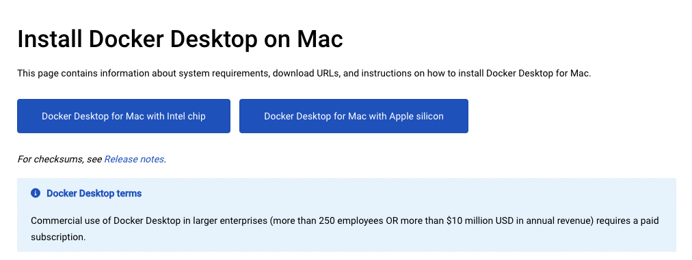

# 環境構築

今回は、バックエンドをDockerという技術を使って動かし、Androidアプリと通信させます。

そのために、Macに環境構築をしましょう。

## インストーラーのダウンロード

Dockerのインストールページにアクセスします。

https://docs.docker.com/desktop/install/mac-install/

`Docker Desktop for Mac with Intel chip` と `Docker Desktop for Mac with Apple silicon` から自分の環境にあっているほうをクリックしインストールしましょう。DMMインターンではM1 Macbookが支給されていると思うので、Apple siliconのほうを選択してください。

## MacにDockerをインストール

ダウンロードした `Docker.dmg` をダブルクリックします。

次のような画面になるので、 `Docker.app` を `Applications` にドラッグ&ドロップしてください。

## Dockerを起動

Finderからアプリケーションフォルダを開き、 `Docker.app` をダブルクリックします。

起動したらDocker Desktopアプリケーションの初期設定が始まります。初期設定が表示されなかった人はそのままでも大丈夫です。

### Docker初期セットアップ

`Docker Subscription Service Agreement`と表示された画面が表示されたら規約を確認して「Accept」で同意します。

続いて表示される設定画面では推奨設定でDockerを利用するために、`Use recommended settings`が選択されていることを確認して、「Finish」で設定を完了します。

Docker Desktopにログインすることを要求されますが、今回は不要なため「Continue without signing in」を選択します。

`Tell us about the work you do`と表示された画面が表示され、Dockerを利用するアンケートに答えることができます。「Skip」でも問題ありませんが興味あれば回答してみてください。

最後に次のような画面が表示されたらDocker Desktopの初期設定が完了です。

MacのトップステータスバーにもDockerのアイコンが表示されていればDockerのセットアップは完了です。

