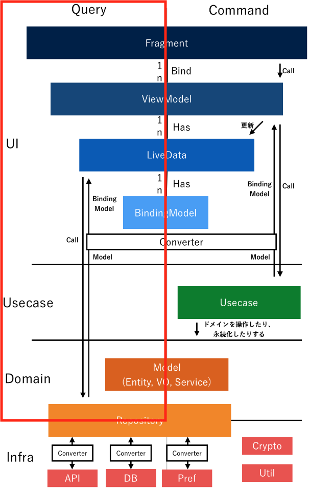

# はじめに
本Codelabでは次のような流れでYatterアプリの実装を行い、Androidアプリ開発の基礎を学習します。  

1. セットアップ
2. パブリックタイムライン画面
3. ログイン画面
4. ツイート画面
5. 以降は自由実装

4まではちょっとした課題もありますが基本的には写経してStep By StepでAndroidアプリ開発学習を進めることができます。  
以降はそれぞれで自由に開発を進めてもらって問題ありません。  

Yatterアプリ開発では、DMM内の推奨アーキテクチャに沿って開発を進めます。  

まず実装に入る前に推奨アーキテクチャドキュメント(tutorial>アーキテクチャについて>arthitecture)を一読しましょう。  
LiveDataやViewModelなどわからないワードが出てくると思いますが、この段階では、**いくつかの層に分けて実装していくこと、Query/Commandで設計が異なること**が理解できれば問題ないです。  

一番はじめに、パブリックタイムライン画面を実装する理由としては、読み取り系のAPIを呼び出すだけで実装ができるためです。つまり設計方針の左側部分だけで実装ができます。  

一度に全ての実装を行うと粒度が大きすぎるため、次のような粒度で進めていきます。  

- ドメイン層実装
  - アプリ全体で利用するクラスの実装
- インフラ層実装
  - APIを実行する
  - Repositoryを実装する
- UI層実装
  - ViewModelを実装する
  - 画面実装する
- DI実装

初めて触るであろう技術については必要な解説をしたり参考資料を載せたりしているため、それぞれのタイミングで習得してください。  

続いては、ログイン画面の実装を行います。こちらはパブリックタイムライン画面とは異なり、設計方針の右側部分だけで実装ができます。  

こちらも一度に全ての実装を行うと粒度が大きいため、次のような粒度で進めていきます。  

- インフラ層実装
  - APIを実行する
  - Preferencesを実装する
- UseCase層実装
  - ビジネスロジックをコードに落とし込む
- UI層実装
  - ViewModelを実装する
  - 画面を実装する
- DI実装

そして最後に設計方針全体を利用したツイート画面の実装を行います。  
ツイート画面は以下の粒度で進めます。  

- インフラ層実装
  - APIを実行する
  - Preferencesを実装する
- UseCase層実装
  - ビジネスロジックをコードに落とし込む
- UI層実装
  - ViewModelを実装する
  - 画面を実装する
- DI実装

パブリックタイムライン・ログイン・ツイートの実装が完了すれば、あとは好きな順番で機能を実装していきましょう。  
