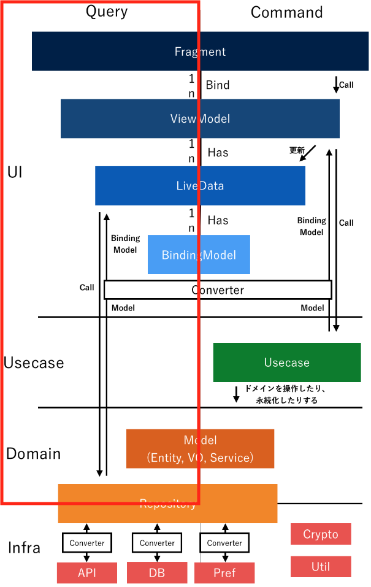
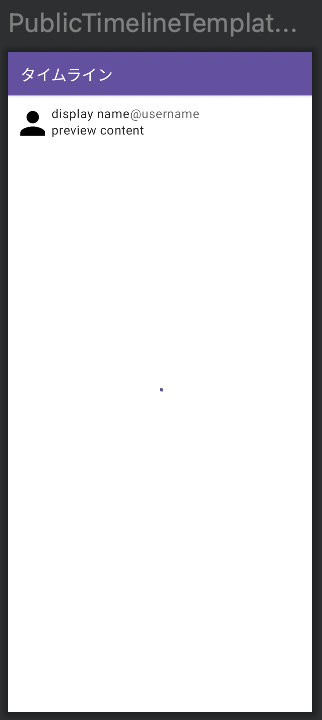
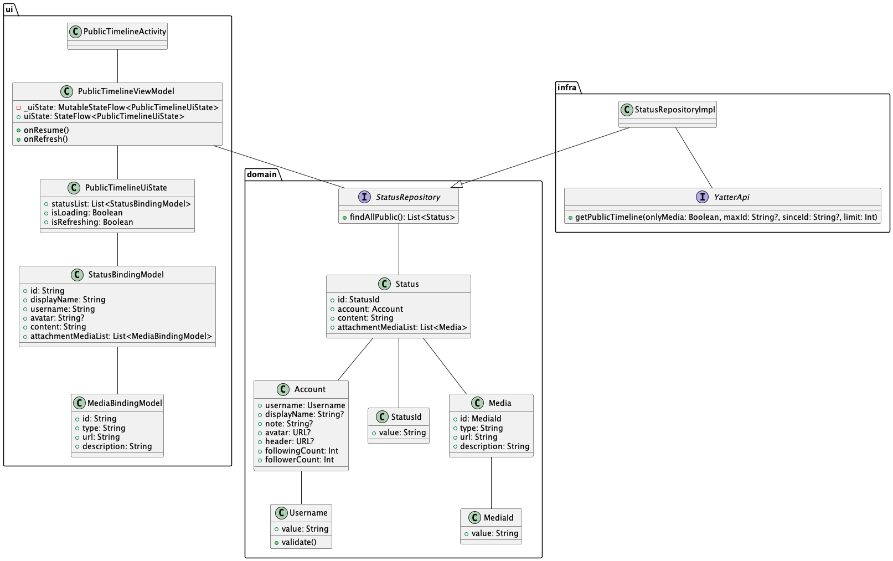

# パブリックタイムライン画面の実装
パブリックタイムライン画面では全ユーザーのツイートが流れるタイムライン画面です。  
デザインの指定はありませんが、Twitterのような見た目を目指して実装を進めます。  

パブリックタイムライン画面を開発するにあたって、設計方針にならい次のようなクラス図設計で実装します。  
パブリックタイムライン画面はAPIから読み取ったものを表示するだけになるため、設計方針のQuery部分だけで実装ができます。  

## 完成イメージ

## 全体像

パブリックタイムライン画面には次の要素があります。

- [Query](../image/1/architecture_query.png)
  - 全ユーザーのツイート表示

次のコースから早速実装に入ります。  

※今回の研修では、「ui」と書かれた部分を実装していきます。
その他の部分は`/appendix`に解説があるので、時間がある方は読んでみてください。
