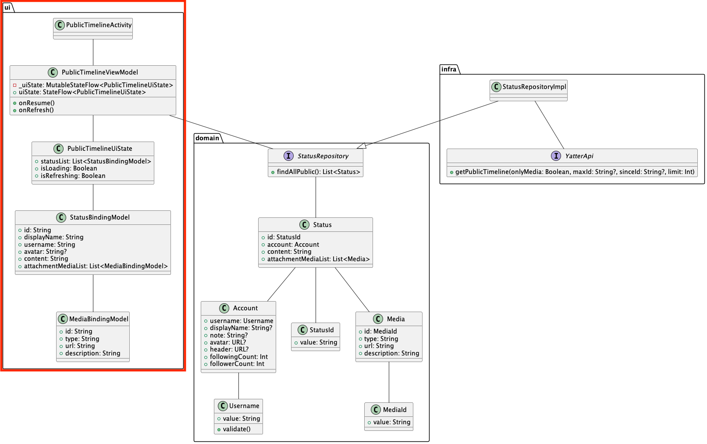
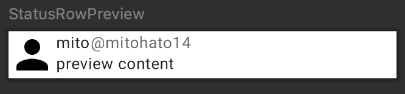

# パブリックタイムラインのUI層実装
パブリックタイムラインのUI層実装を行います。  

## UI層の説明
UI層は実際にユーザーが接する部分を実装します。  

クラス図では次に該当します。  


パブリックタイムライン画面のUI層のファイルは`ui/timeline`パッケージ内に作成するようにしましょう。  

## UI実装
### BindingModelの作成
まずは、BindingModelを定義します。  
BindingModelは、画面を表示する上で必要な情報をまとめた`data class`で実装されることがほとんどです。  
`Status`などのドメインモデルクラスをそのままUI実装に利用することもできますが、アプリの画面では複数のドメインモデルを組み合わせたりドメインモデルの値を加工して利用したりすることが多いため、表示する値を保持するだけのBindingModelを用意します。  
今回のパブリックタイムライン画面開発ではドメインモデルを特に加工することなく表示に利用できますが、プロジェクト全体で設計方針を統一するためにもBindingModelを実装します。  

`StatusJson`ではJsonを表現したデータモデル、`Status`というドメインモデル、`StatusBindingModel`というuiに表示するためのデータモデルというように、責務によって使用するモデルを変換するようにしています。  

タイムライン1行分の見た目に必要な値を`MediaBindingModel`と`StatusBindingModel`に定義していきます。  
BindingModelは`ui/timeline/bindingmodel`パッケージにファイルを作成していきましょう。  

```Kotlin
package com.dmm.bootcamp.yatter2023.ui.timeline.bindingmodel

data class MediaBindingModel(
  val id: String,
  val type: String,
  val url: String,
  val description: String
)
```

```Kotlin
package com.dmm.bootcamp.yatter2023.ui.timeline.bindingmodel

data class StatusBindingModel(
  val id: String,
  val displayName: String,
  val username: String,
  val avatar: String?,
  val content: String,
  val attachmentMediaList: List<MediaBindingModel>
)
```

`Media`から`MediaBindingModel`に変換するための`MediaConverter`と、`Status`から`StatusBindingModel`に変換するための`StatusConverter`も実装しましょう。  
`ui/bindingmodel/converter`パッケージにファイルを作成していきます。  

```Kotlin
package com.dmm.bootcamp.yatter2023.ui.timeline.bindingmodel.converter

import com.dmm.bootcamp.yatter2023.domain.model.Media
import com.dmm.bootcamp.yatter2023.ui.timeline.bindingmodel.MediaBindingModel

object MediaConverter {
    fun convertToDomainModel(mediaList: List<Media>): List<MediaBindingModel> =
        mediaList.map { convertToDomainModel(it) }

    fun convertToDomainModel(media: Media): MediaBindingModel =
        MediaBindingModel(
            id = media.id.value,
            type = media.type,
            url = media.url,
            description = media.description
        )
}
```

```Kotlin
package com.dmm.bootcamp.yatter2023.ui.timeline.bindingmodel.converter

import com.dmm.bootcamp.yatter2023.domain.Status
import com.dmm.bootcamp.yatter2023.ui.timeline.bindingmodel.StatusBindingModel

object StatusConverter {
  fun convertToBindingModel(statusList: List<Status>): List<StatusBindingModel> =
    statusList.map { convertToBindingModel(it) }

  fun convertToBindingModel(status: Status): StatusBindingModel =
    StatusBindingModel(
      id = status.id.value,
      displayName = status.account.displayName ?: "",
      username = status.account.username.value,
      avatar = status.account.avatar.toString(),
      content = status.content
    )
}
```

BindingModelを定義したら続いてはUiStateを定義します。  

BindingModelは表示する値を保持する役割を持っており、UiStateはUI全体の状態を管理します。  
UiStateで保持する値は、
- 画面に表示されるデータ（BindingModel)  
- 画面のローディング状態を表すフラグ  
- エラー状態  

などその画面で起こりうるUIの状態全般です。  

そのため、パブリックタイムライン画面では次のようなUiStateが定義できます。  
- 画面に表示されるデータ  
- ローディングフラグ  
- リフレッシュフラグ  

`PublicTimelineUiState`は`ui/timeline`パッケージ内に作成しましょう。
```Kotlin
data class PublicTimelineUiState(
  val statusList: List<StatusBindingModel>,
  val isLoading: Boolean,
  val isRefreshing: Boolean,
)
```

また詳しくは後述しますがUiStateは初期値が必要なため、emptyメソッドを用意しておきます。  
`companion object`で定義することで`PublicTimelineUiState`クラスをインスタンスかしなくともメソッドを呼び出すことができるようになっています。  

```Kotlin
data class PublicTimelineUiState(
  ...
) {
  companion object {
    fun empty(): PublicTimelineUiState = PublicTimelineUiState(
      statusList = emptyList(),
      isLoading = false,
      isRefreshing = false,
    )
  }
}
```

ここまででUIに表示するデータを表現するクラスの準備ができました。  

### ViewModelの実装
続いては、ViewModelで表示するための実装を行います。  

まずは、ViewModelクラスを`com.dmm.bootcamp.yatter2023.ui.timeline`に定義します。  

```Kotlin
package com.dmm.bootcamp.yatter2023.ui.timeline

class PublicTimelineViewModel : ViewModel() {
  // TODO
}
```

ViewModelからUiStateを公開してUI実装時にアクセスできるようにします。  
UiStateは`StateFlow`を利用して公開します。  
`StateFlow`はKotlin Coroutine Flowの一つです。`StateFlow`を利用しUI実装側で購読(収集)することにより最新の値を参照することができます。  
`Flow`に関しては次の資料もご一読ください。  
- https://developer.android.com/kotlin/flow?hl=ja
- https://developer.android.com/kotlin/flow/stateflow-and-sharedflow?hl=ja

ここでは、`StateFlow`と`MutableStateFlow`を利用します。  
`StateFlow`単体では初期化以降にデータの更新ができないため、更新が可能な`MutableStateFlow`と併せて利用します。  
`MutableStateFlow`単体でも良さそうですが、`MutableStateFlow`を外部に公開してしまうと外部からもこの値を更新することが可能になってしまうため、外部に公開するものは更新ができない`StateFlow`、内部でロジックや状態に合わせて更新するために`MutableStateFlow`を使うという使い分け方をしています。  

次のようなコードにより、ViewModel内で更新するための`MutableStateFlow`を外部向けには`StateFlow`として見せることができます。  

```Kotlin
  private val _uiState: MutableStateFlow<PublicTimelineUiState> =
    MutableStateFlow(PublicTimelineUiState.empty())
  val uiState: StateFlow<PublicTimelineUiState> = _uiState
```

このような定義の仕方を`backing properties`といいます。  
ViewModel内で処理を行い更新する値があり、その値を外部にも公開したいときによく用いられます。  

https://kotlinlang.org/docs/properties.html#backing-properties

---

UI構築に利用する値の準備が済み、実装に入っていきます。  
まずはStatusの一覧を取得するために`StatusRepository`を依存関係に追加します。  

```Kotlin
class PublicTimelineViewModel(
  private val statusRepository: StatusRepository,
) : ViewModel() { ... }
```

続いてViewModel内に`StatusRepository`からStatusの一覧を取得するためのメソッドを実装します。  
非同期でViewModel内のメソッドからのみ呼び出せるように`private suspend`で実装します。  

メソッド内では以下の手順を実装します。  

1. `StatusRepository`からStatus一覧を取得
2. `PublicTimeline`内の`statusList`を更新

```Kotlin
class PublicTimelineViewModel(...) {
  private suspend fun fetchPublicTimeline() {
    val statusList = statusRepository.findAllPublic() // 1
    _uiState.update {
      it.copy(
        statusList = StatusConverter.convertToBindingModel(statusList), // 2
      )
    }
  }
}
```

`_uiState.update {}`のように`MutableStateFlow#update`することにより、現状の`MutableStateFlow`の値を利用しつつ更新することができます。  
また、`it.copy`のように`data class`の`copy`メソッドを利用することによりdata classの値の一部のみを更新することができます。  

前述したように実装することにより`fetchPublicTimeline`メソッドを呼び出すことにより`uiState`を最新状態に更新することができるようになりました。  

続いては実際にViewModel外から呼び出すためのメソッドを実装します。  
ViewModelから公開するメソッド名は、UI側のイベントに合わせた名前にします。  
UI側のイベントに合わせた名前というのは、`on`から始まるような名前で、ボタンが押された時の`onClick~`やライフサイクルイベントに合わせた`onResume`など、スワイプされた時の`onSwipe~`などなどです。
処理を行いたいUI側のイベントと一対一で対応するようなメソッドを用意します。  

ViewModelのメソッド名を処理の内容に合わせたものではなくイベントに合わせた命名にしているのには次の理由があります。  

- ユーザーのアクションに応じてどういった処理を行うべきかをUI側で考えないようにしたい
- イベントに応じた処理をViewModelのテストで動作担保したい
- UI側での処理呼び忘れを防ぐ

今回の画面では画面を表示するたびに最新のリストを取得しておきたいため、`onResume`メソッドを用意します。  
`onResume`メソッド内では以下の処理を行います。  

1. ViewModelのライフサイクルに合わせたスコープのcoroutine起動
2. UiStateをローディング状態にする
3. `fetchPublicTimeline()`メソッドを呼び出しStatus一覧を更新
4. UiStateのローディング状態を解除する

```Kotlin
class PublicTimelineViewModel(...) {
  fun onResume() {
    viewModelScope.launch { // 1
      _uiState.update { it.copy(isLoading = true) } // 2
      fetchPublicTimeline() // 3
      _uiState.update { it.copy(isLoading = false) } // 4
    }
  }
}
```

`viewModelScode.launch`に関して補足をします。  
本来、coroutineを起動すると意図的に止めないと動き続けることになります。  
動き続けた場合にアプリが閉じられた後にcoroutine内の処理が発火してエラーになってしまったりリソースを浪費したりと不都合が多くあります。  
そのためViewModelが生成・破棄されるタイミングでcoroutineを生成・キャンセルする必要があります。  
それぞれのViewModelで実装もできますが毎回管理するのは大変なため、呼び出したViewModelが生存しているタイミングのみ動作するcoroutineを起動することができる`viewModelScope`が用意されています。  

ViewModelで非同期処理を呼び出す時は、`viewModelScope.launch`を行いViewModel用のcoroutineを扱うようにしましょう。  

詳細は次のドキュメントをご覧ください。  
https://developer.android.com/topic/libraries/architecture/coroutines?hl=ja#viewmodelscope

画面を表示するたびに取得するメソッドは実装できましたので続いては、画面を下の方にスワイプして画面を更新するPullToRefresh時のメソッドを用意します。  
画面リフレッシュしたい時に呼び出されるメソッドになる想定のため名前は`onRefresh`とします。  
基本的な流れは`onResume`時と同様です。  

1. ViewModelのライフサイクルに合わせたスコープのcoroutine起動
2. UiStateをリフレッシュ状態にする
3. `fetchPublicTimeline()`メソッドを呼び出しStatus一覧を更新
4. UiStateのリフレッシュ状態を解除する

```Kotlin
class PublicTimelineViewModel(...) {
  fun onRefresh() {
    viewModelScope.launch { // 1
      _uiState.update { it.copy(isRefreshing = true) } // 2
      fetchPublicTimeline() // 3
      _uiState.update { it.copy(isRefreshing = false) } // 4
    }
  }
}
```

これでViewModelに必要な処理を実装できました。  

### UI実装に必要なクラス・ファイルを追加
ViewModelの準備ができたところでUI実装を本格的に始めていきます。  

まずは以下のファイルを作成しましょう。
- ui/timeline/PublicTimelineActivity
  - パブリックタイムラインのActivityを実装
- ui/timeline/PublicTimelinePage
  - パブリックタイムラインのPageを実装
- ui/timeline/PublicTimelineTemplate
  - パブリックタイムラインのTemplateを実装
- ui/timeline/StatusRow

PageとTemplateに関しては後述します。  

### PublicTimelineActivityの実装
パブリックタイムライン画面のベースとなる`PublicTimelineActivity`の実装を行います。  
`ui/timeline`にファイルを作成して、次の内容を写経しましょう。  

```Kotlin
package com.dmm.bootcamp.yatter2023.ui.timeline

import ...

class PublicTimelineActivity : AppCompatActivity() {
  companion object {
    fun newIntent(context: Context): Intent = Intent(
      context,
      PublicTimelineActivity::class.java,
    )
  }

  override fun onCreate(savedInstanceState: Bundle?) {
    super.onCreate(savedInstanceState)
  }

  override fun onResume() {
    super.onResume()
  }
}
```

Activityを実装する際には`newIntent`のようなActivityクラスをインスタンス化するメソッドを用意することが多いです。  
理由としては、Activityの画面遷移をする際に値を渡す方法に起因します。  

まず、Activityの画面遷移をするときに次のコードが必要です。  

```Kotlin
val intent = Intent(context, ${遷移したいActivityのクラス情報})
startActivity(intent)
```

画面遷移時にデータを渡したいときは次のようなコードを追加します。  

```Kotlin
val intent = Intent(context, ${遷移したいActivityのクラス情報})
val data = // 渡したいデータ
intent.putExtra("data", data)
startActivity(intent)
```

そして渡されたデータは次のようなコードで受け取ります。  

```Kotlin
val data = intent?.getStringExtra("data")
```

このようにデータを渡したい側で`putExtra`を呼び出し渡したい値をセットし、受け取り側で`get~Extra`で取得します。  
この方法では2つの問題点があります。  

1. どの値を渡す必要があるか遷移先の実装を確認する必要があり、渡し忘れが発生しやすい
2. 文字列をキーとしてやり取りするため、渡す側と受け取り側でキーを間違える可能性がある

この問題を解決するために、`newIntent`メソッドを用意します。  
1の問題に対しては、`newIntent`の引数に欲しいデータを追加することでActivityに遷移するために必要な値強制することができるため、渡し間違えや忘れることがありません。  
2の問題に対しては、値を渡すことと受け取ることを1つのクラスで完結することができるため、キー用の定数を用意して間違えることを防ぐことができます。  

`newIntent`メソッドを用意した場合の画面遷移は次のような実装になります。  
```Kotlin
startActivity(${遷移したいActivityのクラス}.newIntent(this))
```
---

`PublitTimelineActivity`内で先ほど実装したViewModelをインスタンス化します。  
インスタンス化するときはimportする内容に気をつけてください。  

```Kotlin
import org.koin.androidx.viewmodel.ext.android.viewModel

class PublicTimelineActivity : AppCompatActivity() {
  companion object {...}
  ...
  private val viewModel: PublicTimelineViewModel by viewModel()
  ...
}
```

次の章で紹介するDIの設定がされていないため、このままでは動作しませんが現状はこのままで問題ありません。  

まずは、`onResume`内で`ViewModel#onResume`を呼び出します。  

```Kotlin
  override fun onResume() {
    super.onResume()
    viewModel.onResume()
  }
```

呼び出すことにより、`onResume`が呼び出されるとき（画面を表示するたび）に`ViewModel#onResume`を呼び出しデータを更新することができます。  

### UI実装
Jetpack Composeを利用したUI実装を行います。  

Jetpack Composeではコンポーザブルと呼ばれるコンポーザブル可能な関数を組み合わせることによりUIを構築します。  
コンポーザブルは次のような`@Composable`アノテーションのついた関数になります。  
本来、Kotlinの関数名は小文字始まりが一般的ですがコンポーザブルの命名は大文字始まりにします。  

```Kotlin
@Composale
fun FirsstComposable() {
}
```

`StatusRow`ファイルを開き、パブリックタイムライン画面で表示するStatus一覧の1行分のUIを実装します。  
次のような見た目になることを目指します。  



まずは、`StatusRow`コンポーザブルを定義します。  
`ui/timeline`パッケージ内にファイルを作成します。  
1つのStatusを表示するコンポーザブルになるため、必要な値が含まれている`StatusBindingModel`を引数にとります。  

また、コンポーザブルを定義する時にはModifierも引数で受け取るようにしましょう。  
Modifierに関しては以下ドキュメントをご覧ください。  
https://developer.android.com/jetpack/compose/modifiers?hl=ja

```Kotlin
@Composable
fun StatusRow(
  statusBindingModel: StatusBindingModel,
  modifier: Modifier = Modifier,
) {
}
```

コンポーザブル関数の関数名と引数を決めたらPreviewの用意をすることをお勧めします。  
Previewを用意しない場合、アプリ全体をビルドしエミュレータや実機上で動かさないとどのように表示されるかという確認ができません。  
Previewを用意すると多少の変更はビルドなくとも変更を確認でき、ビルドが必要になっても該当箇所のビルドのみで反映することができるため、素早く確認しながらの実装ができます。  

Previewの利用は、`@Preview`アノテーションを使って次のようなコードを書きます。  
`@Preview`アノテーションをつけたコンポーザブル内でプレビューを表示したいコンポーザブルを呼び出すことでプレビューが表示できます。  
IDE右上に`Code`/`Split`/`Design`並んでいる箇所で`Split`を選択するとコードを書きながらプレビューを確認できるためおすすめです。  
`StatusRow`引数の`StatusBindingModel`はプレビュー用のため、適当な値で問題ありません。  

`Yatter2023Theme`や`Surface`に関しては後述しますのでひとまずそのまま写経してください。  

```Kotlin
@Preview
@Composable
private fun StatusRowPreview() {
  Yatter2023Theme {
    Surface {
      StatusRow(
        statusBindingModel = StatusBindingModel(
          id = "id",
          displayName = "mito",
          username = "mitohato14",
          avatar = "https://avatars.githubusercontent.com/u/19385268?v=4",
          content = "preview content",
          attachmentMediaList = listOf(
            MediaBindingModel(
              id = "id",
              type = "image",
              url = "https://avatars.githubusercontent.com/u/39693306?v=4",
              description = "icon"
            )
          )
        )
      )
    }
  }
}
```

`Preview`のコンポーザブルを用意することでプレビューを確認しながら開発ができるようになりました。  
プレビュー機能には静止画のプレビュー表示の他にアニメーションのプレビュー・実際のデバイスのように操作できるInteractive Mode・プレビューの内容をデバイス上で確認できるRun Previewがあります。  
画面右側にあるプレビュー画面にカーソルを合わせると次のようなアイコンが表示されるとおもいます。  
この3つのアイコンを選択することでアニメーションをプレビューしたりプレビューを操作してみたりデバイスで動作確認したりすることができます。  


`StatusRow`コンポーザブルの実装を進めていきます。  

まずは`Row`コンポーザブルを使ってコンポーザブルを並べます。  
`Row`コンポーザブルは`{}`内のコンポーザブルを横一列に並べることができます。  
引数で受け取ったModifierはルートにあたるコンポーザブルに渡すことが一般的なためRowに渡しています。  
また、引数で受け取っているModifierに対して、`fillMaxWidth()`と`padding(vertical = 4.dp)`を指定しています。  
この2つを指定することで、このRowは横幅を取れるだけとり、縦方向(vertical)に4dpのpaddingを当てるというデザイン反映ができます。  

```Kotlin
@Composable
fun StatusRow(...) {
  Row(
    modifier = modifier
      .fillMaxWidth()
      .padding(vertical = 4.dp)
  ) {
  }
}
```

まずはアイコン画像を設置します。  
画像を表示するためのコンポーザブルとして、`Image`が用意されていますが今回表示するアイコン画像はURLをもとに画像を取得して表示する必要があるため、`Image`コンポーザブルそのままでは利用できません。  
画像データのキャッシュ等を楽に管理するため、今回は[`Coil`](https://coil-kt.github.io/coil/compose/)というライブラリが提供している、`AsyncImage`を利用します。  
`AsyncImage`にURLを渡すことで自動的に画像データを読み込み表示することができます。  

Rowコンポーザブルは左から右に向けて並べるため、アイコン画像はそのまま配置して問題ありません。  

```Kotlin
@Composable
fun StatusRow(...) {
  Row(
    modifier = modifier
      .fillMaxWidth()
      .padding(vertical = 4.dp)
  ) {
    AsyncImage(
      modifier = Modifier.size(48.dp),
      model = statusBindingModel.avatar,
      contentDescription = "アバター画像",
      contentScale = ContentScale.Crop,
    )
  }
}
```

- `modifier`でアイコン画像のサイズ
- `model`に画像URLなどの画像
- `contentDescription`に画像の説明テキスト
- `contentScale`で`AsyncImage`コンポーザブルのサイズにCrop

という指定をしています。  

画像の配置ができたら表示名とユーザー名、Statusの内容を縦方向に並べるために`Column`を利用します。  

```Kotlin
@Composable
fun StatusRow(...) {
  Row(...) {
    AsyncImage(...)

    Column {
    }
  }
}
```

表示名とユーザー名を横に並べるために`Row`を再度用いて、文字を表示するためのコンポーザブルである`Text`コンポーザブルを呼び出します。  

```Kotlin
@Composable
fun StatusRow(...) {
  Row(...) {
    AsyncImage(...)

    Column {
      Row {
        Text(text = statusBindingModel.displayName)
        Text(text = "@${statusBindingModel.username}")  
      }
    }
  }
}
```

実装例でもあるようにユーザー名は表示名に比べて少し薄くしてみましょう。  
いくつか実現する方法はありますが、今回は[`ConpositionLocalProvider`](https://developer.android.com/jetpack/compose/compositionlocal?hl=ja)を利用します。  

`CompositionLocalProvider`を利用することによってアプリ全体のテーマを変更したときに文字のalpha値もすぐに反映されるようになります。  

```Kotlin
@Composable
fun StatusRow(...) {
  Row(...) {
    AsyncImage(...)

    Column {
      Row {
        Text(text = statusBindingModel.displayName)
        CompositionLocalProvider(LocalContentAlpha provides ContentAlpha.medium) {
          Text(
            text = "@${statusBindingModel.username}"
          )
        }  
      }
    }
  }
}
```

最後にStatusのコンテンツを表示するための`Text`コンポーザブルと`AsyncImage`コンポーザブルを表示します。  
`attachmentMediaList`を`forEach`することで、何もアタッチされていなければ何も表示されず、1件以上あれば件数分表示されるようになります。  

```Kotlin
@Composable
fun StatusRow(...) {
  Row(...) {
    AsyncImage(...)

    Column {
      Row {...}
      Text(text = statusBindingModel.content)

      Row(modifier = Modifier.fillMaxWidth()) {
        statusBindingModel.attachmentMediaList.map {
          AsyncImage(
            modifier = Modifier.size(96.dp),
            model = it.url,
            contentDescription = it.description
          )
        }
      }
    }
  }
}
```

ここまで実装できたらプレビュー上で表示が問題なさそうか確認します。  
プレビュー機能の都合上、アイコン画像などのURLから画像を取得する部分は動作しませんので、その画像用のスペースが確保されて、テキストがきちんと表示されていることが確認できれば問題ありません。  
プレビューが表示される箇所にビルドが必要とあった場合は、ビルドを行なってください。  

---

Statusの1行分のUIが構築できたところでリストの実装を`Template`にて行います。  

DMMでのJetpack Composeの実装をする上で`Page`と`Template`という概念を用います。  
この2つはAtomic Designを参考にしています。  

ざっくりとした説明にはなりますが  
`Page`では、ViewModelからJetpack Composeで構築したUIで利用する値を取得し渡す役割があります。基本的には`Template`のみを呼び出します。  
`Template`は複数のコンポーザブルを呼び出し画面全体のレイアウトをします。`Page`から渡された値を各コンポーザブルに渡す役割もあります。  
詳細は実装しながら掴んでいってください。  

先にTemplateを実装します。  
`PublicTimelineTemplate`ファイルを開きコンポーザブルを定義します。  
このタイミングで必要になりそうな引数も定義しておきます。  
`statusList`や`isLoading`、`isRefreshing`はUiStateにも定義されている値です。  
`onRefresh`はPullToRefreshによって画面を更新する時のトリガーとして用いられるものでラムダを受け取るようにします。  

```Kotlin
@Composable
fun PublicTimelineTemplate(
  statusList: List<StatusBindingModel>,
  isLoading: Boolean,
  isRefreshing: Boolean,
  onRefresh: () -> Unit,
) {
}
```

定義ができたらこちらでもプレビューの用意をしてから実装に入ります。  

```Kotlin
@Preview
@Composable
private fun PublicTimelineTemplatePreview() {
  Yatter2023Theme {
    Surface {
      PublicTimelineTemplate(
        statusList = listOf(
          StatusBindingModel(
            id = "id",
            displayName = "display name",
            username = "username",
            avatar = null,
            content = "preview content",
            attachmentMediaList = listOf()
          )
        ),
        isLoading = false,
        isRefreshing = false,
        onRefresh = {},
      )
    }
  }
}
```

Jetpack Composeでスクロールが必要なリスト表示をするときは`LazyColumn`・`LazyRow`・`LazyLayout`といった`Lazy~`から始まるコンポーザブルを利用することが一般的です。特に今回のような縦方向のリストは`LazyColumn`を利用します。  
https://developer.android.com/jetpack/compose/lists?hl=ja

`LazyColumn`を利用してリスト表示をするときは次のようなコードになります。  

```Kotlin
val list = listOf(...)
LazyColumn {
  items(list) { item ->
    RowComposable(item)
  }
}
```

`LazyColumn`のラムダ内で利用できる`items`というメソッドにリストと1行分のコンポーザブルを渡します。  
そうすることにより、`list`に含まれている要素分のコンポーザブルが表示できます。  

前述の内容を踏まえて、Status一覧を表示してみてください。  

実装してみると以下のような実装になります。  

```Kotlin
@Composable
fun PublicTimelineTemplate(...) {
  LazyColumn {
    items(statusList) { item ->
      StatusRow(statusBindingModel = item)
    }
  }
}
```

パブリックタイムライン画面ではStatusの一覧が画面全体に表示されるような見た目になりますので、`fillMaxSize()`を指定して画面全体に広がるようにします。  
画面全体に広がったままでは視認性が悪いため、`contentPadding`を指定し`LazyColumn`内の要素にpaddingがつくようにしてみます。  

```Kotlin
LazyColumn(
  modifier = Modifier.fillMaxSize(),
  contentPadding = PaddingValues(8.dp),
) {...}
```

ここまで実装するとプレビューにリストが表示されるようになったと思います。  
現状はプレビューに渡しているリストは1件のためプレビューにも1件しか表示されていませんのでプレビューに渡しているリストの要素数を増やして要素分リスト項目が表示されていることを確認してみてください。  


`LazyColumn`を利用してリスト表示を行いましたが、ただリストを表示するだけであれば、`StatusRow`実装時にメディア一覧を表示したときのように`forEach`で並べてスクロールさせることもできます。  

```Kotlin
Column(
  modifier = Modifier
    .verticalScroll(rememberScrollState())
) {
  statusList.forEach { item ->
    StatusRow(statusBindingModel = item)
  }
}
```

ただ、この方法の場合はパフォーマンス面で大きな懸念があります。  `Lazy~`を利用しないリスト表示では、リスト全体の描画が一度に全て行われ、その全てがシステム側で保持されます。そのため、リストの要素数が1万件あった場合に1万件全ての描画・保有コストがかかるため動作が著しく重たくなります。  
それに対して`Lazy~`なコンポーザブルを利用した場合には、画面に表示される分のみを描画・保持されます。その状態でスクロールすると新しく表示される要素が描画され、画面外になった要素は破棄されるため保持する内容が必要最小限に抑えられるためパフォーマンス面の問題が解決されます。スクロールするたびに発生する新規描画・破棄のパフォーマンス面のコストは気にならないほどなので問題ありません。  

これらのことからリスト表示するときは、次のような使い分けをすると良いです。  
- `LazyColumn`や`LazyRow`
  - 表示する要素数が可変長
  - 要素数が多い
  - スクロールが必要
- `Column`や`Row`
  - 表示する要素数が固定
  - 要素数が少ない
  - スクロールが必要ない

詳細は次のドキュメントも併せてご覧ください。  
https://developer.android.com/jetpack/compose/lists?hl=ja

---

リスト表示ができたところで、PullToRefreshでのリスト更新を実装します。  

まずは、PullToRefreshする際に表示されるローディングインディケータが表示できるように`Box`コンポーザブルで`LazyColumn`をラップします。  
また、この`Box`コンポーザブルが画面全体を覆えるように`fillMaxSize()`の指定、`Box`コンポーザブル内の要素が画面中央に配置されるように`contentAlignment`の指定をします。  

```Kotlin
fun PublicTimelineTemplate(...) {
  Box(
    modifier = Modifier
      .fillMaxSize(),
    contentAlignment = Alignment.Center,
  ) {
    LazyColumn(...)  
  }
}
```

PullToRefreshには`PullRefreshIndicator`コンポーザブルを利用します。  
このコンポーザブルを利用するためには`PullRefreshState`という状態オブジェクトが必要です。  
まずはこの状態オブジェクトを`isRefreshing`と`onRefresh`を渡して定義します。  
こうすることにより、PullToRefreshが実行されたときに、`onRefresh`の処理を発火することができます。  

```Kotlin
fun PublicTimelineTemplate(...) {
  val pullRefreshState = rememberPullRefreshState(isRefreshing, onRefresh)
  Box(...) {
    LazyColumn(...)
  }
}
```

また、今回利用する`PullRefreshIndicator`はまだStableでは無いため、そのままではAndroid Studio上でエラー表示になっていると思います。  
実験的に追加されているAPIを利用するためにも、`@OptIn(ExperimentalMaterialApi::class)`を` PublicTimelineTemplate`の上部に追加して利用できるようにしましょう。  

```Kotlin
@OptIn(ExperimentalMaterialApi::class)
@Composable
fun PublicTimelineTemplate(...)
```

状態オブジェクトが定義できたら、`PullRefreshIndicator`を配置します。  
次のように先ほど定義した状態オブジェクトと`isRefreshing`、そしてPullToRefreshしたときのローディングインディケータを画面上部の真ん中に表示するために、`align(Alignment.TopCenter)`指定をします。
こうすることにより、`isRefreshing`が`true`の間にローディングインディケータが表示され、`false`になると非表示になります。  

```Kotlin
Box(...) {
  LazyColumn(...)
  PullRefreshIndicator(
    isRefreshing,
    pullRefreshState,
    Modifier.align(Alignment.TopCenter)
  )
}
```

PullToRefresh実装の仕上げです。  

ユーザーが画面上部から下部に向けてスワイプして`PullToRefresh`することを検知するために、`Box`コンポーザブルに`pullRefresh(pullRefreshState)`を追加します。  

```Kotlin
Box(
  modifier = Modifier
    .fillMaxSize()
    .pullRefresh(pullRefreshState),
  contentAlignment = Alignment.Center,
) {...}
```

これにより`PullToRefresh`の実装が完了しました。  

プレビュー画面で実装できているか確認しましょう。  
プレビューのInterctive Modeを起動してパブリックタイムライン画面をクリックしてそのまま下に移動すると画面上部からローディングインディケータが降りてくるとおもいます。  
これで`PullToRefresh`の動作確認まで完了しました。  

---

PullToRefreshでのローディング表示が実装できたため、初回読み込みなど画面全体のローディングの実装を行います。  

画面全体のローディングには`CircularProgressIndicator()`が利用できます。  
`CircularProgressIndicator`をBoxコンポーザブル内に配置しローディング表示しましょう。  

```Kotlin
Box(...) {
  LazyColumn(...)
  PullRefreshIndicator(...)

  CircularProgressIndicator()
}
```

ここのままだと常にローディングインディケータが表示されるため、`isLoading`が`true`な時のみ表示するようにif文で分岐させましょう。  

```Kotlin
Box(...) {
  LazyColumn(...)
  PullRefreshIndicator(...)

  if (isLoading) {
    CircularProgressIndicator()
  }
}
```

プレビューコンポーザブルに設定している`isLoading`の値を`true`と`false`を切り替えてみて画面中央にローディングインディケータが表示されることを確認してみてください。  

プレビュー機能の`Run Preview`で実際にデバイス上で動かした方がローディングインディケータが動いているところが確認しやすいです。  

ここまでで、リスト表示が完了しました。  

ですが、このままではリストだけの殺風景な画面になってしまっていますので、`Scaffold`コンポーザブルを呼び出します。  
`Scaffold`コンポーザブルとは、`TopAppBar`、`BottomAppBar`、`FloatingActionButton`、`Drawer`などの最も一般的なマテリアルデザインのレイアウトを提供します。  
`Scaffold`コンポーザブルの適した引数に適したコンポーザブルを渡すことでを渡すことで現在のAndroidアプリにおいて一般的なデザインであるマテリアルデザインに則ったレイアウトをすることが可能です。  

Yatterアプリにおいても、画面上部の`TopAppbar`、画面右下の`FloatingActionButton`を実装する予定のため`Scaffold`を用います。  
これまで実装していたコンポーザブルのルードである`Box`コンポーザブルを`Scaffold`でラップします。  

ラップした際に`Box`コンポーザブル周辺に赤い波線が引かれていると思います。  
`Scaffold`を使うときには、`Scaffold`から渡される`PaddingValues`を利用する必要があります。  
この`PaddingValues`は`Scaffold`に設定される要素に応じて適切な値が渡されるため、`Scaffold`を利用する際はきちんと利用するようにしましょう。  

```Kotlin
@Composable
fun PublicTimelineTemplate(...) {
  Scaffold() {
    Box(
      modifier = Modifier
        .fillMaxSize()
        .padding(it)
        .pullRefresh(pullRefreshState),
    ) {...}
  }
}
```
まずは`TopAppbar`を配置して、「タイムライン」という文字列を表示するようにします。  
`Scaffold`の`topBar`引数にラムダでコンポーザブルを配置します。  

```Kotlin
@Composable
fun PublicTimelineTemplate(...) {
  Scaffold(
    topBar = {
      TopAppBar(
        title = {
          Text(text = "タイムライン")
        },
      )
    }
  ) {...}
}
```

プレビューを確認すると画面上部に「タイムライン」と書かれたバーが表示されるようになったと思います。  

ここまで実装できたら、Activityと`PublicTimelineTemplate`を繋ぎ込みます。  

`PublicTimelineTemplate`でStatus一覧の実装はできましたが、このコンポーザブルはまだどこからも呼び出されていないため、アプリを実行しても表示されることはありません。  
そのため、`Template`コンポーザブルを呼び出す必要があります。  

---

まずは、`Template`コンポーザブルと`Page`コンポーザブルを繋ぎこみます。  

`PublicTimelinePage`ファイルを開いて、`PublicTimelinePage`コンポーザブルを定義します。  

```Kotlin
@Composable
fun PublicTimelinePage() {
}
```

`Page`コンポーザブルは特にUIを実装しないため、今回はプレビューを省略します。  

前述もしましたが、`page`コンポーザブルの役目はViewModelから状態を取り出し、`Template`コンポーザブルに渡すことですので、`PublicTimelinePage`引数にViewModelを取ります。  

```Kotlin
@Composable
fun PublicTimelinePage(viewModel: PublicTimelineViewModel) {
}
```

ViewModelを引数で受け取ったら、ViewModelから状態を抜き出します。  
今回の設計では画面に表示するための状態をUiStateととしてまとめていますのでまずは次のコードでUiStateを抜き出します。  

```Kotlin
val uiState by viewModel.uiState.collectAsStateWithLifecycle()
```

このコードを記載することで`ViewModel#uiState`の変更を監視することができ、更新をUIに反映することができます。  

UiStateの監視準備ができたところで`Page`コンポーザブルから`Template`コンポーザブルを呼び出し、渡せる値は引数に渡します。  

```Kotlin
import androidx.lifecycle.compose.collectAsStateWithLifecycle

@Composable
fun PublicTimelinePage(viewModel: PublicTimelineViewModel) {
  val uiState by viewModel.uiState.collectAsStateWithLifecycle()
  
  PublicTimelineTemplate(
      statusList = uiState.statusList,
      isLoading = uiState.isLoading,
      isRefreshing = uiState.isRefreshing,
      onRefresh = ,
    )
}
```

`onRefresh`はViewModelのメソッドになるため、`UiState`からは取得できません。  
メソッドを引数として渡すときは関数オブジェクトとして渡す必要があります。  

関数オブジェクトとして渡すには`::`をメソッド名の前に利用します。  
今回は特に`ViewModel`内のメソッドのため、`viewModel::onRefresh`と記載します。  

```Kotlin
import androidx.lifecycle.compose.collectAsStateWithLifecycle

@Composable
fun PublicTimelinePage(viewModel: PublicTimelineViewModel) {
  val uiState by viewModel.uiState.collectAsStateWithLifecycle()
  
  PublicTimelineTemplate(
      statusList = uiState.statusList,
      isLoading = uiState.isLoading,
      isRefreshing = uiState.isRefreshing,
      onRefresh = viewModel::onRefresh,
    )
}
```

これでPageコンポーザブルとTemplateコンポーザブルの繋ぎこみが完了しました。  

---

最後にActivityとPageコンポーザブルとの繋ぎこみを行います。  

`PublicTimelineActivity`ファイルを開き、`onCreate`メソッドを探します。  

`onCreate`メソッドは画面が生成されるときに呼び出されるライフサイクルメソッドで、UIの実装や呼び出しもこのタイミングで行います。  

ActivityからJetpack Composeで構築したUIを呼び出すには`setContent {}`を利用します。  
次のようなコードを記載して呼び出すようにしましょう。  

```Kotlin
override fun onCreate(savedInstanceState: Bundle?) {
  super.onCreate(savedInstanceState)

  setContent {
    Yatter2023Theme {
      Surface {
        PublicTimelinePage(viewModel = viewModel)
      }
    }
  }
}
```

`Yatter2023Theme`と`Surface`が再度出てきました。  

この2つのメソッドはアプリ全体で利用する色や文字スタイル、UIコンポーネントの形状といったものを管理してアプリ全体を一つのテーマで統一するために用いられるものです。  

この2つを利用しないと、1つのアプリなのに画面によって使われている色や見た目が違っていたり、統一するためにボイラーコードを多く書く必要が出てきます。  
それらを完結にするために利用されます。  

`Yatter2023Theme`でアプリ全体のテーマ（色や文字スタイル、UIコンポーネントの形状を含みます）を管理するコンポーザブルで、デフォルトの場合`${プロジェクト名}Theme`といった命名でプロジェクト作成時に自動生成されています。  
`Theme.kt`というファイルでテーマが定義されていますので、アプリ全体の色を変えたい時などに変更してみてください。  

`Surface`コンポーザブルでは、ダークテーマ対応をはじめとする背景色に対して適切なコンテンツカラーを利用できるようにサポートするコンポーザブルです。  
例えば白背景の上には黒文字といったコントラスト比を意識した画面は`Surface`を利用しなくとも実装できます。ですが、デバイスのダークテーマに合わせて背景色を黒をベースにした色に変わったときに文字色が黒文字のままで見えにくい・見えない画面になってしまいます。  
そこで`Surface`コンポーザブルを利用することで黒背景に対しては白文字など、背景色が変更されてもコントラスト比を保ったまま表示ができるようにしています。  

---

Activityの実装が完了したらプロジェクト内の`AndroidManifest.xml`というファイルを開きます。  
マニフェストファイルでは、アプリに関する重要な情報をAndroidビルドツール・Android OS・Google Playに対して説明するものです。  

マニフェストファイルには以下の要素が記載されています。  
- アプリが利用するパーミッション
- アプリに存在するActivity
- アプリ起動時にどのActivityを一番最初に呼び出すか
- アプリのアイコン
- アプリ名
- アプリ全体のテーマ

今回、PublicTimelineActivityを新規に作成したため、マニフェストファイルに追記します。  

```XML
<?xml version="1.0" encoding="utf-8"?>
<manifest ...>
    <application ...>
        <activity
            android:name=".MainActivity"
            ...>
        </activity>

<!--    追加    -->
        <activity
            android:name=".ui.timeline.PublicTimelineActivity"
            android:exported="false" />

    </application>
</manifest>
```

こうすることにより`PublicTimelineActivity`という名前のActivityが存在することを定義します。  
もしこの定義がない状態で`PublicTimelineActivity`を起動しようとすると実行時エラーでクラッシュします。  

`PublicTimelineActivity`の定義ができたら実際に`PublicTimelineActivity`をアプリ起動時に表示できるように`MainActivity`にコードを追記します。  

画面遷移するためのコードは前述したように、`startActivity(${遷移したいActivityのクラス}.newIntent(this))`を呼び出します。  
また、今回は一度パブリックタイムライン画面に遷移した後に`MainActivity`に戻ることはないので、`finish()`メソッドを呼び出してActivityを終了させておきます。  

```Kotlin
class MainActivity : AppCompatActivity() {
  ...
  override fun onCreate(savedInstanceState: Bundle?) {
    super.onCreate(savedInstanceState)
    setContent {...}
    
    // 追加
    startActivity(PublicTimelineActivity.newIntent(this))
    finish()
  }
}

```

ここまでの実装でパブリックタイムラインのUI実装全体が完了しました。  
現状のままではアプリを起動してもアプリがクラッシュして見ることができないと思います。  
DIの設定がまだできていないことが原因ですので次のDI層実装に進みましょう。  

## Appendix
今回、UI構築を行う際にタイトルや`contentDescription`を文字列で直書きしています。  
ただ、実務のAndroidアプリ開発では文字列リソースとして`strings.xml`というファイルで一元管理することが多いです。  

文字列リソースとして扱う利点として次の内容があります。  

- 同じ文字列を表示している箇所の変更時に修正が一箇所で済む
- 複数言語対応時に端末の設定に応じて自動で言語選択される

文字列リソースは`res/values/strings.xml`で扱います。  
次のように定義・利用します。  

```XML
<string name="string_resource_id">表示する文字列</string>
```

```Kotlin
// Jetpack Compose
stringResource(id = R.string.string_resource_id)

// Android View
context.getString(R.string.string_resource_id)
```

今回は資料の見やすさのため直書きしていますが、文字列リソースを利用して実装もしてみましょう。  

詳しい内容は公式ドキュメントをご一読ください。  
https://developer.android.com/guide/topics/resources/string-resource?hl=ja
