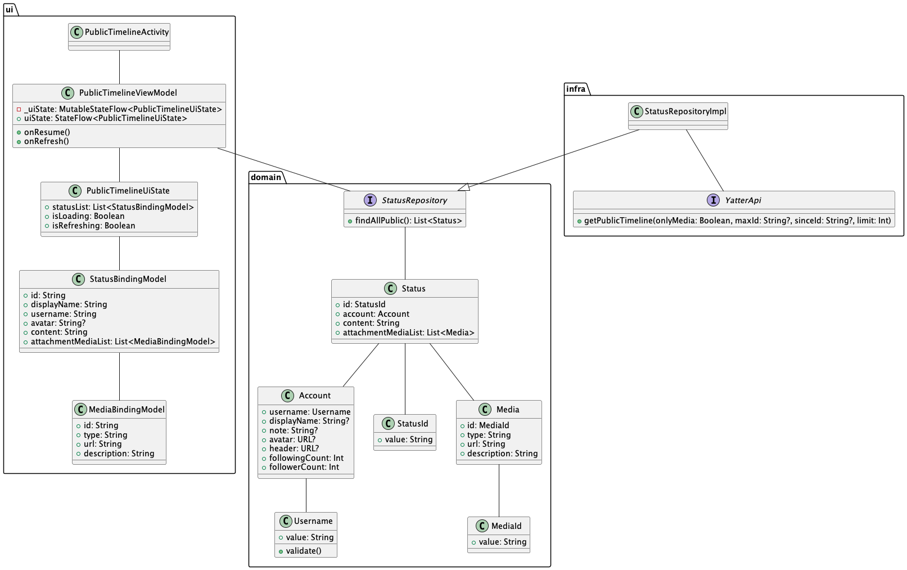

# パブリックタイムライン画面のdomain層実装
パブリックタイムライン画面のdomain層の実装を行います。  

クラス図の次の部分に当たります。  



## ドメイン層の説明
設計方針にもあるように、domain層では言語化された事業ドメインをそのままコードに落とし込むことに専念します。  

domain層には、次のクラスを定義します。  
- Entity
- Value Object
- Domain Service
- Repository

それぞれの詳細はアーキテクチャドキュメント(tutorial>アーキテクチャについて>arthitecture)でも解説されていますのでそちらをご確認ください。  

ここでは、軽い特徴のみに絞って説明します。  

### Entity
Entityは同一性によって定義・識別されるオブジェクトです。  
idやそれに値するものをクラスに持たせて利用するケースがほとんどです。  

特にDMMのコードでは、`Identifier`と`Entity`を用いて定義することである値による同一性担保を強制させています。  

### Value Object
Entityと違い、自身が持つ属性（メンバー変数）が全て一致することで同一のオブジェクトとして扱います。  

Kotlinで定義するときはdata objectで定義し、全プロパティをvalで定義します。  

### Domain Service
EntityともValue Objectとも違い、振る舞いそのものをモデリングしたい場合に利用されます。  
Entityの振る舞いとしてもValue Objectの振る舞いとしても定義が難しい場合に定義します。  

### Repository
あるドメインに対してオブジェクトの永続化を行ったり永続化されたオブジェクトの検索窓口になったりします。  
EntityやValue Objectの集約を扱います。  

## ドメインの考え方と実装
パブリックタイムライン画面を実装する際に必要な概念を検討します。  
まずパブリックタイムライン画面でStatusを表示するためにStatusドメインをEntityで定義します。  

ドメインを実装する前に次のファイルを新規作成します。  
domainパッケージ(ディレクトリ)は作成されていないためパッケージの作成からしましょう。  

```
domain/Status.kt
domain/StatusId.kt
domain/Account.kt
domain/Username.kt
```


```Kotlin
// Status.kt
class Status(
  id: StatusId, // 一意のID
  val account: Account, // 投稿者を表すドメイン
  val content: String, // 投稿内容
) : Entity<StatusId>(id)
```

```Kotlin
// StatusId.kt
class StatusId(value: String): Identifier<String>(value)
```

同じユーザーが同じ内容を投稿することもあり得るため、idをドメインモデルで持ってStatusの一意性を表すためにEntityにしています。  
Statusの一意性をidで表現するために`StatusId`クラスを`Identifier`を継承して定義します。  
実際の値はただのStringですが、StatusIdとして定義することによりStatus以外のidやただの文字列がStatusのIdとして用いられることを防ぐことができます。  
定義した`StatusId`を`Entity`に渡すことにより、StatusクラスをStatusIdで一意性を表現したEntityとすることができます。  

---

続いてAccountドメインです。  
Statusドメインですでに利用されている、投稿者を表すためのAccountドメインも定義します。  
ユーザー名が空文字になることは許容されていないため、Usernameドメインに`validate`メソッドを作成しバリデーションチェックできるようにしておきます。  

```Kotlin
abstract class Account(
  id: AccountId,
  val username: Username, // ユーザー名
  val displayName: String?, // 表示名
  val note: String?, // アカウントノート
  val avatar: URL, // アバター画像URL
  val header: URL, // ヘッダー画像URL
  val followingCount: Int, // フォロー数
  val followerCount: Int, // フォロワー数
) : Entity<AccountId>(id) {

  abstract suspend fun followings(): List<Account>

  abstract suspend fun followers(): List<Account>
}
```

```Kotlin
class AccountId(value: String) : Identifier<String>(value)
```

```Kotlin
class Username(value: String): Identifier<String>(value) {
  fun validate(): Boolean = value.isNotBlank()
}
```

Accountドメインでも同じ表示名やアバターを使う可能性があるため、一意性を担保するため今回のプロジェクトではidで一意になるようにします。  
また、Accountドメインには`followings`と`followers`というメソッドを用意しています。  
あるユーザーのフォローとフォロワーはそのユーザーのアカウントドメインに属する値として考えることができますが、`account/{username}`のAPIでは取得できない要素になります。  
そこで前述したようなドメインメソッドを用意することによって、ドメインを扱う側としては通常のアカウントドメイン内の値の一部として読み取ることができます。  

AccountドメインはStatusドメインと違い、[abstract](https://kotlinlang.org/docs/classes.html#abstract-classes)で定義されています。  
`followings()`と`followers()`メソッドをドメインモデルで定義したことによってabstractなクラスにする必要が出てきています。  

繰り返しにはなりますが、あるユーザーのフォロー・フォロワーを取得するには`account/{username}`のAPIを実行する必要があります。  
愚直に実装しようとした場合は`followings()`と`followers()`メソッド内でAPI実行のコードを書くことになります。  
ですが、設計方針としてAPIなどのアプリ外部へアクセスするのはinfra層でのみとしています。  
ドメインモデルから直接API呼び出しを行わずにdomain層ではあくまでドメインモデルの定義のみを行うために、abstractを付けて定義します。  

---

ドメインモデルを作成したらRepositoryの定義をします。  
`StatusRepository`ファイルを`com.dmm.bootcamp.yatter2023.domain.repositroy`パッケージに作成します。  
Domain層では、Repositoryのinterface定義のみをするので、interfaceとして`domain/repository`配下に`StatusRepository`を作成します。  

```Kotlin
interface StatusRepository {
}
```

`StatusRepository`でStatusの取得や作成、削除といったメソッドを定義していきます。  

```Kotlin
interface StatusRepository {
  suspend fun findById(id: StatusId): Status?

  suspend fun findAllPublic(): List<Status>

  suspend fun findAllHome(): List<Status>

  suspend fun create(
    content: String,
    attachmentList: List<File>
  ): Status

  suspend fun delete(
    status: Status
  )
}
```

これでパブリックタイムライン画面で利用するdomain層の実装を行うことができました。  
