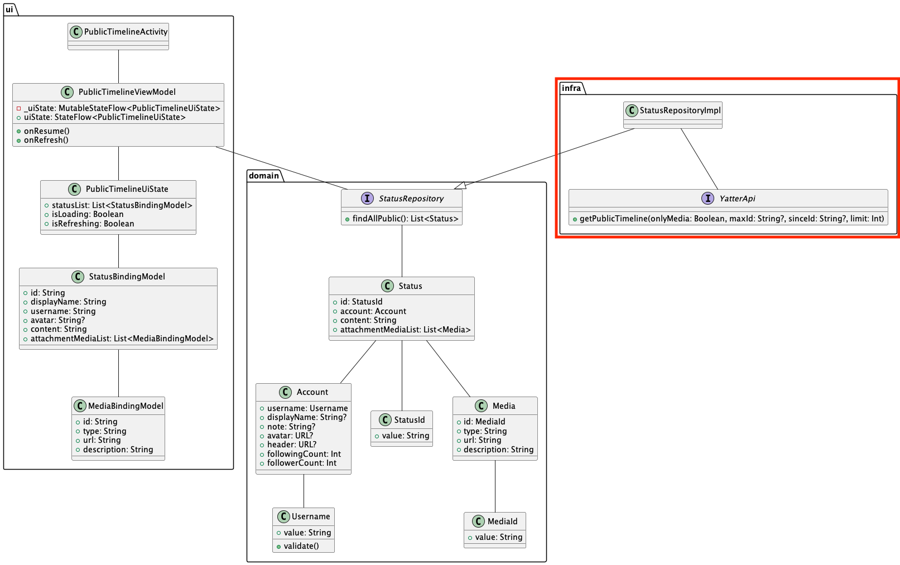
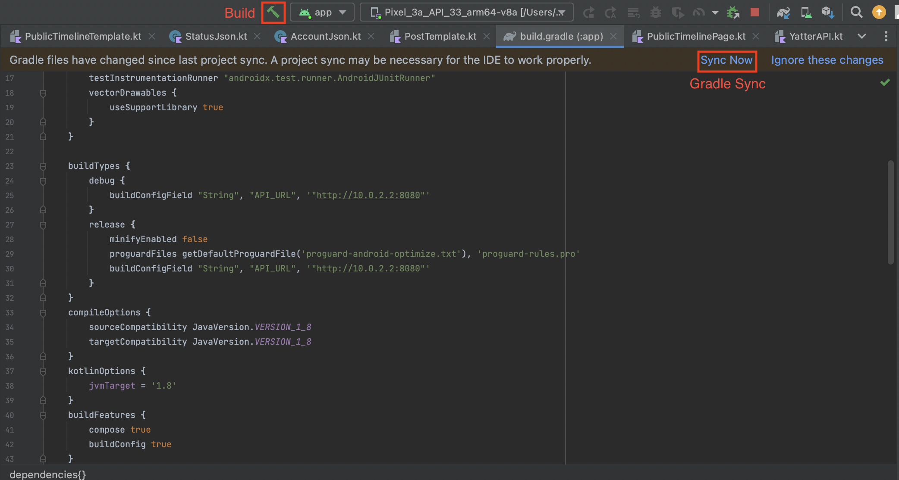
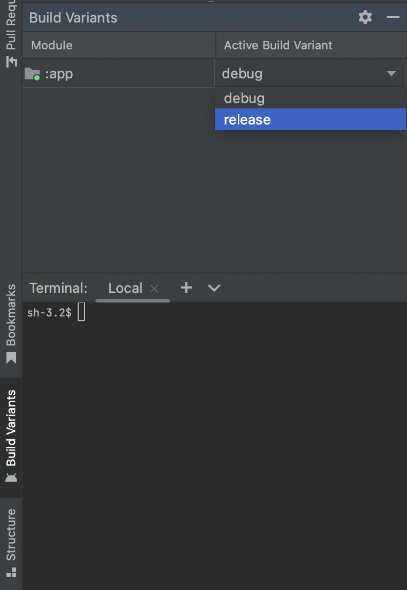

# パブリックタイムライン画面のinfra層実装
パブリックタイムライン画面のinfra層実装を行います。 

## infra層の説明
infra層では純粋な技術的関心ごとを実装します。  
domain層で定義したRepositoryやDomainServiceをはじめとするinterfaceの実装もinfra層で具体的な技術を使って実装します。  

クラス図では次に該当します。  


## API接続実装
まずは、APIと接続する部分を実装します。  
今回は`Retrofit`というライブラリを利用します。  
ライブラリを使わずにAPI通信を実装する方法もありますが、Retrofitを利用することがデファクトスタンダードになっています。  
他にも`Ktor`を利用する場合もあります。  

実装する前にドキュメントを一読してみましょう。  
https://square.github.io/retrofit/

Javaで説明されていますが、次の内容を抑えられれば良いです。  

- APIをどうやってメソッドやクラスで表現するのか
  - URLやHTTPメソッドの指定の仕方
  - リクエストの表現の仕方
  - レスポンスの表現の仕方
- converterを指定することでいろんなタイプのレスポンスやシリアライザを指定できること

また、次の資料でもRetrofitの使い方を解説していますので合わせてご一読ください。  

```
appendix > 12-Retrofitを用いた通信について
```

---

Retrofitのドキュメントを一読したら実装に入ります。  
パブリックタイムライン画面で利用するAPIは次のAPIのみです。  
```
GET /timelines/public
```

このAPIのレスポンスはJsonで次のような値になっています。  

```
[
  {
    "id": 123,
    "account": {
      "id": 0,
      "username": "john",
      "display_name": "ジョン",
      "create_at": "2023-05-22T05:23:19.017Z",
      "followers_count": 52,
      "following_count": 128,
      "note": "string",
      "avatar": "string",
      "header": "string"
    },
    "content": "ピタ ゴラ スイッチ♪",
    "create_at": "2023-05-22T05:23:19.017Z",
    "media_attachments": [
      {
        "id": 123,
        "type": "image",
        "url": "string",
        "description": "hoge hoge"
      }
    ]
  }
]
```

`Status`(ツイート)の配列で`Status`はいろんなパラメータと、そのほかに`Account`の情報と`MediaAttachment`の配列を持っています。  
こういったレスポンスをそのまま文字列として扱うには不便なので、アプリ開発では一般的にJsonなどのレスポンスをクラス（型）で表現します。  
クラスで表現し、（デ）シリアライザを使用することで、Jsonの文字列とクラスの変換をできるようにします。  
ちなみに、今回はシリアライザライブラリとして[Moshi](https://github.com/square/moshi)を使用します。

早速、`StatusJson`クラス・`AccountJson`クラス・`MediaAttachmentJson`クラスを実装してみましょう。  
`com.dmm.bootcamp.yatter2023.infra.api.json`パッケージを作り、そこにそれぞれのクラスを追加していきます。  
まずは、サンプルとして`AccountJson`を実装してみます。`Account`のJsonはこうなってます。

```
{
  "id": 0,
  "username": "string",
  "display_name": "string",
  "create_at": "2019-04-23T04:42:43.836Z",
  "note": "string",
  "avatar": "string",
  "following_count": 100,
  "followers_count": 200,
  "header": "string"
}
```

このJsonをそのままクラスで表現します。

```Kotlin
package com.dmm.bootcamp.yatter2023.infra.api.json

data class AccountJson(
  val id: String,
  val username: String,
  val display_name: String?,
  val note: String?,
  val avatar: String?,
  val header: String?,
  val following_count: Int,
  val followers_count: Int,
  val create_at: String,
)
```

`AccountJson`クラスのメンバ変数の型が全て`String`になっています。  
Jsonではidをintegerで取り扱っていますが、Androidアプリ側でJsonをクラスに変換する際にStringとして扱うようにしています。  
`id`を`String`で扱う理由としては、もし今後idをintで扱いきれないほどユーザーが増えた時などの都合によってStringやUUIDといったinteger以外に変更したくなった時にもアプリ側の変更無しに対応できるようにするためにStringで扱うようにしています。  

Androidをはじめとするモバイルアプリ開発において、アプリに変更を入れて実際のユーザーに届くまでにストア申請が必ず入ります。  
ストア申請は早ければ数時間程度でリリースできるようになりますが、状況によっては数日、長ければ1週間以上かかる場合もありさらに審査結果によっては再修正も必要になり、バックエンドやWebフロントに比べて本番環境へのデプロイに時間がかかります。  
そのため、修正が入ってもアプリの修正・リリースをしなくとも機能するように意識して実装することが多くあります。  
今回のidをintではなくStringで最初から扱うのもそういった理由からきています。  

このままのクラス実装でも動作するのですが、一般的にAndroidの開発で推奨されているコーディング規約には変数の命名は`camelCase`であるため`display_name`や`create_at`という命名は規約違反となっています。そのため、下記のように`camelCase`に修正します。  

```Kotlin
package com.dmm.bootcamp.yatter2023.infra.api.json

data class AccountJson(
  val id: String,
  val username: String,
  val displayName: String?,
  val note: String?,
  val avatar: String?,
  val header: String?,
  val followingCount: Int,
  val followersCount: Int,
  val createAt: String,
)
```

ただしこれでは動きません。実際のJsonでは`display_name`や`created_at`というキーであるのに対して、クラスでは`displayName`、`createAt`という違う文字列になっているので、シリアライザが対応関係を解決することができません。  
この対応関係を揃えるための機能を`Moshi`が用意しているので、それに習うと`AccountJson`クラスは下記のようになります。  

```Kotlin
package com.dmm.bootcamp.yatter2023.infra.api.json

data class AccountJson(
  @Json(name = "id") val id: String,
  @Json(name = "username") val username: String,
  @Json(name = "display_name") val displayName: String?,
  @Json(name = "note") val note: String?,
  @Json(name = "avatar") val avatar: String?,
  @Json(name = "header") val header: String?,
  @Json(name = "following_count") val followingCount: Int,
  @Json(name = "followers_count") val followersCount: Int,
  @Json(name = "create_at") val createAt: String
)
```

`@Json(name = )`を使って「Jsonのキーが`name`と一致する値をこの変数に代入してくれ」という指定ができるようになります。  
`@Json(name = )`での指定は、変数名とJsonのキー名が一致しない時には必須になりますが、一致している場合は必須ではないため次のような定義でも問題ありません。  
動作も変わらないため、好みやチームの方針に合わせる形で問題ありません。  

```Kotlin
package com.dmm.bootcamp.yatter2023.infra.api.json

data class AccountJson(
  val id: String,
  val username: String,
  @Json(name = "display_name") val displayName: String?,
  val note: String?,
  val avatar: String?,
  val header: String?,
  @Json(name = "following_count") val followingCount: Int,
  @Json(name = "followers_count") val followersCount: Int,
  @Json(name = "create_at") val createAt: String
)
```

これで`AccountJson`の実装は完了です。  
`AccountJson`ではありませんでしたが、Jsonのネストを次のように表現することも可能です。  

```Kotlin
data class StatusJson(
  ...
  val account: AccountJson,
  @Json(name = "media_attachments") val attachmentMediaList: List<MediaJson>?,
  ...
)
```

では、残りの`StatusJson`と`MediaJson`を自力で実装してみましょう。  

<details>
<summary>StatusJsonとMediaJsonの実装例</summary>

`StatusJson`と`MediaJson`は次のように実装できます。  
これらの実装例は一例になりますので変数名等が多少違っていても問題ありません。  

```Kotlin
package com.dmm.bootcamp.yatter2023.infra.api.json

import com.squareup.moshi.Json

data class StatusJson(
  val id: String,
  val account: AccountJson,
  val content: String?,
  @Json(name = "create_at") val createAt: String,
  @Json(name = "media_attachments") val attachmentMediaList: List<MediaJson>?,
)
```

```Kotlin
package com.dmm.bootcamp.yatter2023.infra.api.json

import com.squareup.moshi.Json

data class MediaJson(
  val id: String,
  val type: String,
  val url: String,
  val description: String,
)
```
</details>

---

必要なJsonクラスが定義できたところで、APIの実装を行います。  
`com.dmm.bootcamp.yatter2023/infra/api`に`YatterApi`のinterfaceを定義します。  

```Kotlin
package com.dmm.bootcamp.yatter2023.infra.api

interface YatterApi
```

この`YatterApi`に、1つのAPIに対して1つのメソッドを定義することで`Retrofit`が内部で通信を行い、`converter`を通してレスポンスを指定した型に変換してくれます。  

`GET /timelines/public`のAPIに対するメソッドとして`getPublicTimeline`を定義します。  
返り値の方はStatus一覧のレスポンスになるため`List`とします。  
さらにAPIの実行は非同期処理になるため`suspend`も付けます。  

```Kotlin
interface YatterApi {
  suspend fun getPublicTimeline(): List<StatusJson>
}
```

次にリクエストする際に必要な値を確認します。  
API Docを見るとリクエストに必要な値は次のようになっています。  

|パラメータ名|option/required|Param Type|Type|説明|
|-|-|-|-|-|
|onlye_media|option|query|boolean|Only return statuses that have media attachments (public and tag timelines only)|
|max_id|option|query|integer|Get a list of followings with ID less than this value|
|since_id|option|query|integer|Get a list of followings with ID greater than this value|
|limit|option|query|integer|Maximum number of followings to get (Default 40, Max 80)|

`Retrofit`ではリクエストに必要な値を引数で表現します。  

```Kotlin
interface YatterApi {
  @GET("timelines/public")
  suspend fun getPublicTimeline(
    @Query("only_media") onlyMedia: Boolean,
    @Query("max_id") maxId: String?,
    @Query("since_id") sinceId: String?,
    @Query("limit") limit: Int,
  ): List<StatusJson>
}
```

API Doc上では全てオプションとなっているためデフォルト値を定義できそうな部分は定義し、それ以外の部分はnullをデフォルト値として定義します。  

```Kotlin
interface YatterApi {
  @GET("timelines/public")
  suspend fun getPublicTimeline(
    @Query("only_media") onlyMedia: Boolean = false,
    @Query("max_id") maxId: String? = null,
    @Query("since_id") sinceId: String? = null,
    @Query("limit") limit: Int = 40,
  ): List<StatusJson>
}
```

これでYatter APIの実装は完了です。  

---

続いて、Yatter APIのインスタンスを作成するFactoryクラスを実装します。  
`YatterApiFactory.kt`ファイルを`YatterApi`と同じパッケージ内に作成しましょう。  

```Kotlin
class YatterApiFactory {
  fun create(): YatterApi {
    val moshi = Moshi.Builder()
      .add(KotlinJsonAdapterFactory())
      .build()
    return Retrofit.Builder()
      .baseUrl("http://10.0.2.2:8080/v1/")
      .client(
        OkHttpClient.Builder()
          .addInterceptor(
            HttpLoggingInterceptor().apply {
              level = HttpLoggingInterceptor.Level.BODY
            }
          )
          .build()
      )
      .addConverterFactory(MoshiConverterFactory.create(moshi))
      .addCallAdapterFactory(CoroutineCallAdapterFactory())
      .build()
      .create(YatterApi::class.java)
  }
}
```

今、baseUrlに`http://10.0.2.2:8080/`を指定しています。AndroidのエミュレータからPCのlocalhostに接続する場合はこのURLを指定します。  
https://developer.android.com/studio/run/emulator-networking

ローカルで開発している分にはこの指定で問題ありませんが、本番環境やSTG環境といった開発環境ごとにこのURLを変更する運用は大変です。  
Androidアプリ開発には`Build Type`という機能があり、このtypeごとに設定値を作ることができます。まずは実践です。  
`app/build.gradle`を開いて、buildTypesを以下のように書き換えます。  

```Groovy
buildTypes {
  debug {
    buildConfigField "String", "API_URL", '"http://10.0.2.2:8080"'
  }
  release {
    minifyEnabled false
    proguardFiles getDefaultProguardFile('proguard-android-optimize.txt'), 'proguard-rules.pro'
    buildConfigField "String", "API_URL", '"http://10.0.2.2:8080"'
  }
}
```

buildTypesには`debug`と`release`が用意されており、そこに`API_URL`を定義しています。現状では`debug`も`release`も同じ`http://10.0.2.2:8080/`を指定していますが、本番環境用のURLができたら変更しましょう。  
書き換えた後は一度プロジェクトを`Gradle Sync`とビルドをします。そうするすることによって`Build Type`に指定した設定値が`BuildConfig`という生成クラスに生成され、コードから利用することができます。  



`Gradle Sync`に関して少し補足をします。  
Androidアプリ開発では`build.gradle`のようなgradleのファイルに利用するライブラリやバージョン、build Typeといったプロジェクト全体の設定を記述して利用するケースが多いです。  
そのgradleファイルに記述した設定を反映させる処理が`Gradle Sync`となっています。  
そのため、gradleファイルを編集したら`Gradly Sync`が必要なんだなと理解していただければ問題ありません。  

ビルドが完了したらFactoryクラスの修正を行います。  

```Kotlin
class YatterApiFactory {
  fun create(): YatterApi = Retrofit.Builder()
    .baseUrl(BuildConfig.API_URL + "/v1/")
    ...
}
```

これにより、debugビルドをするとdebug用のAPI_URLが利用され、releaseビルドを行えばrelease用のAPI_URLを利用することができます。  
Android Studioではこの`Build Type`を`Build Variants`ページからどの`Build Type`を利用するか指定することができます。  



これで`YatterApiFactory`の完成です。  

### 課題
Androidアプリ開発ではKotlin Coroutineという非同期処理の実装に必要な要素を多く利用します。特にこれからCoroutineの知識が重要になってきます。  
そのため、次のドキュメントを一読しましょう。このタイミングで完全に理解する必要はありませんが概要がある程度わかるくらいまで読み、分からない部分が出てきたタイミングで読み返しましょう。  

- https://kotlinlang.org/docs/coroutines-basics.html
- https://developer.android.com/kotlin/coroutines

---

ここまでで、API通信するための実装をしました。  
ですが、このままでは実際の通信は行えません。その理由としてはAndroidアプリの権限に起因します。  
Androidアプリ開発時にAndroidスマホ備え付けの機能を利用する際に権限が必要なケースが多くあり、API通信をはじめとするインターネット接続もそのケースに含まれます。  

Androidアプリのインターネット接続を許可するためには、`AndroidManifest.xml`とというマニフェストファイルに権限を宣言する必要があります。  
マニフェストファイルについては後述しますので、ひとまずは権限を利用するための宣言をする場所くらいの認識で問題ありません。  

`AndroidManifest.xml`ファイルを見つけたら次の一文を追加してインターネット接続を許可します。  

```XML
<manifest xmlns:android="http://schemas.android.com/apk/res/android"
    xmlns:tools="http://schemas.android.com/tools">

    <!--  追加  -->
    <uses-permission android:name="android.permission.INTERNET" />

    <application ...>

```


## Repositoryの実装
`com.dmm.bootcamp.yatter2023.infra.domain.repository`というパッケージを作成します。  
作成したパッケージに属するように、`StatusRepositoryImpl`クラスを作成し、`StatusRepository`の実装を行います。  

```Kotlin
package com.dmm.bootcamp.yatter2023.infra.domain.repository

import com.dmm.bootcamp.yatter2023.domain.repository.StatusRepository

class StatusRepositoryImpl : StatusRepository
```

`StatusRepositoryImpl`で`StatusRepository`内のメソッドの実装を行なっていないため、`class StatusRepositoryImpl`に赤い波線が入っていると思います。赤い波線部にカーソルを当て、「option + return」を押して、`implemention members`を選択します。  
どのメソッドを実装するか確認するダイアログが表示されるため、全てのメソッドを選択しOKを押せば次のようなコードが生成されます。  

```Kotlin
class StatusRepositoryImpl : StatusRepository {
  override suspend fun findById(id: StatusId): Status? {
    TODO("Not yet implemented")
  }

  override suspend fun findAllPublic(): List<Status> {
    TODO("Not yet implemented")
  }

  override suspend fun findAllHome(): List<Status> {
    TODO("Not yet implemented")
  }

  override suspend fun create(content: String, attachmentList: List<File>): Status {
    TODO("Not yet implemented")
  }

  override suspend fun delete(status: Status) {
    TODO("Not yet implemented")
  }
}
```

このメソッドの中で、まずは`findAllPublic`の実装のみを行います。  
他の`TODO`となっているところはそのままでも問題なくビルドは成功します。ですが実行時にはランタイムエラーがでクラッシュしますので必要になったタイミングで実装書ましょう。  

まずは、クラスのコンストラクタでAPI通信を行うための`YatterApi`を受け取ります。  

```Kotlin
class StatusRepositoryImpl(
  private val yatterApi: YatterApi,
): StatusRepository {
  ...
}
```

`StatusRepositoryImpl#findAllPublic()`を実装するには`YatterApi`の`getPublicTimeline`を呼び出し、取得したレスポンスのリストをアプリのドメインリストに変換する必要があります。  

まずは、レスポンスのリストを取得するところまで実装します。  
現時点でエラーになっているかと思いますが、後に実装しますので今はこのままで問題ありません。  

```Kotlin
override suspend fun findAllPublic(): List<Status> = withContext(Dispatchers.IO) {
  val jsonList = yatterApi.getPublicTimeline()
  //ここで `List<StatusJson>` を `List<Status>` に変換
}
```

ここでは、`withContext(Dispatchers.IO)`で処理をラップしていることがわかります。  
詳細は省きますが、アプリのメインスレッド上で、API通信などの時間のかかりうる処理を実行するとその処理が完了するまで他の処理を行えずアプリがフリーズしてしまいます。そのため、データの読み書きに特化したIOスレッドでAPI通信処理を実行するために`withContext(Dispatchers.IO)`でラップしています。  

詳細は次のドキュメントを一読しましょう。
https://developer.android.com/kotlin/coroutines/coroutines-adv

---

続いて、変換部分を作っていきましょう。  
`Status`ドメインモデルが、`Account`をメンバとして持っているために、`Account`のコンバーターを、さらには現状Accountは `abstract class`なのでその実装クラスも必要になります。  

それぞれ次のようになります。  
package通りに配置していってください。

### AccountImpl
```Kotlin
package com.dmm.bootcamp.yatter2023.infra.domain

import com.dmm.bootcamp.yatter2023.domain.Account
import com.dmm.bootcamp.yatter2023.domain.Username
import java.net.URL

class AccountImpl(
  id: AccountId,
  username: Username,
  displayName: String?,
  note: String?,
  avatar: URL,
  header: URL,
  followingCount: Int,
  followerCount: Int,
) : Account(
  id,
  username,
  displayName,
  note,
  avatar,
  header,
  followingCount,
  followerCount,
) {
  override suspend fun followings(): List<Account> {
    TODO("Not yet implemented")
  }

  override suspend fun followers(): List<Account> {
    TODO("Not yet implemented")
  }
}
```

### AccountConverter
```Kotlin
package com.dmm.bootcamp.yatter2023.infra.domain.converter

import com.dmm.bootcamp.yatter2023.BuildConfig
import com.dmm.bootcamp.yatter2023.domain.Account
import com.dmm.bootcamp.yatter2023.domain.Username
import com.dmm.bootcamp.yatter2023.infra.api.json.AccountJson
import com.dmm.bootcamp.yatter2023.infra.domain.AccountImpl
import java.net.URL

object AccountConverter {
  fun convertToDomainModel(
    jsonList: List<AccountJson>
  ): List<Account> = jsonList.map { convertToDomainModel(it) }

  fun convertToDomainModel(json: AccountJson): Account = AccountImpl(
    id = AccountId(json.id),
    username = Username(json.username),
    displayName = json.displayName,
    note = json.note,
    avatar = URL(BuildConfig.API_URL + "/v1/" + json.avatar),
    header = URL(BuildConfig.API_URL + "/v1/" + json.header),
    followingCount = json.followingCount,
    followerCount = json.followersCount,
  )
}
```

### StatusConverter
```Kotlin
package com.dmm.bootcamp.yatter2023.infra.domain.converter

import com.dmm.bootcamp.yatter2023.domain.Status
import com.dmm.bootcamp.yatter2023.domain.StatusId
import com.dmm.bootcamp.yatter2023.infra.api.json.StatusJson

object StatusConverter {
  fun convertToDomainModel(jsonList: List<StatusJson>): List<Status> =
    jsonList.map { convertToDomainModel(it) }

  fun convertToDomainModel(json: StatusJson): Status = Status(
    id = StatusId(json.id.toString()),
    account = AccountConverter.convertToDomainModel(json.account),
    content = json.content ?: "",
  )
}
```

これで変換処理の実装が完了しました。  

---

最後に、`StatusRepositoryImpl#findAllPublic()`の実装を仕上げます。  

```Kotlin
  override suspend fun findAllPublic(): List<Status> = withContext(IO) {
    val statusList = yatterApi.getPublicTimeline()
    StatusConverter.convertToDomainModel(statusList)
  }
```

## 単体テスト

infra層の実装が完了したら単体テストを書いて処理に問題がないか確認します。  
Androidの単体テストにはJUnitが多く利用されます。  
YatterでもJUnitを使ってテストを書きます。  

Androidアプリ開発での単体テストは、`app/src/test/java`ディレクトリ内にテスト対象のクラスと同じパッケージ内に定義します。  


今回は`StatusRepositoryImpl`のテストを書くため、`infra/domain/repository`パッケージをtestディレクトリ内にも作成し、作成したパッケージに`StatusRepositoryImplSpec`というクラスも作成します。  

Yatterアプリ開発ではテストクラスの命名規則として`${テスト対象クラス名}Spec`という名前にします。  
`Spec`は仕様という意味のある`specification`の略で、テストは使用であるという意味合いを持たせています。  

```Kotlin
class StatusRepositoryImplSpec {}
```

単体テストの実装時にテスト対象クラスが利用する他のクラスはモック化して利用します。  
モック化することによりさまざまなテスト環境を作り出すことができたりテスト対象クラスの振る舞いテストに注力することできます。  

モックライブラリとして今回は[`mockk`](https://mockk.io/)を利用します。  
モック化したいクラスを次のような記述をすることでモック化できます。  

```Kotlin
val mockClass = mockk<MockClass>()
```

モック化したクラスは次のような記述をしてテストを記述していきます。  

```Kotlin
// モッククラスのメソッド実行時の返り値をモック
every { // 実行するメソッドがsuspendであれば、coEvery
  mockClass.execute()
} returns "foo"

// 返り値のないメソッドを実行できるようにする
justRun {
  mockClass.execute()
}

// モックしたメソッドを実行したか確認
verify { // 実行するメソッドがsuspendであれば、coVerify
  mockClass.execute()
}
```

ここで記載したmockkの使い方は基本的なことのみですので、さらに詳しい実装方法は[公式ページ](https://mockk.io/)をご確認ください。  

`StatusRepository`は`YatterApi`を引数に取るため、`TatterApi`をモック化してテスト対象をインスタンス化します。  

```Kotlin
class StatusRepositoryImplSpec {
  private val yatterApi = mockk<YatterApi>()
  private val subject = StatusRepositoryImpl(yatterApi)
}
```

jUnitでのテストはテストケースごとにメソッドを用意します。  
APIから値を取得し、変換できることを確認します。  

```Kotlin
class StatusRepositoryImplSpec {
  private val yatterApi = mockk<YatterApi>()
  private val subject = StatusRepositoryImpl(yatterApi)

  @Test
  fun getPublicTimelineFromApi() = runTest {
  }
}
```

テストの準備ができたらテスト実装に入ります。  
まずは、テスト用の値とメソッドのモック化です。  

```Kotlin
val jsonList = listOf(
  StatusJson(
    id = "id",
    account = AccountJson(
      username = "username",
      displayName = "display name",
      note = "note",
      avatar = "avatar",
      header = "header",
      followingCount = 100,
      followersCount = 200,
      createAt = "2023-06-02T12:44:35.030Z"
    ),
    content = "content",
    createAt = "2023-06-02T12:44:35.030Z",
    attachmentMediaList = listOf(),
  )
)

val expect = listOf(
  Status(
    id = StatusId(value = "id"),
    account = AccountImpl(
      username = Username("username"),
      displayName = "display name",
      note = "note",
      avatar = "avatar",
      header = "header",
      followingCount = 100,
      followerCount = 200
    ),
    content = "content",
    attachmentMediaList = listOf()
  )
)

coEvery {
  yatterApi.getPublicTimeline()
} returns jsonList
```

値の準備ができたら、実際に対象のメソッドを呼び出し、結果が取得できていることを確認します。  
ここで利用してる`assertThat`は`Truth`ライブラリのものを利用していますので、`com.google.common.truth.Truth.assertThat`をimportされていることを確認してください。  

```Kotlin
val result: List<Status> = subject.findAllPublic()

coVerify {
  yatterApi.getPublicTimeline()
}

assertThat(result).isEqualTo(expect)
```

テストが書けたらYatterプロジェクト内で次のコマンドを実行し、テストを走らせます。  
ターミナルアプリを利用しても問題ありませんし、Android Studio内のターミナルを利用しても問題ありません。(Shiftを2回押した後に「terminal」と入力すると出ます)  

テストメソッド名かクラス名の左横にある実行ボタンを押すとGUIでもテスト実行できます。  

アプリ全体のテストを確認したいときはコマンド、単一のテストメソッドだけをテストしたいときはGUIというように分けても良いでしょう。  

```
./gradlew test
```

テストが通過していればinfra層の実装とテストが終了です。  
もし何かしらのエラーやテスト失敗が出ていればエラー内容を確認して対応してみましょう。  

テストを実行すると次のファイルに結果が出力されます。  

```
app/build/reports/tests/testReleaseUnitTest/index.html
```
