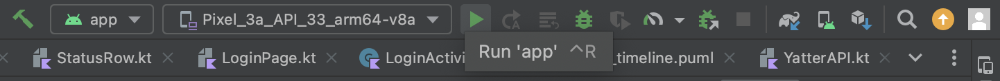

# パブリックタイムラインのDI実装
UI実装まで完了したらDIの実装を行いパブリックタイムライン画面を仕上げていきます。  
DIについては次の資料をまずはご一読ください。  

https://developer.android.com/training/dependency-injection?hl=ja

Androidアプリ開発ではよくDIが用いられます。  
DIライブラリとしてDagger/Dagger Hilt・Koin・Kodeinがよく利用されます。  

今回はKoinを利用します。  

## DI実装

まずはDIを利用するための前準備としてApplicationクラスを実装します。  
ApplicationクラスはAndroidアプリが起動するときに一番初めにインスタンス化されるクラスです。さらに、アプリが生きている間インスタンスは残り続けるため、Androidアプリ起動時に行いたい処理やアプリ全体で共有したいデータを管理したい時などに用いられるものです。  

DI設定はアプリが生存している間、残しておきたい設定になるためApplicationクラスでDIの設定をすることが一般的です。  
DIを利用しないなど、Applicationクラスが不要の場合は作成しなくて問題ありません。  

`YatterApplication.kt`というクラスを`com.dmm.bootcamp.yatter2023`パッケージに作成します。  

```Kotlin
package com.dmm.bootcamp.yatter2023

import android.app.Application

class YatterApplication: Application() {
  override fun onCreate() {
    super.onCreate()
  }
}
```

Applicationクラスを定義したら、アプリが起動したときに定義したApplicationクラスが呼び出されるように定義します。  

Activityを追加したときのように`AndroidManifest.xml`ファイルを開きます。  
マニフェストファイル内の`<application>`タグの`android:name`属性に、追加した`YatterApplication`を追記します。  

```XML
<application
    android:name=".YatterApplication"
    ...>
```

これでアプリ起動時に`YatterApplication`インスタンスが生成されるようになります。  

Applicationクラスの定義ができたところでKoinの設定を進めます。  
`YatterApplication#onCreate`内に次のコードを追加してAndroidアプリ開発向けのKoin初期設定を行います。  

```Kotlin
startKoin {
  androidLogger()
  androidContext(this@YatterApplication)

  modules(
    modules = listOf()
  )
}
```

`androidLogger()`で Androidアプリ実行時のログにKoinのログも出力するための設定で、`AndroidContext(this@YatterApplication)`でAndroidアプリのリソース情報やActivityの起動など様々なところで利用するAndroid Contextの設定を行なっています。  
`modules()`でDIの設定がされたmoduleを渡すことでKoinのDI設定が完了します。  

Contextは利用用途も多いですが、扱いを間違えると意図しないメモリリークやクラッシュが発生しうるハマりどころとして有名な箇所でもありますので、色々と調べてみてください。  

---

続いてはmoduleの設定を行います。  
Yatterでは、各レイヤーごとにmoduleを作成して管理しやすいようにします。  

`com.dmm.bootcamp.yatter2023.di`パッケージに次のファイルを作成します。  
- DomainImplModule
- InfraModule
- ViewModelModule

まずは、`DomainImplModule`から実装します。  
`DomainImplModuke`ではdomainモジュールで`interface`として定義したものを実装したクラスの定義を書きます。  

`DomainImplModule`ファイルを開き、次の記述をします。  

```Kotlin
package com.dmm.bootcamp.yatter2023.di

val domainImplModule = module {
}
```

この`module {}`内にクラスのインスタンス化方法を記載します。  

KoinでのDI定義方法としては主に次のような記述をします。  

```Kotlin
factory<注入先の型> { 注入するクラスのインスタンス化 }
// or
single<注入先の型> { 注入するクラスのインスタンス化 }
// or
viewModel<注入先の型> { 注入するクラスのインスタンス化 }
```

`factory`は注入するたびに新しいインスタンスを作成する注入方法で、`single`は注入するインスタンスがアプリ起動中は常に同じもの(シングルトン)を注入する方法で、`viewModel`はViewModelクラスを注入するときにっ利用する注入方法です。  

では、`StatusRepository`の設定を行います。  
RepositoryパターンではRepositoryの実装クラス内でキャッシュを持つことも多いため、シングルトンとしてDI設定することがほとんどです。  

```Kotlin
val domainImplModule = module {
  single<StatusRepository> { StatusRepositoryImpl(get()) }
}
```

`StatusRepositoryImpl`の引数に`get()`という記述があります。  
この記述は、あるクラスを注入するときのインスタンス化でさらに他のクラスが必要なときに記述されます。  
`get()`とすることにより、`StatusRepositoryImpl`の引数で必要なオブジェクト(今回は`YatterApi`)をKoin DIで注入することができます。  

`DomainImplModule`で定義したいDI設定は完了したため、続いては`InfraModule`の定義をします。  

`DomainImplModule`時と同様にモジュールの記述をします。  

```Kotlin
val infraModule = module {
}
```

`InfraModule`ではAPI接続に必要な`YatterApi`の定義をします。  
`DomainImplModule`で定義した`StatusRepositoryImpl`の引数でも必要なものです。  

```Kotlin
single { YatterApiFactory().create() }
```

Repositoryの時とは違い、注入先の型とインスタンス化で生成されるクラスの型が一致しているため`<>`は省略して問題ありません。  

最後に`ViewModelModule`の設定です。  

```Kotlin
val viewModelModule = module {
}
```

先述したようにViewModelのDI設定は`viewModel`という専用のものを使います。  

ViewModelは他のクラスとは違ったインスタンス化方法やライフサイクルを持っているため、専用のものとなっています。  

```Kotlin
viewModel { PublicTimelineViewModel(get()) }
```

3つのModule設定が完了したため、最後にApplicationクラスの`modules`に渡してDIの設定は完了です。  

```Kotlin
modules(
  modules = listOf(
    domainImplModule,
    infraModule,
    viewModelModule,
  )
)
```

ここまで実装できたらパブリックタイムライン実装は一通り完了です。  

Android Studio上部にある`Run app`ボタンからアプリのビルド・実行をして動作を確認してみましょう。  



パブリックタイムラインが表示され、Statusの一覧が表示されれば実装は完了です。  
