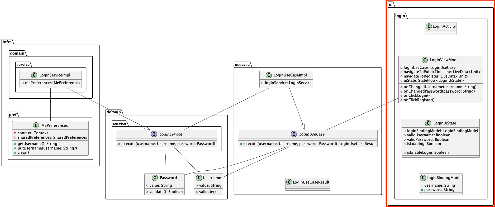
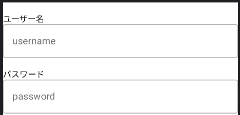
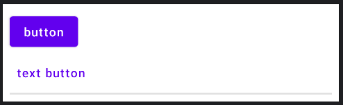

# ログイン画面のUI層実装
ログイン画面のUI実装を行います。  

クラス図では次に該当します。  



次のような見た目になることを目指して実装します。  


基本的な実装の流れとしては、パブリックタイムライン画面を実装した時と変わりありません。  

## BindingModelの実装
まずは、BindingModelの実装からです。  
`ui/login`パッケージに`LoginBindingModel`ファイルを作成します。  

ログイン画面で表示する内容としては、ユーザーによって入力されるユーザー名とパスワードの値で、Stringとして保持します。  

```Kotlin
data class LoginBindingModel(
  val username: String,
  val password: String,
)
```

## UiStateの実装
続いては`UiState`の実装です。  
BindingModelと同様に、`ui/login`パッケージ内に`LoginUiState`を用意します。  

パブリックタイムライン画面の時と同様に、`bindingModel`と`isLoading`を用意します。  

```Kotlin
data class LoginUiState(
  val loginBindingModel: LoginBindingModel,
  val isLoading: Boolean,
)
```

ログイン画面ではUiStateにユーザー名やパスワードがきちんと入力されているかどうかというフラグを持たせて、ログイン処理実行可能な状態になってからログインボタンを押せるようにするとユーザーフレンドリーです。  

もちろんUseCase内でも弾いているためUI層で対策しなくても良い内容ですが、ユーザーが利用しやすいように実施します。  

```Kotlin
data class LoginUiState(
  ...
  val validUsername: Boolean,
  val validPassword: Boolean,

) {

  val isEnableLogin: Boolean = validUsername && validPassword

}
```

最後に`LoginUiState`でも初期化用の`empty`メソッドを実装して、`UiState`は完了です。  

```Kotlin
data class LoginUiState(...) {
  companion object {
    fun empty(): LoginUiState = LoginUiState(
      loginBindingModel = LoginBindingModel(
        username = "",
        password = ""
      ),
      validUsername = false,
      validPassword = false,
      isLoading = false,
    )
  }
}
```

## ViewModelの実装
ViewModelの実装に移ります。  
`Ui/login`パッケージに`LoginViewModel`クラスを作成しているのでそこに処理を追記していきます。  
ログイン処理では`LoginUseCase`を使用します。

```Kotlin
class LoginViewModel(
  private val loginUseCase: LoginUseCase,
) {
}
```

まずは、`UiState`を`StateFlow`としてViewModel内で保持します。  

```Kotlin
class LoginViewModel(...) : ViewModel() {
  private val _uiState: MutableStateFlow<LoginUiState> = MutableStateFlow(LoginUiState.empty())
  val uiState: StateFlow<LoginUiState> = _uiState
}
```

UiStateの保持ができたら、イベントメソッドの定義を行います。  

今回用意するイベントメソッドは次の通りです。  

- onChangedUsername(username: String)
- onChangedPassword(password: String) 
- onClickLogin()
- onClickRegister()

`onChanged~`メソッドはテキストボックスにユーザーが文字を入力したときに、UiState内の値を入力された文字に更新するために用意されています。  
パスワードのバリデーションチェックもこのタイミングで行います。  

`onClick~`メソッドはログインボタンや会員登録へ進むためのボタンをユーザーが押下したときに呼び出すメソッドです。  
ログインボタンの場合はログイン処理を、会員登録ボタンは会員登録画面への遷移を実装します。  
会員登録画面の実装自体は本研修では解説しないため時間がある時に実装してみてください。  

まずは、メソッドの定義からです。  

```Kotlin
class LoginViewModel(...) : ViewModel() {

  fun onChangedUsername(username: String) {}

  fun onChangedPassword(password: String) {}

  fun onClickLogin()

  fun onClickRegister()
}
```

後述もしますが、Jetpack Composeでテキスト入力を行うには、`TextField`コンポーザブルを利用します。  
このコンポーザブルの引数に`(String) -> Unit`なラムダ式を渡すことで、ユーザーがテキストボックスで入力・削除した最新の文字列を監視することができます。  

そのため、ユーザー名とパスワードの入力状況を監視するように`onChangedUsename`と`onChangedPassword`メソッドを実装します。  

ラムダ式については次で詳細に説明されているため、興味ある方はご覧ください。  
https://developer.android.com/codelabs/basic-android-kotlin-compose-function-types-and-lambda?hl=ja#0

---

まず、`onChangedUsername`から実装を進めます。  
`onChangedUsername`で行う処理は次の通りです。  

- usernameのバリデーションチェック結果をUiStateに更新
- 新しいusernameの値をUiStateに更新

usernameのバリデーションは以前実装した`UserName#validate`を利用します。  

```Kotlin
fun onChangedUsername(username: String) {
  val snapshotBindingModel = uiState.value.loginBindingModel
  _uiState.update {
    it.copy(
      validUsername = Username(username).validate(),
      loginBindingModel = snapshotBindingModel.copy(
        username = username
      )
    )
  }
}
```

`onChangedPassword`も`onChangedUsername`と同様に実装します。  

```Kotlin
fun onChangedPassword(password: String) {
  val snapshotBindingModel = uiState.value.loginBindingModel
  _uiState.update {
    it.copy(
      validPassword = Password(password).validate(),
      loginBindingModel = snapshotBindingModel.copy(
        password = password
      )
    )
  }
}
```

続いては`onClickLogin`の実装です。  
`onClickLogin`メソッドでは次の処理を実施します。  

- ローディング状態にする
- ログイン処理(`LoginUseCase`)実行
- ログイン処理成功したらパブリックタイムライン画面へ遷移
- ログイン処理失敗したらエラー表示
- ローディング状態を解除する

これらの処理をコードに落とし込んでいきます。  

まずは、ログイン処理成功時の画面遷移の準備をします。  
画面遷移処理はViewModel内では実施できないため、UI側に画面遷移することを通達する手段が必要になります。  
このような時に`LiveData`を拡張した`SingleLiveEvent`が利用されることが多いため、Yatterにおいても同様にします。  

`SingleLiveEvent`は公式で用意されているものではありませんが、一般的に利用されているクラスです。  

`LiveData`の詳細は次もご覧ください。  
https://developer.android.com/topic/libraries/architecture/livedata?hl=ja

UiStateをStateFlowとして、ViewModelで保持していたように`SingleLiveEvent`もbacking fieldとして定義して、ViewModel内では`SingleLiveEvent`、外部からは`LiveData`として見えるように定義します。  

```Kotlin
private val _navigateToPublicTimeline: SingleLiveEvent<Unit> = SingleLiveEvent()
val navigateToPublicTimeline: LiveData<Unit> = _navigateToPublicTimeline
```

この値は次のようにすることで、外部に画面遷移する必要があることを伝播します。  

```Kotlin
// ViewModel内
_navigateToPublicTimeline.value = Unit

// Activity側
viewModel.navigateToPublicTimeline.observe(this) {
  // 画面遷移処理
}
```

画面遷移の準備ができたところで`onClickLogin`メソッドを次の処理手順に従いながら実装します。  

1. ローディング状態にする
2. ログイン処理(`LoginUseCase`)実行
3. ログイン処理成功したらパブリックタイムライン画面へ遷移
4. ログイン処理失敗したらエラー表示
5. ローディング状態を解除する

処理手順をコードに落とし込むと次のような形になります。  

```Kotlin
fun onClickLogin() {
  viewModelScope.launch {
    _uiState.update { it.copy(isLoading = true) } // 1

    val snapBindingModel = uiState.value.loginBindingModel
    when (
      val result =
        loginUseCase.execute(
          Username(snapBindingModel.username),
          Password(snapBindingModel.password),
        ) // 2
    ) {
      is LoginUseCaseResult.Success -> {
        _navigateToAllTimeline.value = Unit // 3
    }

      is LoginUseCaseResult.Failure -> {
        // 4
        // エラー表示
      }
    }

    _uiState.update { it.copy(isLoading = true) } // 5
  }
}
```

`onClickLogin`までの実装ができたら、続いては`onClickRegister`です。  
登録画面をまだ実装はしていないため、`onClickLogin`時のような画面遷移用の`SingleLiveEvent`の定義・SingleLiveEventの発火までです。  

```Kotlin
private val _navigateToRegister: SingleLiveEvent<Unit> = SingleLiveEvent()
val navigateToRegister: LiveData<Unit> = _navigateToRegister

...

fun onClickRegister() {
  _navigateToRegister.value = Unit
}
```

## UI実装
続いてUI側の実装です。  
基本的にはパブリックタイムライン画面を実装した時と同様なクラス・ファイルが必要になります。  
次のファイルを`ui/login`に作成しましょう。  

- LoginActivity
- LoginPage
- LoginTemplate

### Activityの実装
まずは`LoginActivity`の実装から入ります。  
パブリックタイムライン画面を実装した時と同様にテンプレの記述を行います。  
AndroidStudioにはTemplate機能があるため、毎回記述するのが大変な人は活用しても良いでしょう。  

```Kotlin
class LoginActivity : ComponentActivity() {
  companion object {
    fun newIntent(context: Context): Intent = Intent(
      context,
      LoginActivity::class.java,
    )
  }
}
```

続いてViewModelのインスタンスを取得します。  
```Kotlin
private val viewModel: LoginViewModel by viewModel()
```

`onCreate`メソッド内で、ViewModel側で定義していた画面遷移用の値を監視して画面遷移するように実装します。  
ログイン画面でログインしてパブリックタイムライン画面に遷移したときは戻るボタン等でログイン画面に戻って欲しくないため、`finish()`で`LoginActivity`を閉じておきます。  

```Kotlin
override fun onCreate(savedInstanceState: Bundle?) {
  super.onCreate(savedInstanceState)

  viewModel.navigateToPublicTimeline.observe(this) {
    startActivity(PublicTimelineActivity.newIntent(this))
    finish()
  }

  viewModel.navigateToRegister.observe(this) {
    //TODO: 会員登録画面への遷移
  }
}
```

`LoginActivity`の用意ができたら`AndroidManifest.xml`へのActivityの定義も忘れずに行いましょう。  

```XML
<application ...>
  <activity .../>

  <activity
      android:name=".ui.login.LoginActivity"
      android:exported="false" />
</application>

```

これでログイン処理が完了するととパブリックタイムライン画面に遷移することができるようになりました。  

### Composeの実装
Activityの用意ができたらJetpack ComposeでのUI構築に入ります。  

`LoginTemplate`コンポーザブルを`LoginTemplate`ファイルに作成し、プレビューコンポーザブルまで用意します。  

```Kotlin
@Composable
fun LoginTemplate() {
}

@Preview
@Composable
fun LoginTemplatePreview() {
  Yatter2023Theme {
    Surface() {
      LoginTemplate()
    }
  }
}
```

ログイン画面で最低限必要な要素としてはユーザー名とパスワードを入力するテキストボックス2つにログイン・会員登録のボタン2つというシンプルな作りです。  

今回は用件満たしつつ、操作間違いが少なそうな次の見た目を作成することを目指します。  


まずは、`LoginTemplate`の引数を決めます。  
基本的にはパブリックタイムライン画面での引数と同じような流れでを引数を決めます。  
まずは、画面に表示するための`username`・`password`・`isLoading`の3つです。  
そして、今回はテキストボックスに入力されたら実行するラムダ式(`(String) -> Unit`)とボタンを押された時に実行するラムダ式(`() -> Unit`)がありますのでそれぞれ名前をつけて引数に追加します。  
そして、ログインボタンを活性化するための`isEnableLogin`も追加します。  

最終的に引数は次のようになります。
```Kotlin
@Composable
fun LoginTemplate(
  userName: String,
  onChangedUserName: (String) -> Unit,
  password: String,
  onChangedPassword: (String) -> Unit,
  isEnableLogin: Boolean,
  isLoading: Boolean,
  onClickLogin: () -> Unit,
  onClickRegister: () -> Unit,
) {}
```

引数を追加したらPreview側もプレビュー用の仮の値を当てはめます。  

```Kotlin
@Preview
@Composable
fun LoginTemplatePreview() {
  Yatter2023Theme {
    Surface {
      LoginTemplate(
        userName = "username",
        onChangedUserName = {},
        password = "password",
        onChangedPassword = {},
        isEnableLogin = true,
        isLoading = false,
        onClickLogin = {},
        onClickRegister = {},
      )
    }
  }
}
```

引数の用意ができたら実際のUI構築です。  

今回は先に`Scaffold`と`TopBar`の用意をします。  
パブリックタイムライン画面の実装時を思い出しつつ実装してみてください。  

```Kotlin
@Composable
fun LoginTemplate(...) {
  Scaffold(
    topBar = {
      TopAppBar(
        title = {
          Text(text = "ログイン")
        }
      )
    }
  ) {}
}
```

プレビューを確認すると画面上部にAppBarとログインタイトルが表示されます。  

画面全体ローディング表示ができるように`Box`コンポーザブルを用意しておきます。  
画面全体を覆うようにし、ScaffoldのpaddingValue(it)、画面調整用の`8dp`をpaddingにします。  

```Kotlin
@Composable
fun LoginTemplate(...) {
  Scaffold(...) {
    Box(
      modifier = Modifier
        .fillMaxSize()
        .padding(it)
        .padding(8.dp),
    ) {}
  }
}
```

ユーザー名とパスワードを入力するためのテキストボックスと補助用のテキストを縦に並べて表示します。  

Jetpack Composeでテキストボックスを実装するために利用するコンポーザブルにはいくつか種類があります。  
その中でも今回はテキストボックスが枠で囲われた`OutlinedTextField`を利用します。  
他のテキストボックス用のコンポーザブルも見た目と名前が違うだけで引数や使い方に違いはないため、好きなものを使って問題ありません。  

`OutlinedTextField`は`value`に現在表示されるテキストの内容、`onValueChange`にユーザーがテキストボックス入力したときに実行される`(String) -> Unit`なラムダを渡すことで入力の変更を検知することができます。  
今回はさらに、`placeholder`引数も利用して、ユーザーが何も入力していない時(入力文字が空文字の時)に表示する補助テキストを表示します。  

`OutlinedTextField`コンポーザブルと`Text`コンポーザブルを利用して入力箇所のUI構築を行います。  
サイズ等は調整していますが、好きな値にしても問題ありません。  

```Kotlin
fun LoginTemplate(...) {
  Scaffold(...) {
    Box(...) {
      Column(modifier = Modifier.fillMaxSize()) {
        Text(
          modifier = Modifier
            .fillMaxWidth()
            .padding(top = 16.dp),
          text = "ユーザー名"
        )
        OutlinedTextField(
          singleLine = true,
          modifier = Modifier
            .fillMaxWidth()
            .padding(bottom = 16.dp),
          value = userName,
          onValueChange = onChangedUserName,
          placeholder = {
            Text(text = "username")
          },
        )

        Text(
          modifier = Modifier.fillMaxWidth(),
          text = "パスワード"
        )
        OutlinedTextField(
          singleLine = true,
          modifier = Modifier
            .fillMaxWidth()
            .padding(bottom = 16.dp),
          value = password,
          onValueChange = onChangedPassword,
          placeholder = {
            Text(text = "password")
          },
        )
      }
    }
  }
}
```



入力箇所の表示ができたら続いてはログインボタン、および会員登録画面への遷移ボタンを配置します。  

新たに3つのコンポーザブルが登場します。  

- Button
- TextButton
- Diveider

基本的には名前の通りになりますが、`Button`コンポーザブルは丸角四角形状で塗りつぶしているボタン、`TextButton`は文字ボタンで`Button`コンポーザブルほど目立たせはしないがボタンの動作をするコンポーザブル、そして`Divider`は区切り線になります。  



ログイン画面用にコンポーザブルを組み合わせて実装します。  

```Kotlin
fun LoginTemplate(...) {
  Scaffold(...) {
    Box(...) {
      Column(...) {
        ...
        Button(
          enabled = isEnableLogin,
          onClick = onClickLogin,
          modifier = Modifier
              .fillMaxWidth(),
        ) {
          Text(text = "ログイン")
        }

        Divider(modifier = Modifier.padding(vertical = 16.dp))
        
        Text(
          text = "はじめてご利用の方は",
          modifier = Modifier.fillMaxWidth(),
          textAlign = TextAlign.Center,
          style = MaterialTheme.typography.body2
        )
        TextButton(
          onClick = onClickRegister,
          modifier = Modifier.fillMaxWidth()
        ) {
          Text(text = "新規会員登録")
        }
      }
    }
  }
}
```

最後にローディングインディケータ表示の実装をします。  
パブリックタイムライン画面でローディング実装をした時と同様に`Box`コンポーザブル内で`isLoading`の状態に合わせて表示します。  

```Kotlin
fun LoginTemplate(...) {
  Scaffold(...) {
    Box(...) {
      Column(...) {...}

      if (isLoading) {
        CircularProgressIndicator()
      }
    }
  }
}
```

---

Templateまで実装できたらPageの実装を行います。  
パブリックタイムライン画面と同様にViewModelとTemplateの繋ぎこみを行います。  

`viewModel::メソッド名`のように記述することで、関数オブジェクトを渡すことができます。  
ひとまずはこうすることによって、メソッドを変数のように扱うことができるくらいの認識でも問題ありません。  

関数オブジェクトの詳細について知りたい方は次の資料をご一読ください。  
https://developer.android.com/codelabs/basic-android-kotlin-compose-function-types-and-lambda?hl=ja#0

```Kotlin
@Composable
fun LoginPage(viewModel: LoginViewModel) {
  val uiState: LoginUiState by viewModel.uiState.collectAsStateWithLifecycle()

  LoginTemplate(
    userName = uiState.loginBindingModel.username,
    onChangedUserName = viewModel::onChangedUsername,
    password = uiState.loginBindingModel.password,
    onChangedPassword = viewModel::onChangedPassword,
    isEnableLogin = uiState.isEnableLogin,
    isLoading = uiState.isLoading,
    onClickLogin = viewModel::onClickLogin,
    onClickRegister = viewModel::onClickRegister,
  )
}
```

最後に、Activityから呼び出します。  

```Kotlin
override fun onCreate(savedInstanceState: Bundle?) {
  super.onCreate(savedInstanceState)

  setContent {
    Yatter2023Theme {
      Surface {
        LoginPage(viewModel = viewModel)
      }
    }
  }
  ...
}
```

ここまで実装できたらログイン画面のUI実装は完了です。  
