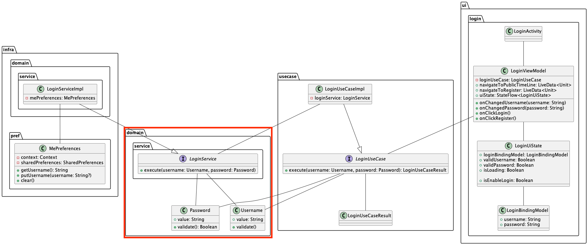

# ログイン画面のdomain層実装
ログイン画面に必要なdomain層の実装を行います。  
ログイン画面に新規実装が必要なdomain層のファイルは次のようになります。  

- domain/Password
- domain/service/LoginService

クラス図では次の箇所にあたります。  


Passwordドメインモデルでは、パスワード文字列を保持しバリデーションチェックを行います。  

LoginServiceドメインサービスでは、ユーザー名とパスワードが問題ないか確認しログイン処理を行います。  

## Passwordドメイン実装

まずは、`Password`ドメインモデルの定義をします。  

```Kotlin
package com.dmm.bootcamp.yatter2023.domain

data class Password(
  val value: String,
)
```

続いてバリデーションチェックの実装を行います。  
パスワードの要件としては、8文字以上で大文字小文字数字の混在、記号の利用があります。  

利用可能な記号と文字数を固定値として保持します。  

```Kotlin
data class Password(...) {
  companion object {
    private const val SYMBOLS = "/*!@#$%^&*()\"{}_[]|\\?/<>,."
    private const val MIN_LENGTH = 8
  }
}
```

続いて、`大文字`・`小文字`・`記号`・`文字数`をチェックするプライベートメソッドを用意しバリデーションチェックをします。  

```Kotlin
data class Password(...) {
  companion object {...}

  fun validate(): Boolean = value.isNotEmpty() &&
    hasUpperCase() &&
    hasLowerCase() &&
    hasSymbol() &&
    hasMinLength()

  private fun hasUpperCase(): Boolean = value.toCharArray().any { it.isUpperCase() }

  private fun hasLowerCase(): Boolean = value.toCharArray().any { it.isLowerCase() }

  private fun hasSymbol(): Boolean = value.toCharArray().any { SYMBOLS.contains(it) }

  private fun hasMinLength(): Boolean = value.length >= MIN_LENGTH
}
```

これで`Password`ドメインモデルの実装が完了しました。  

`Password`ドメインにはロジックが含まれていますので、テストを書いてみましょう。  

いくつかのケースに応じて`validate`の結果が正しくなるか確認しましょう。  

- abc → false
- abcdefghi → false
- Abcdefghi → false
- Abcdefghi10 → false
- Abcdefghi10% → true
- etc...

例として5つのケースを挙げましたが、きちんとロジックを確認するには2^4ケース分必要になります。  

パブリックタイムライン実装時に書いたテストを参考に`Password`ドメインのテストを書いてみましょう。  

<details>
<summary>テストの実装例</summary>

```Kotlin
class PasswordSpec {
  @Test
  fun checkValidate() = runTest {
    val testCase = listOf(
      "abc" to false,
      "abcdefghi" to false,
      "Abcdefghi" to false,
      "Abcdefghi10" to false,
      "Abcdefghi10%" to true,
    )

    testCase.forEach {
      assertThat(Password(it.first).validate()).isEqualTo(it.second)
    }
  }
}
```
</details>


## LoginService定義

続いて、`LoginService`の定義を行います。  
`Repository`の時と同様にdomain層ではinterface定義のみ行います。  

```Kotlin
package com.dmm.bootcamp.yatter2023.domain.service

interface LoginService {
  suspend fun execute(
    username: Username,
    password: Password,
  )
}
```

## CheckLoginService定義
クラス図にはありませんが、
ログイン済みかどうかを判定するために`CheckLoginService`を新規作成し、`MainViewModel`でログイン状況を確認して遷移する画面を制御します。  

`Repository`の時と同様にdomain層ではinterface定義のみ行います。  

```Kotlin
// domain/service/CheckLoginService.kt

interface CheckLoginService {
  suspend fun execute(): Boolean
}
```

これで必要なdomain層の実装は完了です。  
