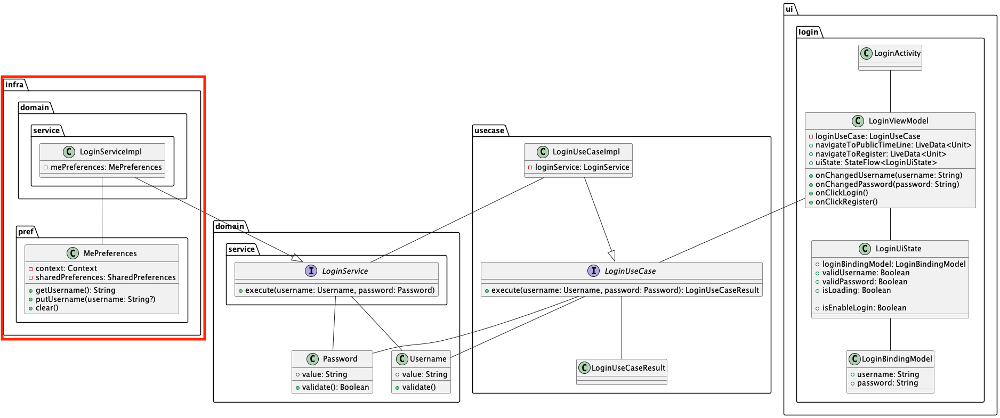

# ログイン画面のinfra層実装
ログイン画面のinfra層実装を行います。  

今回infra層で実装する内容は次の2つです。  
- MePreferencesの実装
- LoginServiceImplの実装
- CheckLoginServiceImplの実装

クラス図では次にあたります。  



## MePreferencesの実装

Yatterアプリでは認証情報としてユーザー名を扱います。  
ログインしているユーザーの`username`をアプリを実行しているデバイスに保存するために`MePreferences`を実装します。  

`MePrefrences`では、内部実装として[`SharedPreferences`](https://developer.android.com/training/data-storage/shared-preferences?hl=ja)というものを利用します。  
`SharedPreferences`とは、Key-Value形式でデバイス内にデータを保存するための仕組みです。  
アプリを終了した後も残り続け、アプリデータ削除もしくはアンインストールしない限りデータが残るためサーバーに保存しないようなアプリの設定を扱うために用いられます。  

`MePreferences`クラスを定義します。  
`SharedPreferences`ではPreferences名とKey-Value形式で扱うためのキー情報が必要なため固定値として持っておきます。  

`SharedPreferences`のインスタンスは`Context`から取得できるため引数にも追加します。  

```Kotlin
class MePreferences(context: Context) {
  companion object {
    private const val PREF_NAME = "me"
    private const val KEY_USERNAME = "username"
  }
}
```

実際にcontextからインスタンスを取得します。  
`Context.MODE_PRIVATE`とというモード指定をしていますが現状はこのモードしかサポートされていないため特に気にする必要はありません。  

```Kotlin
class MePreferences(context: Context) {
  ...
  private val sharedPreferences = context.getSharedPreferences(
    PREF_NAME,
    Context.MODE_PRIVATE
  )
}
```

SharedPreferencesに値を書き込み・取り出し・削除するためのメソッドを実装します。  

値を取り出すときは、`getString`のように`get~`なメソッド呼び出しだけで問題ありませんが、書き込みや削除の場合は最後に`apply()`する必要があるためお気を付けてください。  

```Kotlin
class MePreferences(...) {
  ...
  fun getUsername(): String? = sharedPreferences.getString(
    KEY_USERNAME,
    ""
  )

  fun putUserName(username: String?) {
    sharedPreferences.edit().putString(
      KEY_USERNAME,
      username
    ).apply()
  }

  fun clear() = sharedPreferences.edit().clear().apply()

}
```

ログインユーザーのユーザー名を記録する`MePreferences`を実装できたため、`LoginService`の実装を進めます。  

## LoginServiceImplの実装

まずは、`LoginServiceImpl`ファイルの作成です。  
domain層実装時に定義した`LoginService`インターフェースを継承してメソッドをオーバーライドします。  

```Kotlin
package com.dmm.bootcamp.yatter2023.infra.domain.service

class LoginServiceImpl(
  private val mePreferences: MePreferences
) : LoginService {
  override suspend fun execute(
    username: Username,
    password: Password,
  ) {
    TODO("Not yet implemented")
  }
}
```

DomainServiceは純粋な振る舞いを定義しますので、`LoginService`では渡されたユーザー名とパスワードをもとにログイン処理を行うことに注力して、ユーザー名とパスワードの値が問題ないかという部分の処理は呼び出し元で行うようにします。  

現状のYatterではユーザー名とパスワードが登録済みの情報と一致しているかというログイン処理は確認しておりません。  
そのため、`LoginServiceImpl`の処理としてもアプリ終了後でも再ログインが不要にするためにユーザー名を`MePreferences`に保存するのみにします。  

今後、API接続してさらに厳格なログイン処理を行う場合は`LoginServiceImpl`の処理を変更してください。  

```Kotlin
override suspend fun execute(...) {
  mePreferences.putUserName(username.value)
}
```

`LoginServiceImpl`も単体テストを記述してみましょう。  

<details>
<summary>LoginServiceImplのテスト例</summary>

```Kotlin
class LoginServiceImplSpec {
  private val mePreferences = mockk<MePreferences>()
  private val subject = LoginServiceImpl(mePreferences)

  @Test
  fun saveUsername() = runTest {
    val username = Username("username")
    val password = Password("Password1%")
    justRun {
      mePreferences.putUserName(any())
    }

    subject.execute(username, password)

    coVerify {
      mePreferences.putUserName(username.value)
    }
  }
}
```
</details>

つづいて、`CheckLoginServiceImpl`クラスの実装です。  
次の様に実装します。

```Kotlin
// infra/domain/service/CheckLoginServiceImpl.kt

internal class CheckLoginServiceImpl(
  private val mePreferences: MePreferencese,
) : CheckLoginService {
  override suspend fun execute(): Boolean {
    return mePreferences.getUsername() != ""
  }
}
```

CheckLoginServiceImplの単体テストも書いてみましょう。
今回のテストでは次の観点の確認ができると良さそうです。  

- MePreferencesに値が保存されていなければfalse
- MePreferencesに値が保存されていればtrue

<details>
<summary>CheckLoginServiceImplのテスト実装例</summary>

```Kotlin
class CheckLoginServiceImplSpec {
  private val mePreferences = mockk<MePreferences>()
  private val subject = CheckLoginServiceImpl(mePreferences)

  @Test
  fun getTrueWhenSavedUsername() = runTest {
    val username = "username"

    coEvery {
      mePreferences.getUsername()
    } returns username

    val result: Boolean = subject.execute()

    assertThat(result).isTrue()
  }

  @Test
  fun getFalseWhenUnsavedUsername() = runTest {
    val username = ""

    coEvery {
      mePreferences.getUsername()
    } returns username

    val result: Boolean = subject.execute()

    assertThat(result).isFalse()
  }
}
```

</details>

---

ここまでで`MePreferences`と`LoginService`、`CheckLoginService`とが属するinfra層の実装は完了しました。  

続いてusecase層の実装に移ります。  
