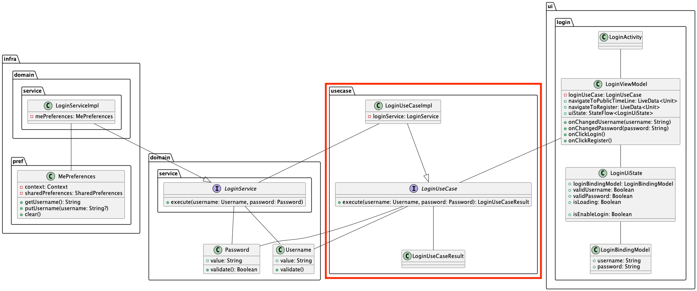

# ログイン機能のusecase層実装
ログイン機能のusecase層実装を行います。  



## UseCaseの説明
UseCaseは副作用を伴うような業務手順をロジックとしてコードに落とし込みます。  

ログインのユースケースとして次の業務手順が必要になると考えられます。  

1. ユーザー名とパスワードを受け取る
2. ユーザー名が空でないかの確認
3. パスワードが空でないかの確認
4. パスワードのバリデーションチェックが通過するかの確認
5. ログイン処理

UI層で弾く予定の処理も含まれますが、UseCaseは複数箇所から呼ばれる可能性もありその呼び出し元全てにおいて、ログインするために必要な確認・処理を実装する方針にすると実装ミスや漏れが発生しやすい部分になりますのでUseCseでもきちんと確認できるように実装します。  

UseCaseを実装する際には1つのUseCaseに対して、3つのファイルを作成します。  

- UseCase(interface)
- UseCaseResult(sealed class)
- UseCaseImpl(class)

の3つです。  

UseCase(interface)とUseCaseImpl(class)自体はRepositoryやDomainServiceで実装した時と同様なイメージです。  

UseCaseの戻り値はResultとして値を返すようにします。ResultのFailureは、UseCase層での関心事(バリデーションなど)で起きうるエラーを定義し、UseCase層以外の関心事(ネットワークエラーなど)に関してはOtherErrorとして定義します。  

UseCaseの実行結果をResultとして表現することによりUseCase内で行われるさまざまなロジックのうち、どこでどのような問題が発生したのか明確化し呼び出し元で発生した問題に合わせた対応をすることができます。  

## LoginUseCaseの実装

では、実装に入ります。  
ログインのUseCaseのinterfaceとResultは`usecase/login`パッケージ内にファイルを作成し、UseCaseImplのみ`usecase/impl/login`パッケージ内にファイル作成します。  

まずはUseCaseReultの定義からです。今回のログイン実装では次の内容を定義します。  

- 成功
- 失敗
  - ユーザー名が空
  - パスワードが空
  - パスワードのバリデーションチェックが遠らない
  - その他のエラー

UseCaseResultは[`sealed class/interface`](https://kotlinlang.org/docs/sealed-classes.html)で定義すると扱いやすいです。  

sealed interfaceで`UseCaseResult`と`Failure`を定義し、継承することでUseCaseResultを表現します。  

```Kotlin
sealed interface LoginUseCaseResult {
  object Success : LoginUseCaseResult
  sealed interface Failure : LoginUseCaseResult {
    object EmptyUsername : Failure
    object EmptyPassword : Failure
    object InvalidPassword : Failure
    data class OtherError(val throwable: Throwable) : Failure
  }
}
```

---

続いては、UseCase(interface)を定義します。  
基本的にはDomainServiceの定義と同じような書き方で、先ほど定義したUseCaseResultを返却するようにします。  

```Kotlin
interface LoginUseCase {
  suspend fun execute(
    username: Username,
    password: Password,
  ): LoginUseCaseResult
}
```

---

それでは、`LoginUseCaseImpl`の実装に移ります。  

まずは、`LoginUseCase`を継承して、必要なメソッドをオーバーライドします。  
引数に`LoginService`を受け取り、利用できるようにします。  

```Kotlin
internal class LoginUseCaseImpl(
  private val loginService: LoginService,
) : LoginUseCase {

  override suspend fun execute(
    username: Username,
    password: Password
  ): LoginUseCaseResult {
    TODO("Not yet implemented")
  }
}
```

executeメソッドの実装を進めます。  
`username`、`password`が空文字であった場合の結果を返却します。  
ユーザー名とパスワードが空の状態でUseCaseに渡されたことを`LoginUserCaseResult.Failure`の適した値を返却することで表現しています。  

```Kotlin
override suspend fun execute(...): LoginUseCaseResult {
  if (username.value.isBlank()) return LoginUseCaseResult.Failure.EmptyUsername
  if (password.value.isBlank()) return LoginUseCaseResult.Failure.EmptyPassword
}

```

続いて、パスワードが空文字でなくともdomain層の実装で定義していたパスワードのバリデーションチェックが通っていない場合も失敗のUseCaseResultを返します。  

```Kotlin
override suspend fun execute(...): LoginUseCaseResult {
  ...
  if (!password.validate()) return LoginUseCaseResult.Failure.InvalidPassword
}
```

最後にinfra層で実装した`LoginService`を呼び出してログイン処理を行います。  

```Kotlin
override suspend fun execute(...): LoginUseCaseResult {
  ...
  loginService.execute(username, password)
}
```

全ての処理が完了したら呼び出し元に問題なく完了したことを伝えるために、`Success`を返却します。  

```Kotlin
override suspend fun execute(...): LoginUseCaseResult {
  ...
  return LoginUseCaseResult.Success
}
```

さらに、UseCase内の一連の処理の中でUseCaseResultで定義していない例外が発生した時に`OtherError`として呼び出し元に返却できるように全体の処理を`try/catch`でラップします。  

```Kotlin
class LoginUseCaseImpl(...) {
  suspend fun execute(...) {
    try {
      if (...) {...}
      ...
    } catch (e: Exception) {
      return LoginUseCaseResult.Failure.OtherError(e)
    }
  }
}
```

これにてLoginUseCaseの実装は完了です。  

<details>
<summary>LoginUseCaseの実装全体</summary>

```Kotlin
internal class LoginUseCaseImpl(
  private val loginService: LoginService,
) : LoginUseCase {
  override suspend fun execute(
    username: Username,
    password: Password
  ): LoginUseCaseResult {
    try {
      if (username.value.isBlank()) return LoginUseCaseResult.Failure.EmptyUsername
      if (password.value.isBlank()) return LoginUseCaseResult.Failure.EmptyPassword

      if (!password.validate()) return LoginUseCaseResult.Failure.InvalidPassword
      loginService.execute(username, password)

      return LoginUseCaseResult.Success
    } catch (e: Exception) {
      return LoginUseCaseResult.Failure.OtherError(e)
    }
  }
}
```

</details>

---

### LoginUseCaseImplの単体テスト
`LoginUseCaseImpl`にも単体テストを書いてみましょう。  
UseCaseには成功以外にも失敗ケースも定義していますので、そのテストも記述しましょう。  
テストの実装が完了したら次のテスト例を参考に抜けているテストがないか確認して、`LoginUseCaseImpl`の処理に問題ないか検証します。  

<details>
<summary>LoginUseCaseImplのテスト例</summary>

```Kotlin
class LoginUseCaseImplSpec {
  private val loginService = mockk<LoginService>()
  private val subject = LoginUseCaseImpl(loginService)

  @Test
  fun loginSuccess() = runTest {
    val username = Username("username")
    val password = Password("Password1%")

    coJustRun {
      loginService.execute(any(), any())
    }

    val result = subject.execute(username, password)

    coVerify {
      loginService.execute(username, password)
    }

    assertThat(result).isEqualTo(LoginUseCaseResult.Success)
  }

  @Test
  fun loginFailureUsernameEmpty() = runTest {
    val username = Username("")
    val password = Password("Password1%")

    coJustRun {
      loginService.execute(any(), any())
    }

    val result = subject.execute(username, password)

    coVerify(inverse = true) {
      loginService.execute(any(), any())
    }

    assertThat(result).isEqualTo(LoginUseCaseResult.Failure.EmptyUsername)
  }

  @Test
  fun loginFailurePasswordEmpty() = runTest {
    val username = Username("username")
    val password = Password("")

    coJustRun {
      loginService.execute(any(), any())
    }

    val result = subject.execute(username, password)

    coVerify(inverse = true) {
      loginService.execute(any(), any())
    }

    assertThat(result).isEqualTo(LoginUseCaseResult.Failure.EmptyPassword)
  }

  @Test
  fun loginFailurePasswordInvalid() = runTest {
    val username = Username("username")
    val password = Password("password")

    coJustRun {
      loginService.execute(any(), any())
    }

    val result = subject.execute(username, password)

    coVerify(inverse = true) {
      loginService.execute(any(), any())
    }

    assertThat(result).isEqualTo(LoginUseCaseResult.Failure.InvalidPassword)
  }

  @Test
  fun loginFailurePasswordOther() = runTest {
    val username = Username("username")
    val password = Password("Password1%")
    val error = Exception()

    coEvery {
      loginService.execute(any(), any())
    } throws error

    val result = subject.execute(username, password)

    coVerify {
      loginService.execute(any(), any())
    }

    assertThat(result).isEqualTo(LoginUseCaseResult.Failure.OtherError(error))
  }

}
```

</details>

