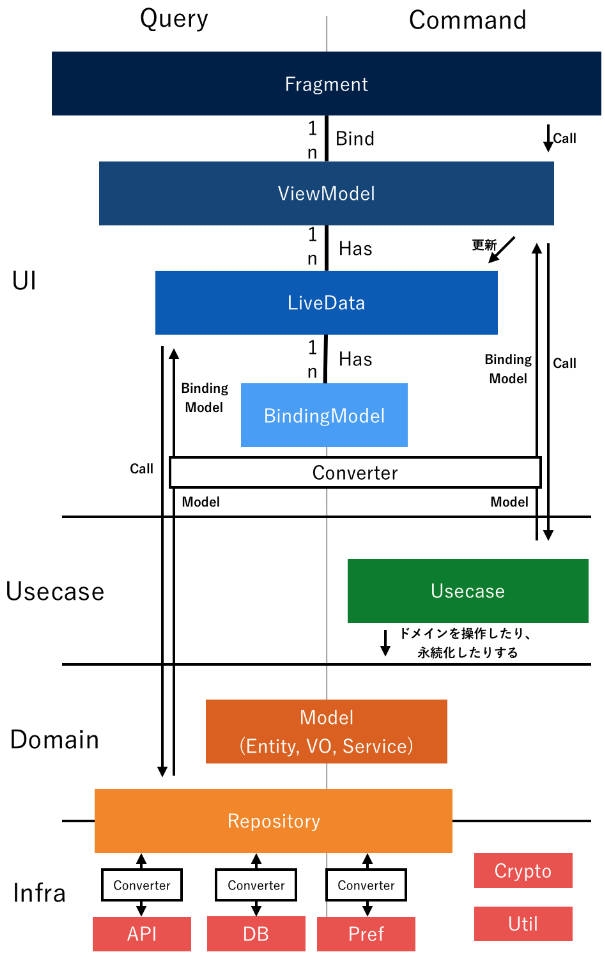

# ツイート画面の実装
ツイート画面はツイートを作成して投稿するための画面です。

設計方針のうち、パブリックタイムライン画面ではQuery部分を、ログイン画面ではCommand部分を実装しました。

ツイート画面では、QueryとCommandの両方が必要になります。

## 完成イメージ

## 全体像
ツイート画面には次の要素があります。

- Query
  - ツイート者のアイコン表示
  - ツイート者のトークン取得
- Command
  - 入力されたツイート内容の送信

ツイート画面全体の設計は以下の通りです。

※今回の研修では、「ui」と書かれた部分を実装していきます。
その他の部分は`/appendix`に解説があるので、時間がある方は読んでみてください。

