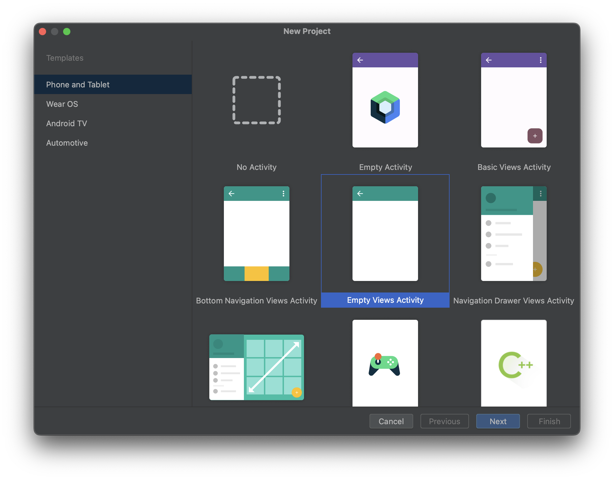
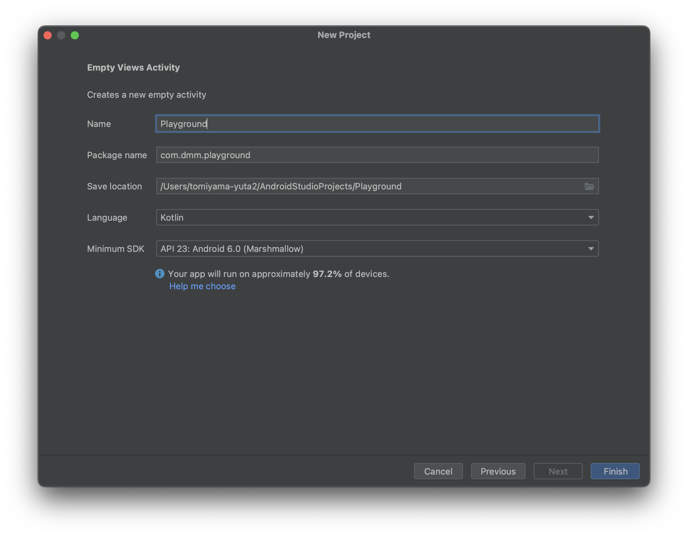
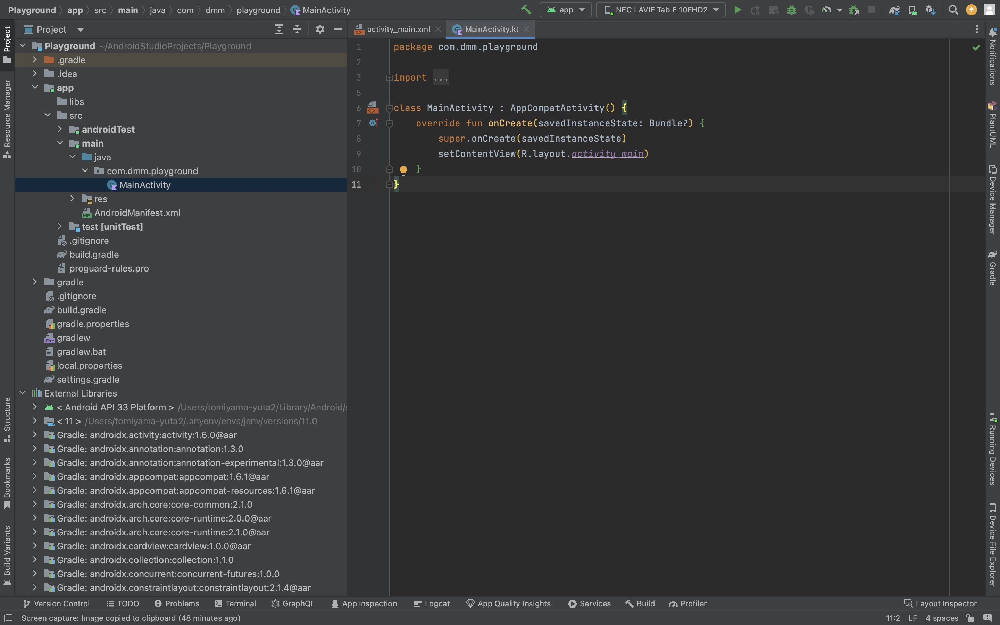

# はじめに
この資料では、Jetpack Composeでない、従来のAndroidアプリ開発についてハンズオン形式で解説します。

こちらは必須ではありません。解説も多めなので、余裕のある人、もしくはAndroidアプリ開発について更に知りたいという人が見てもらえればと思います。

# プロジェクトのセットアップ

Android Studioの `File` -> `New` -> `New Project` から新しいプロジェクトを作ります。

今回は `Empty Views Activity` を選びます。



`Name` と `Package name` はなんでもいいのですが、他のプロジェクトにかぶらないようにしましょう。



`Finish` をクリックすればプロジェクトが作成されます。



`app/build.gradle` を開き、 `android {}` セクションに以下のように `viewBinding` と `dataBinding` の設定を追加します。

```gradle
android {
    ...
  
    viewBinding {
        enabled = true
    }
    dataBinding {
        enabled = true
    }
}
```

一旦セットアップは完了です。
