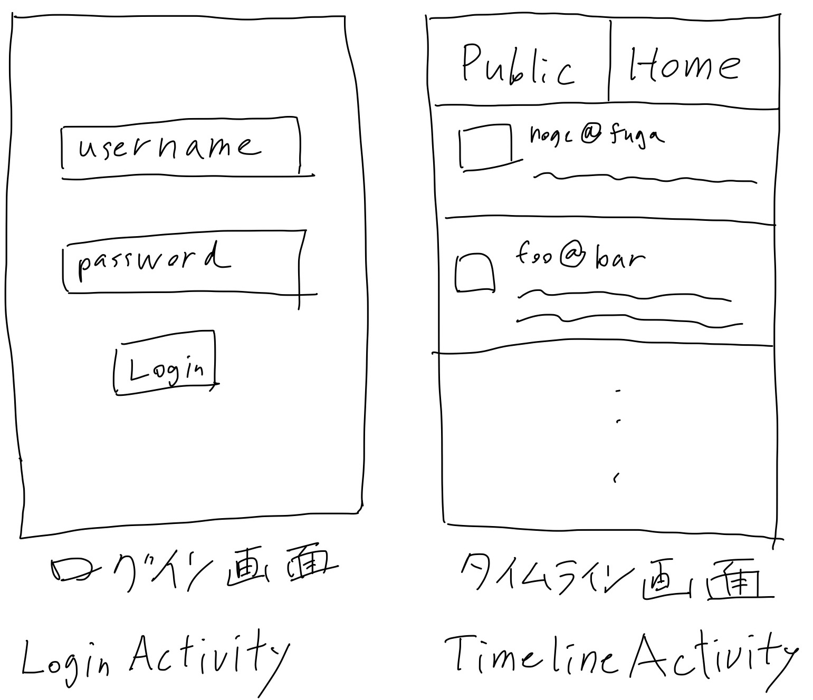
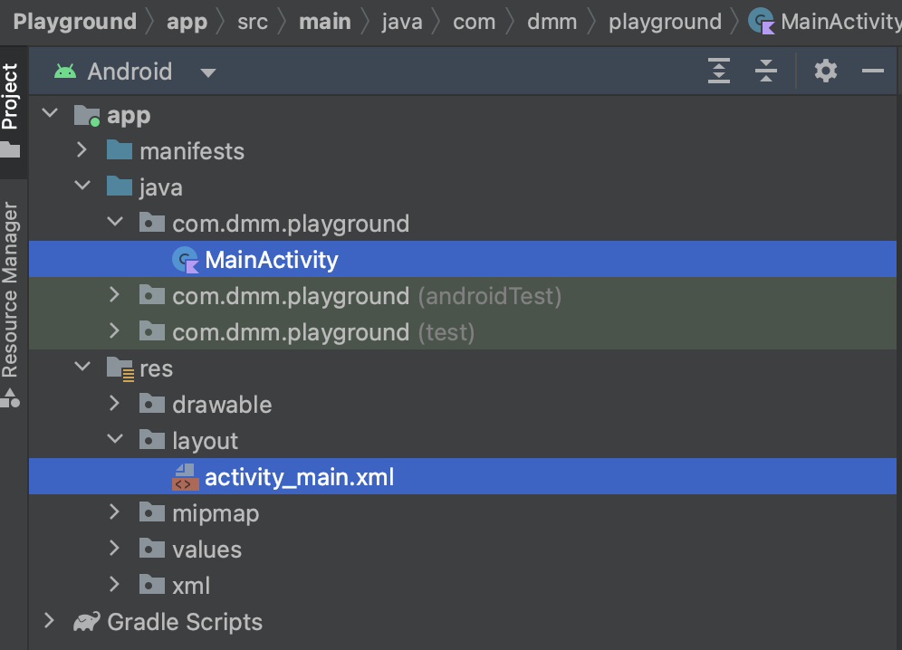

# Activityについて

Androidの最も重要なコンポーネントの1つに、 `Activity` があります。

多くのモバイルアプリは、複数の画面で構築されています。ActivityはJavaのclassとして提供され、それを継承することで1つの画面を実装します。



この図には2つの画面がありますが、それぞれに対応するActivityがあります。

Activityは基本的にはJava/KotlinのコードとXMLのレイアウトファイルをセットで扱います。Android StudioからActivityを新規作成すると、ActivityのKotlinファイルとレイアウトのXMLファイルが同時に生成されます。



## Hello Worldまで

生成された `MainActivity.kt` と `activity_main.xml` を見てみましょう。

```kotlin
class MainActivity : AppCompatActivity() {
    override fun onCreate(savedInstanceState: Bundle?) {
        super.onCreate(savedInstanceState)
        setContentView(R.layout.activity_main)
    }
}
```

```xml
<?xml version="1.0" encoding="utf-8"?>
<androidx.constraintlayout.widget.ConstraintLayout xmlns:android="http://schemas.android.com/apk/res/android"
    xmlns:app="http://schemas.android.com/apk/res-auto"
    xmlns:tools="http://schemas.android.com/tools"
    android:layout_width="match_parent"
    android:layout_height="match_parent"
    tools:context=".MainActivity">

    <TextView
        android:layout_width="wrap_content"
        android:layout_height="wrap_content"
        android:text="Hello World!"
        app:layout_constraintBottom_toBottomOf="parent"
        app:layout_constraintEnd_toEndOf="parent"
        app:layout_constraintStart_toStartOf="parent"
        app:layout_constraintTop_toTopOf="parent" />

</androidx.constraintlayout.widget.ConstraintLayout>
```

Activityは `setContentView` で表示するレイアウトを指定しています。

レイアウトのXMLで `TextView` の `android:text` に `Hello World!` という文字列が設定されているのがわかると思います。

この状態でビルドし実行すると、画面に `Hello World!` が表示されます。

## ライフサイクルについて

Activityは、以下の図のようなライフサイクルがあります。


Activityにはライフサイクルのそれぞれのイベントに対応したメソッドがあり、それをオーバーライドすることによりそれぞれのイベントに応じた処理ができます。

実際に以下のようにActivityの各メソッドをオーバーライドしてみましょう。

```kotlin
class MainActivity : AppCompatActivity() {

    private val tag = this::class.java.name

    override fun onCreate(savedInstanceState: Bundle?) {
        Log.d(tag, "Activity onCreate")
        super.onCreate(savedInstanceState)
        setContentView(R.layout.activity_main)
    }

    override fun onStart() {
        Log.d(tag, "Activity onStart")
        super.onStart()
    }

    override fun onRestart() {
        Log.d(tag, "Activity onRestart")
        super.onRestart()
    }

    override fun onResume() {
        Log.d(tag, "Activity onResume")
        super.onResume()
    }

    override fun onPause() {
        Log.d(tag, "Activity onPause")
        super.onPause()
    }

    override fun onStop() {
        Log.d(tag, "Activity onStop")
        super.onStop()
    }

    override fun onDestroy() {
        Log.d(tag, "Activity onDestroy")
        super.onDestroy()
    }
}
```

これでビルドしてアプリを起動してみましょう。アプリを閉じたり開いたりしていると、先程のライフサイクルの図のような順番でLogcatのログが流れているのが確認できると思います。

```
Activity onCreate
Activity onStart
Activity onResume
Activity onPause
Activity onStop
Activity onRestart
Activity onStart
Activity onResume
Activity onPause
Activity onStop
Activity onDestroy
```

## おまけ: マニフェストについて
追加したActivityは、アプリのマニフェストで宣言する必要があります。Android StudioからActivityを新規追加した場合は自動で `AndroidManifest.xml` が更新されるので今回は編集する必要はありませんが、手動でActivityを追加した場合は手動でActivityを宣言する必要があります。

```xml
<?xml version="1.0" encoding="utf-8"?>
<manifest xmlns:android="http://schemas.android.com/apk/res/android"
    xmlns:tools="http://schemas.android.com/tools">

    <application
        android:allowBackup="true"
        android:dataExtractionRules="@xml/data_extraction_rules"
        android:fullBackupContent="@xml/backup_rules"
        android:icon="@mipmap/ic_launcher"
        android:label="@string/app_name"
        android:roundIcon="@mipmap/ic_launcher_round"
        android:supportsRtl="true"
        android:theme="@style/Theme.Playground"
        tools:targetApi="31">
        <activity
            android:name=".MainActivity"
            android:exported="true">
            <intent-filter>
                <action android:name="android.intent.action.MAIN" />

                <category android:name="android.intent.category.LAUNCHER" />
            </intent-filter>
        </activity>
    </application>

</manifest>
```

`<activity>` セクションの解説を軽くします。

`android:name` は宣言するActivityのclass名です。通常は `com.dmm.yatter.MainActivity` のように完全修飾クラス名ですが、この例のように最初の文字をピリオドにした場合は、 `build.gradle` で指定した `namespace` がprefixになります。

```
namespace 'com.dmm.playground'
```

`android:exported` は、Activityをアプリの起動画面として設定したい場合や、他のアプリからそのActivityを起動させたい場合にtrueに設定します。

`<intent-filter>` セクションに `<action android:name="android.intent.action.MAIN" />` と `<category android:name="android.intent.category.LAUNCHER" />` があります。これは、アプリをランチャーに表示する(ホーム画面などから起動できるようにする)のに必要な設定です。これにより、指定したActivityがホーム画面などからアプリを開いた際に起動します。

