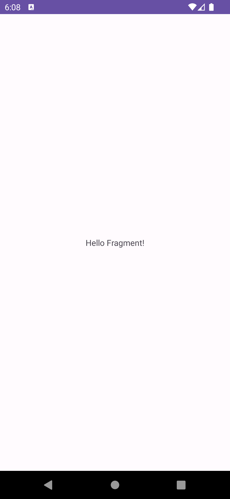

# Fragmentについて

AndroidのUIを構築する際の基本的なコンポーネントの1つに `Fragment` があります。

Fragmentの使い方はActivityと似ています。Javaのclassとして提供されていて、それを継承して使います。Activityと同じく、レイアウトのXMLがあります。

Fragmentは、Activityとは別の独自のライフサイクルがあり、Activityの実行中に追加・削除ができます。Activityと違い、1つのFragmentを複数のActivityや別のFragmentから再利用できます。また、1つのActivityで複数のActivityを扱うこともできます。


## Fragmentをプロジェクトに追加する

Fragmentをプロジェクトに追加しましょう。

Android Studioの機能を使って追加してもいいですが、余計なコードが生成されるのでそれを消すのがめんどくさい場合は直接Kotlinファイルとxmlファイルを追加してもいいです。


とりあえず、画面に `Hello Fragment!` と表示させる簡単なFragmentにします。

```kotlin
class FirstFragment : Fragment() {
    override fun onCreateView(
        inflater: LayoutInflater,
        container: ViewGroup?,
        savedInstanceState: Bundle?
    ): View? {
        return inflater.inflate(R.layout.fragment_first, container, false)
    }
}
```

```xml
<?xml version="1.0" encoding="utf-8"?>
<androidx.constraintlayout.widget.ConstraintLayout xmlns:android="http://schemas.android.com/apk/res/android"
    xmlns:app="http://schemas.android.com/apk/res-auto"
    android:layout_width="match_parent"
    android:layout_height="match_parent">

    <TextView
        android:layout_width="wrap_content"
        android:layout_height="wrap_content"
        android:text="Hello Fragment!"
        app:layout_constraintBottom_toBottomOf="parent"
        app:layout_constraintEnd_toEndOf="parent"
        app:layout_constraintStart_toStartOf="parent"
        app:layout_constraintTop_toTopOf="parent" />

</androidx.constraintlayout.widget.ConstraintLayout>
```

Fragmentは、 `inflater.inflate(R.layout.fragment_first, container, false)` のようにしてlayoutファイルを指定してViewを生成します。

レイアウトのxmlの書き方は基本的にActivityと同じです。

## ActivityにFragmentを追加する

ActivityにFragmentを追加する方法は2種類あります。

### Activityのレイアウトのxmlでfragmentタグを使う

以下のように、 `activity_main.xml` を書き換えてみましょう。

```xml
<?xml version="1.0" encoding="utf-8"?>
<fragment xmlns:android="http://schemas.android.com/apk/res/android"
    xmlns:app="http://schemas.android.com/apk/res-auto"
    xmlns:tools="http://schemas.android.com/tools"
    android:layout_width="match_parent"
    android:layout_height="match_parent"
    android:name="com.dmm.playground.FirstFragment"
    tools:context=".MainActivity" />
```

`android.name` 属性に表示させたいFragmentのpathを指定しています。

これで `MainActivity` に `FirstFragment` を表示させることができます。



### ViewGroupにプログラムでFragmentを追加する

プログラムからFragmentをActivityに追加するやり方です。 `activity_main.xml` を以下のように書き換えます。

```xml
<?xml version="1.0" encoding="utf-8"?>
<androidx.fragment.app.FragmentContainerView xmlns:android="http://schemas.android.com/apk/res/android"
    xmlns:app="http://schemas.android.com/apk/res-auto"
    xmlns:tools="http://schemas.android.com/tools"
    android:id="@+id/fragment_container_view"
    android:layout_width="match_parent"
    android:layout_height="match_parent"
    tools:context=".MainActivity" />
```

`MainActivity.kt` の `onCreate` を以下のように書き換えます。

```kotlin
override fun onCreate(savedInstanceState: Bundle?) {
    Log.d(tag, "Activity onCreate")
    super.onCreate(savedInstanceState)
    setContentView(R.layout.activity_main)
    if (savedInstanceState == null) {
        val fragment = FirstFragment()
        supportFragmentManager
            .beginTransaction()
            .replace(R.id.fragment_container_view, fragment)
            .commitNow()
    }
}
```

`replace` でFragmentを表示させたいActivityのViewのidと表示させたいFragmentのインスタンスを指定しています。

これで実行すると、先程と同じようにFragmentの画面が表示されると思います。

## Fragmentのライフサイクルについて

FragmentにもActivityのようにライフサイクルがあります。


Activityと同じように、それぞれの状態に応じたメソッドがFragmentにはあります。オーバーライドして動作を確かめてみましょう。

```kotlin
class FirstFragment : Fragment() {

    private val tag = this::class.java.name

    override fun onAttach(context: Context) {
        Log.d(tag, "Fragment onAttach")
        super.onAttach(context)
    }

    override fun onCreate(savedInstanceState: Bundle?) {
        Log.d(tag, "Fragment onCreate")
        super.onCreate(savedInstanceState)
    }

    override fun onCreateView(
        inflater: LayoutInflater,
        container: ViewGroup?,
        savedInstanceState: Bundle?
    ): View? {
        Log.d(tag, "Fragment onCreateView")
        return inflater.inflate(R.layout.fragment_first, container, false)
    }

    override fun onActivityCreated(savedInstanceState: Bundle?) {
        Log.d(tag, "Fragment onActivityCreated")
        super.onActivityCreated(savedInstanceState)
    }

    override fun onStart() {
        Log.d(tag, "Fragment onStart")
        super.onStart()
    }

    override fun onResume() {
        Log.d(tag, "Fragment onResume")
        super.onResume()
    }

    override fun onPause() {
        Log.d(tag, "Fragment onPause")
        super.onPause()
    }

    override fun onStop() {
        Log.d(tag, "Fragment onStop")
        super.onStop()
    }

    override fun onDestroyView() {
        Log.d(tag, "Fragment onDestroyView")
        super.onDestroyView()
    }

    override fun onDestroy() {
        Log.d(tag, "Fragment onDestroy")
        super.onDestroy()
    }

    override fun onDetach() {
        Log.d(tag, "Fragment onDetach")
        super.onDetach()
    }
}
```

ビルドし、アプリを起動して閉じたり開いたりしてみて、Logcatを見てみましょう。

```
Activity onCreate
Fragment onAttach
Fragment onCreate
Fragment onCreateView
Fragment onActivityCreated
Fragment onStart
Activity onStart
Activity onResume
Fragment onResume
Fragment onPause
Activity onPause
Fragment onStop
Activity onStop
Activity onRestart
Fragment onStart
Activity onStart
Activity onResume
Fragment onResume
Fragment onPause
Activity onPause
Fragment onStop
Activity onStop
```

