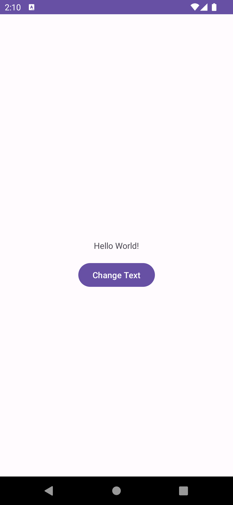

# よく使うLayout/Viewの紹介

XMLでAndroidのUIを実装するときによく使うViewをいくつか紹介します。

ちなみに、基本的に `〇〇Layout` は子要素を持つもの、 `〇〇View` は子要素を持たないものであることが多いです。(例外もあります)

### よく使う属性

XMLの属性に様々なパラメータを指定しながらUIを組みます。頻出する属性をいくつか紹介します。

- `android:layout_width` : 要素の横幅のサイズを指定します。`16dp` のようにdpで指定するほか、 `match_parent` で親要素いっぱいに表示する、 `wrap_content` で自分の要素の表示に必要な分だけ表示するということができます。
- `android:layout_height` : 要素の縦幅のサイズを指定します。使い方は `android:layout_width` と同じです。
- `android:id` : 要素にidを指定します。これでXMLの他の要素やプログラム上から参照可能になります。
- `android:layout_margin` : 他の要素との距離を16dpのように指定します。 `android:layout_margin` だと上下左右の4方向に指定したサイズのマージンが設定されます。上下左右を個別で指定したい場合は `android:layout_marginTop`, `android:layout_marginBottom`, `android:layout_marginStart`, `android:layout_marginEnd` を使います。
- `android:padding` : 要素の中での距離を16dpのように指定します。例えば `TextView` にpaddingを設定すると、TextViewの背景を含めた大きさの中で指定したサイズだけ文字と隙間ができます。また、 `ConstraintLayout` のように子要素を持つ要素に指定した場合は、自身と子要素の間の距離になります。marginと同じように、 `android:padding` だと上下左右方向に指定したpaddingが適用され、個別に適用したい場合は `android:paddingTop`, `android:paddingBottom`, `android:paddingStart`, `android:paddingEnd` を使います。
- `android:background` : 背景を指定します。色だけでなく、画像などのdrawable resourceを指定することもできます。

## ConstraintLayout

ActivityやFragmentのルートのViewとして使うことの多いLayoutです。親要素(画面の端など)や兄弟要素に対する制約ベースでUIを組みます。(画面上端から16dp, 画面左端から16dpのように)

```xml
<?xml version="1.0" encoding="utf-8"?>
<androidx.constraintlayout.widget.ConstraintLayout xmlns:android="http://schemas.android.com/apk/res/android"
    xmlns:app="http://schemas.android.com/apk/res-auto"
    android:layout_width="match_parent"
    android:layout_height="match_parent">

    <TextView
        android:id="@+id/text_view"
        android:layout_width="wrap_content"
        android:layout_height="wrap_content"
        android:text="Hello World!"
        app:layout_constraintBottom_toBottomOf="parent"
        app:layout_constraintEnd_toEndOf="parent"
        app:layout_constraintStart_toStartOf="parent"
        app:layout_constraintTop_toTopOf="parent" />

    <Button
        android:id="@+id/change_text_button"
        android:layout_width="wrap_content"
        android:layout_height="wrap_content"
        android:layout_marginTop="16dp"
        android:text="Change Text"
        app:layout_constraintStart_toStartOf="parent"
        app:layout_constraintTop_toBottomOf="@id/text_view"
        app:layout_constraintEnd_toEndOf="parent" />

</androidx.constraintlayout.widget.ConstraintLayout>
```



制約は、子要素の属性に `app:layout_constraintStart_toStartOf="parent"` のようにつけます。指定できる属性は以下の通りです。

- `app:layout_constraintTop_toTopOf` : 自身の上端から指定した要素の上端に制約を貼る
- `app:layout_constraintTop_toBottomOf` : 自身の上端から指定した要素の下端に制約を貼る
- `app:layout_constraintStart_toStartOf` : 自身の左端から指定した要素の左端に制約を貼る
- `app:layout_constraintStart_toEndOf` : 自身の左端から指定した要素の右端に制約を貼る
- `app:layout_constraintBottom_toBottomOf` : 自身の下端から指定した要素の下端に制約を貼る
- `app:layout_constraintBottom_toStartOf` : 自身の下端から指定した要素の上端に制約を貼る
- `app:layout_constraintEnd_toEndOf` : 自身の右端から指定した要素の右端に制約を貼る
- `app:layout_constraintEnd_toStartOf` : 自身の右端から指定した要素の左端に制約を貼る

ConstraintLayoutの子要素は、基本的には必ずこの制約を上下方向と左右方向にそれそれ最低1つ貼らなくてはいけません。上記の例のTextViewのように4方向すべてに貼ることもできますし、Buttonのように上方向に貼っている場合は下方向に制約を貼らずに使うこともできます。

## LinearLayout

Jetpack Composeの `Row`, `Column` のように1方向に子要素を並べるレイアウトです。

```xml
<?xml version="1.0" encoding="utf-8"?>
<LinearLayout xmlns:android="http://schemas.android.com/apk/res/android"
    xmlns:app="http://schemas.android.com/apk/res-auto"
    android:layout_width="match_parent"
    android:layout_height="match_parent"
    android:orientation="vertical">

    <TextView
        android:layout_width="wrap_content"
        android:layout_height="wrap_content"
        android:text="foo" />

    <TextView
        android:layout_width="wrap_content"
        android:layout_height="wrap_content"
        android:text="bar" />

</LinearLayout>
```


並べる方向を `android:orientation` で指定します。

## FrameLayout

Jetpack Composeの `Box` のように、z軸方向に要素を並べることができます。

後に書いた要素が前に表示されます。

```xml
<?xml version="1.0" encoding="utf-8"?>
<FrameLayout xmlns:android="http://schemas.android.com/apk/res/android"
    xmlns:app="http://schemas.android.com/apk/res-auto"
    android:layout_width="match_parent"
    android:layout_height="match_parent">

    <TextView
        android:layout_width="wrap_content"
        android:layout_height="wrap_content"
        android:textColor="#FF0000"
        android:textSize="60sp"
        android:text="foo" />

    <TextView
        android:layout_width="wrap_content"
        android:layout_height="wrap_content"
        android:textColor="#00FF00"
        android:textSize="40sp"
        android:text="bar" />

</FrameLayout>
```


## TextView

文字列を表示するためのViewです。文字列の表示に関する指定をする属性があります。いろいろありますが、代表的なものをいくつか紹介します。

- `android:text` : 表示する文字列を指定します。
- `android:textSize` : 表示するテキストのフォントサイズを `12sp` のように指定します。
- `android:textColor` : 表示するテキストの色を指定します。
- `android:textStyle` : `bold`, `italic`, `normal` を指定することができます。`bold|italic` のように、 `|` を使って組み合わせることもできます。ｌ

## EditText

文字列を入力するためのViewです。TextViewを継承しているため、上記のようなTextViewの属性が使えます。
EditTextで使える代表的な属性をいくつか紹介します。

- `android:inputType` : 入力したいテキストのタイプを指定します。いろいろありますが、代表的なものに `text`, `textEmailAddress`, `textPassword`, `phone` などがあります。これらに応じて、IMEのモードが切り替わったり、パスワードの場合には文字が*で隠されるなどがあります。
- `android:imeOptions` : キーボードのエンターキーで行う動作を指定します。 `actionDone`, `actionSend`, `actionSearch` などがあり、ユースケースによって使い分けます。

EditTextを使う場合、ボタンをクリックしたタイミングなどで入力した文字列をプログラム上で取得するという使い方をよくします。以下は、ボタンをクリックしたらTextViewに入力した文字列を表示させ、EditTextに入力した内容を消す例です。

```xml
<?xml version="1.0" encoding="utf-8"?>
<androidx.constraintlayout.widget.ConstraintLayout xmlns:android="http://schemas.android.com/apk/res/android"
    xmlns:app="http://schemas.android.com/apk/res-auto"
    android:layout_width="match_parent"
    android:layout_height="match_parent">

    <EditText
        android:id="@+id/edit_text"
        android:layout_width="128dp"
        android:layout_height="wrap_content"
        app:layout_constraintStart_toStartOf="parent"
        app:layout_constraintTop_toTopOf="parent"
        app:layout_constraintEnd_toEndOf="parent"
        app:layout_constraintBottom_toBottomOf="parent" />

    <TextView
        android:id="@+id/text_view"
        android:layout_width="wrap_content"
        android:layout_height="wrap_content"
        app:layout_constraintStart_toStartOf="parent"
        app:layout_constraintTop_toBottomOf="@id/edit_text"
        app:layout_constraintEnd_toEndOf="parent" />

    <Button
        android:id="@+id/change_text_button"
        android:layout_width="wrap_content"
        android:layout_height="wrap_content"
        android:layout_marginTop="16dp"
        android:text="Set Text"
        app:layout_constraintStart_toStartOf="parent"
        app:layout_constraintTop_toBottomOf="@id/text_view"
        app:layout_constraintEnd_toEndOf="parent" />

</androidx.constraintlayout.widget.ConstraintLayout>
```

```kotlin
override fun onCreateView(
    inflater: LayoutInflater,
    container: ViewGroup?,
    savedInstanceState: Bundle?
): View {
    val binding = FragmentFirstBinding.inflate(inflater, container, false)
    binding.changeTextButton.setOnClickListener {
        val text = binding.editText.text.toString()
        binding.textView.text = text
        binding.editText.setText("")
    }
    return binding.root
}
```


## Button

ボタンのViewです。

- `android:text` : ボタンに表示するテキストを指定します。
- `android:backgroundTint` : ボタンの背景色を指定します。
- `android:cliclable` : クリック可能かどうかtrue/falseで指定します。

色や形など、さらに細かくスタイルを指定したい場合は、 `style` 属性にstyle resourceを指定します。

プログラム上で `setOnClickListener` を呼び出すことでクリックされたときの動作を指定できます。(EditTextの例を参照)

## ImageView

画像を表示するViewです。

画像のresourceを属性に指定して表示することや端末に保存されている画像を表示できるほか、別の章で解説しますがライブラリを使うことによってネットワーク上の画像を表示することもできます。

- `android:src` : 表示したい画像のresourceを指定します。
- `android:contentDescription` : 目が不自由な人のための機能(talkback)でここに指定した文字列が読み上げられます。
- `android:scaleType` : 画像の表示方法を指定します。次の2つがよく使われます。
  - `fitCenter` : 画像が中央を基準にImageViewに収まり、かつ幅・高さのいずれかがImageViewのサイズに一致するように画像が拡大・縮小されます。
  - `centerCrop` : 画像がImageViewの中央に表示され、ImageView全体を覆うまで拡大・縮小されます。


```xml
  <?xml version="1.0" encoding="utf-8"?>
<androidx.constraintlayout.widget.ConstraintLayout xmlns:android="http://schemas.android.com/apk/res/android"
    xmlns:app="http://schemas.android.com/apk/res-auto"
    android:layout_width="match_parent"
    android:layout_height="match_parent">

    <ImageView
        android:layout_width="300dp"
        android:layout_height="wrap_content"
        android:src="@mipmap/ic_launcher"
        android:contentDescription="app icon"
        android:scaleType="fitCenter"
        app:layout_constraintStart_toStartOf="parent"
        app:layout_constraintTop_toTopOf="parent"
        app:layout_constraintBottom_toBottomOf="parent"
        app:layout_constraintEnd_toEndOf="parent" />

</androidx.constraintlayout.widget.ConstraintLayout>
```

## ImageButton

画像をボタンとして扱うためのViewです。ImageViewを継承しているため、上記の属性が使えます。

## RecyclerView

リスト表示などに使うViewです。使い方が複雑なため、別の章で解説します。
