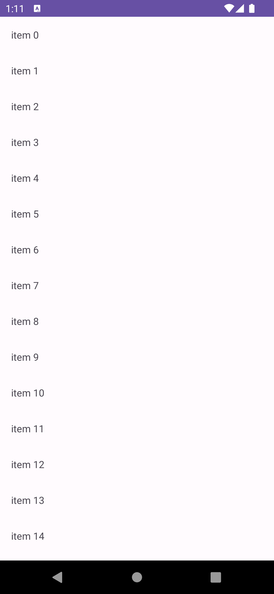

# RecyclerViewについて

`RecyclerView` はリスト表示をする際に使うViewです。

RecyclerViewを使うには、いくつかのステップがあります。

1. レイアウトのXMLにRecyclerViewの要素を追加する
2. リストの要素のレイアウトのXMLを実装する
3. リストの要素のViewHolderを実装する
4. RecyclerViewのAdapterを実装する
5. RecyclerViewにAdapterをセットする

## レイアウトのXMLにRecyclerViewの要素を追加する

今回はFragmentのレイアウトのXMLにRecyclerViewを追加します。

今回はRecyclerViewしかない画面を例として考えるので、ルートの要素をRecyclerViewにしています。

```xml
<?xml version="1.0" encoding="utf-8"?>
<androidx.recyclerview.widget.RecyclerView xmlns:android="http://schemas.android.com/apk/res/android"
    xmlns:app="http://schemas.android.com/apk/res-auto"
    android:id="@+id/recycler_view"
    android:layout_width="match_parent"
    android:layout_height="match_parent"
    app:layoutManager="androidx.recyclerview.widget.LinearLayoutManager" />
```

## リストの要素のレイアウトのXMLを実装する

リストの中の1要素は別のレイアウトのファイルで表現します。

今回はテキストを1つ表示するだけの簡単なレイアウトを例にします。 `view_item.xml` というファイル名で `app/res/layout` に追加しましょう。

```xml
<?xml version="1.0" encoding="utf-8"?>
<androidx.constraintlayout.widget.ConstraintLayout xmlns:android="http://schemas.android.com/apk/res/android"
    xmlns:app="http://schemas.android.com/apk/res-auto"
    android:layout_width="match_parent"
    android:layout_height="wrap_content">

    <TextView
        android:id="@+id/item_text_view"
        android:layout_width="wrap_content"
        android:layout_height="wrap_content"
        android:layout_marginStart="16dp"
        android:layout_marginTop="16dp"
        android:layout_marginBottom="16dp"
        app:layout_constraintStart_toStartOf="parent"
        app:layout_constraintTop_toTopOf="parent"
        app:layout_constraintBottom_toBottomOf="parent" />

</androidx.constraintlayout.widget.ConstraintLayout>
```

## リスト要素のViewHolderを実装する

RecyclerViewはリストの1要素を表すclassです。RecylerViewのAdapterからbindされたタイミングでデータを渡され、それを元に画面に表示します。

ViewHolderのインスタンス化には表示するViewのインスタンスを渡す必要があります。今回は、ViewBindingを用います。

```kotlin
class ItemViewHolder private constructor(
    private val binding: ViewItemBinding,
) : RecyclerView.ViewHolder(binding.root) {

    fun bind(text: String) {
        binding.itemTextView.text = text
    }

    companion object {
        fun create(
            inflater: LayoutInflater,
            container: ViewGroup,
            attachToRoot: Boolean,
        ): ItemViewHolder {
            return ItemViewHolder(
                ViewItemBinding.inflate(
                    inflater,
                    container,
                    attachToRoot,
                )
            )
        }
    }
}
```

`bind` メソッドはRecyclerViewのAdapterから呼び出します。

## RecyclerViewのAdapterを実装する

Adapterは、ViewHolderの生成・管理やRecyclerViewに表示させるアイテム自体の管理を行います。

今回は、表示させるViewHolderが1種類しか扱えないかわりに、アイテムリストの変更をよしなに反映してくれる `ListAdapter` を使って実装します。

```kotlin
class ItemListAdapter : ListAdapter<String, ItemViewHolder>(itemCallback) {
    override fun onCreateViewHolder(parent: ViewGroup, viewType: Int): ItemViewHolder {
        return ItemViewHolder.create(
            LayoutInflater.from(parent.context),
            parent,
            false,
        )
    }

    override fun onBindViewHolder(holder: ItemViewHolder, position: Int) {
        holder.bind(getItem(position))
    }

    companion object {
        private val itemCallback = object : DiffUtil.ItemCallback<String>() {
            override fun areItemsTheSame(oldItem: String, newItem: String): Boolean {
                return oldItem == newItem
            }

            override fun areContentsTheSame(oldItem: String, newItem: String): Boolean {
                return oldItem == newItem
            }
        }
    }
}
```

アイテムリストの変更を検知するための `DiffUtil.ItemCallback` をListAdapterのインスタンス化時に渡しています。今回は単純に文字列のみのデータのため単純な比較で実装していますが、もっと複雑なデータであれば、 `areItemsTheSame` で同じアイテムとして扱うかどうかを、 `areContentsTheSame` で内容まで同じかどうかを判定します。

`onCreateViewHolder` では、ViewHolderのインスタンス化をします。 `ItemViewHolder` のcompanion objectに `create` メソッドを実装してあるので、今回はそれを呼び出すだけです。

`onBindViewHolder` では、リストのn番目の要素のデータをViewHolderに渡します。引数のpositionをリストのindexとして扱います。ListAdapterは内部でアイテムリストを持っていて、 `getItem` で指定したindexの要素を取得できるので、それで取得して `ItemViewHolder` の `bind` メソッドに渡しています。

## RecyclerViewにAdapterをセットする

AdapterをRecyclerViewにセットし、表示させるデータをセットします。

```kotlin
override fun onCreateView(
    inflater: LayoutInflater,
    container: ViewGroup?,
    savedInstanceState: Bundle?
): View {
    val binding = FragmentFirstBinding.inflate(inflater, container, false)
    val itemList = List(100) {
        "item $it"
    }
    val adapter = ItemListAdapter()
    adapter.submitList(itemList)
    binding.recyclerView.adapter = adapter
    return binding.root
}
```

`submitList` でAdapterにリストのデータを渡し、RecyclerViewの表示を更新します。

RecyclerViewにadapterをセットすればOKです。

ビルドして実行すると、以下のように表示されると思います。


