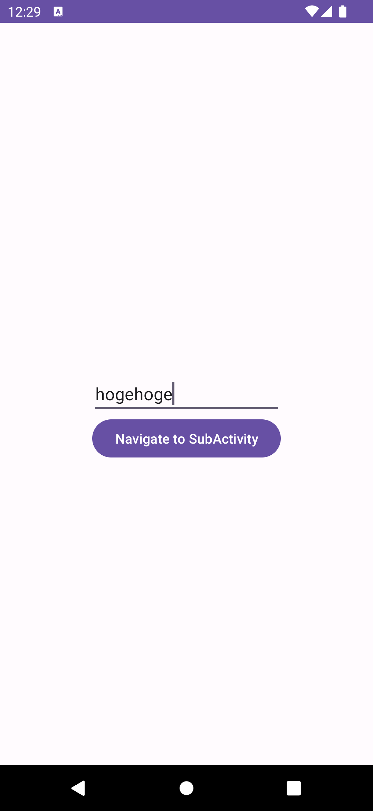

# Activityの画面遷移について

この章ではActivityでどのように画面遷移するのかを解説します。

Activityの画面遷移には、 `Intent` を使います。

`MainActivity` から `SubActivity` に画面遷移する場合を考えてみましょう。

`MainActivity` はテキストを入力するEditTextがあり、そこに入力された値を `SubActivity` に画面遷移する際に一緒に渡して表示するという場合で考えてみます。

まず遷移先の `SubActivity` から実装します。

`MainActivity` から渡されたテキストを表示するTextViewが1つあるだけの簡単な画面です。

```xml
<?xml version="1.0" encoding="utf-8"?>
<androidx.constraintlayout.widget.ConstraintLayout xmlns:android="http://schemas.android.com/apk/res/android"
    xmlns:app="http://schemas.android.com/apk/res-auto"
    xmlns:tools="http://schemas.android.com/tools"
    android:layout_width="match_parent"
    android:layout_height="match_parent"
    tools:context=".SubActivity">

    <TextView
        android:id="@+id/argument_text_view"
        android:layout_width="wrap_content"
        android:layout_height="wrap_content"
        app:layout_constraintStart_toStartOf="parent"
        app:layout_constraintTop_toTopOf="parent"
        app:layout_constraintEnd_toEndOf="parent"
        app:layout_constraintBottom_toBottomOf="parent" />

</androidx.constraintlayout.widget.ConstraintLayout>
```

Activityの画面遷移に使う `Intent` は、 `putExtra` メソッドで追加の情報をKeyを指定して渡すことができます。それで渡されたExtraは、遷移後のActivityで `intent.get〇〇Extra` でKeyを指定して取得することができます。〇〇にはStringやIntなどの型名が入ります。 IntやStringなどの基本的な型とその配列、Bundle, Parcelable, Serializableのオブジェクトを渡すことができます。

目的のActivityへのIntentの生成と `putExtra` までを行う処理を目的のActivityのcompanion objectに実装することで、呼び出し側でのputExtraし忘れなどのミスを防ぐことができるのでおすすめです。

```kotlin
class SubActivity : AppCompatActivity() {

    override fun onCreate(savedInstanceState: Bundle?) {
        super.onCreate(savedInstanceState)
        val binding = ActivitySubBinding.inflate(layoutInflater)
        setContentView(binding.root)
        val text = intent.getStringExtra(KEY_TEXT)
        binding.argumentTextView.text = text
    }

    companion object {
        private const val KEY_TEXT = "text"

        fun createIntent(
            context: Context,
            text: String,
        ): Intent {
            val intent = Intent(context, SubActivity::class.java)
            intent.putExtra(KEY_TEXT, text)
            return intent
        }
    }
}
```

次に、遷移元の `MainActivity` を実装していきます。

遷移後の画面に渡すためのテキストを入力するEditTextと、遷移ボタンのButtonがあるだけの簡単な画面です。

```xml
<?xml version="1.0" encoding="utf-8"?>
<androidx.constraintlayout.widget.ConstraintLayout xmlns:android="http://schemas.android.com/apk/res/android"
    xmlns:app="http://schemas.android.com/apk/res-auto"
    xmlns:tools="http://schemas.android.com/tools"
    android:layout_width="match_parent"
    android:layout_height="match_parent"
    tools:context=".MainActivity">

    <EditText
        android:id="@+id/edit_text"
        android:layout_width="200dp"
        android:layout_height="wrap_content"
        app:layout_constraintStart_toStartOf="parent"
        app:layout_constraintTop_toTopOf="parent"
        app:layout_constraintEnd_toEndOf="parent"
        app:layout_constraintBottom_toBottomOf="parent" />

    <Button
        android:id="@+id/navigate_button"
        android:layout_width="wrap_content"
        android:layout_height="wrap_content"
        android:text="Navigate to SubActivity"
        app:layout_constraintStart_toStartOf="parent"
        app:layout_constraintTop_toBottomOf="@id/edit_text"
        app:layout_constraintEnd_toEndOf="parent" />

</androidx.constraintlayout.widget.ConstraintLayout>
```

Buttonのクリックリスナーで `SubActivity` の `createIntent` を呼び出してIntentを取得し、それを `startActivity` に渡して呼び出すことで画面遷移します。

```kotlin
class MainActivity : AppCompatActivity() {

    override fun onCreate(savedInstanceState: Bundle?) {
        super.onCreate(savedInstanceState)
        val binding = ActivityMainBinding.inflate(layoutInflater)
        setContentView(binding.root)
        binding.navigateButton.setOnClickListener {
            val text = binding.editText.text.toString()
            val intent = SubActivity.createIntent(this, text)
            startActivity(intent)
        }
    }
}
```

これでビルドして実行してみましょう。

`MainActivity` で入力した任意のテキストが `SubActivity` に渡せていることを確認できると思います。




