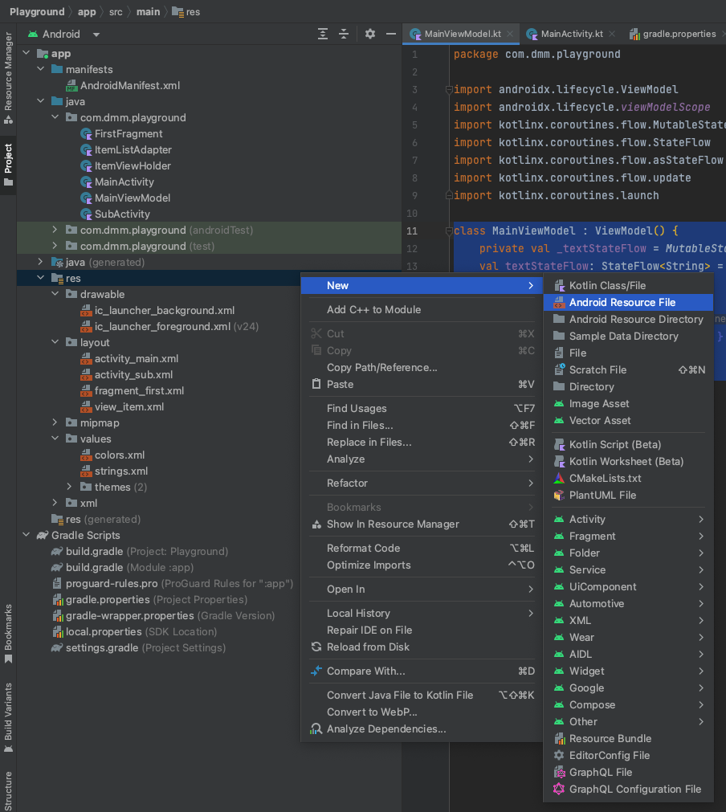
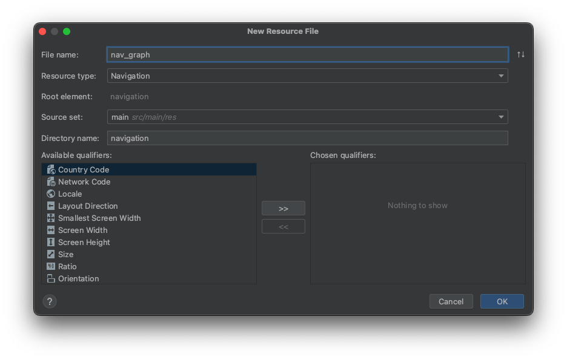
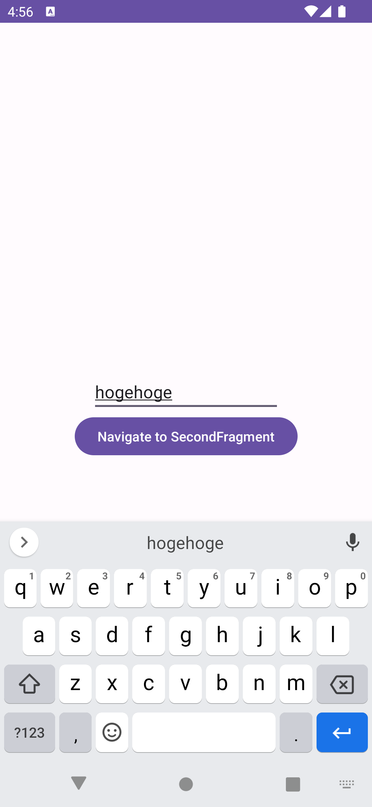

# Fragmentの画面遷移について

この章ではFragmentでどのように画面遷移するのかを解説します。

Fragmentの画面遷移はいくつかやり方がありますが、今回は公式で提供されているNavigation Componentを使うやり方を紹介します。

## Navigation Componentのセットアップ

まずはプロジェクトルートの `build.gradle` の `plugins` ブロックに以下を追加します。

```gradle
plugins {
    ...
    id 'androidx.navigation.safeargs.kotlin' version '2.5.3' apply false
}
```

次に、 `app/build.gradle` の `plugins` ブロックと `dependencies` ブロックに以下を追加します。

```gradle
plugins {
    ...
    id 'androidx.navigation.safeargs.kotlin'
}

dependencies {
    ...
    implementation("androidx.navigation:navigation-fragment-ktx:2.5.3")
    implementation("androidx.navigation:navigation-ui-ktx:2.5.3")
}
```

## ナビゲーショングラフの作成

画面遷移のグラフをXMLで定義します。

Android Studioで `res` ディレクトリを右クリックし、 `New` -> `Android Resource File` を選択します。



ナビゲーショングラフのファイル名を `File name` に指定します。今回は `nav_graph` にします。

`Resource Type` に `Navigation` を指定しOKをクリックすると、ナビゲーショングラフのファイルがプロジェクトに追加されます。



```xml
<?xml version="1.0" encoding="utf-8"?>
<navigation xmlns:android="http://schemas.android.com/apk/res/android"
    xmlns:app="http://schemas.android.com/apk/res-auto"
    android:id="@+id/nav_graph">

</navigation>
```

## Fragmentの準備

例として、遷移元と遷移先のFragmentを準備しましょう。

Activityの例と同じように、 `FirstFragment` はテキストを入力するEditTextがあり、そこに入力された値を `SecondActivity` に画面遷移する際に一緒に渡して表示するという場合で考えてみます。

一旦UIの見た目だけ実装します。

### FirstFragment

```kotlin
class FirstFragment : Fragment() {

    override fun onCreateView(
        inflater: LayoutInflater,
        container: ViewGroup?,
        savedInstanceState: Bundle?,
    ): View {
        val binding = FragmentFirstBinding.inflate(inflater, container, false)
        return binding.root
    }
}
```

```xml
<?xml version="1.0" encoding="utf-8"?>
<androidx.constraintlayout.widget.ConstraintLayout xmlns:android="http://schemas.android.com/apk/res/android"
    xmlns:app="http://schemas.android.com/apk/res-auto"
    android:layout_width="match_parent"
    android:layout_height="match_parent">

    <EditText
        android:id="@+id/edit_text"
        android:layout_width="200dp"
        android:layout_height="wrap_content"
        app:layout_constraintStart_toStartOf="parent"
        app:layout_constraintTop_toTopOf="parent"
        app:layout_constraintEnd_toEndOf="parent"
        app:layout_constraintBottom_toBottomOf="parent" />

    <Button
        android:id="@+id/navigate_button"
        android:layout_width="wrap_content"
        android:layout_height="wrap_content"
        android:text="Navigate to SecondFragment"
        app:layout_constraintStart_toStartOf="parent"
        app:layout_constraintTop_toBottomOf="@id/edit_text"
        app:layout_constraintEnd_toEndOf="parent" />

</androidx.constraintlayout.widget.ConstraintLayout>
```

### SecondFragment

```kotlin
class SecondFragment : Fragment() {

    override fun onCreateView(
        inflater: LayoutInflater,
        container: ViewGroup?,
        savedInstanceState: Bundle?,
    ): View? {
        val binding = FragmentSecondBinding.inflate(inflater, container, false)
        return binding.root
    }
}
```

```xml
<?xml version="1.0" encoding="utf-8"?>
<androidx.constraintlayout.widget.ConstraintLayout xmlns:android="http://schemas.android.com/apk/res/android"
    xmlns:app="http://schemas.android.com/apk/res-auto"
    android:layout_width="match_parent"
    android:layout_height="match_parent">

    <TextView
        android:id="@+id/argument_text_view"
        android:layout_width="wrap_content"
        android:layout_height="wrap_content"
        app:layout_constraintStart_toStartOf="parent"
        app:layout_constraintTop_toTopOf="parent"
        app:layout_constraintEnd_toEndOf="parent"
        app:layout_constraintBottom_toBottomOf="parent" />

</androidx.constraintlayout.widget.ConstraintLayout>
```

## nav_graphの実装

先程作成した `nav_graph.xml` のナビゲーショングラフに、 `FirstFragment` と `SecondFragment` を設定します。

`navigation` 要素の子要素に、ナビゲーショングラフに登録したいFragmentを `fragment` 要素で追加します。

`android:id` にナビゲーショングラフ上でFragmentを扱う際のidを設定します。

`android:name` には登録したいFragmentのpathを指定します。

`android:label` は、今回は扱いませんが `setupWithNavController()` などを使用してNavGraphをToolBarに接続する場合などに画面に表示されるタイトルとして指定した文字列が使われます。

`fragment` の子要素に `action` と `argument` があります。

`action` は画面遷移の定義です。画面遷移の遷移元のFragmentに設定します。 `android:id` にidを指定し、それがKotlinで画面遷移の処理をする際に使うAction名になります。 `android:destination` は遷移先に指定したいFragmentのナビゲーショングラフ上のidを指定します。

`argument` は画面遷移で受け取りたい引数の定義です。画面遷移の遷移先のFragmentに設定します。 `android:name` で引数名を、 `app:argType`　で引数の型を指定します。

ナビゲーショングラフにFragmentを追加したら、 `navigation` の `app:startDestination` に最初に表示するFragmentのidを指定します。

```xml
<?xml version="1.0" encoding="utf-8"?>
<navigation xmlns:android="http://schemas.android.com/apk/res/android"
    xmlns:app="http://schemas.android.com/apk/res-auto"
    xmlns:tools="http://schemas.android.com/tools"
    android:id="@+id/nav_graph"
    app:startDestination="@id/firstFragment">
    <fragment
        android:id="@+id/firstFragment"
        android:name="com.dmm.playground.FirstFragment"
        android:label="FirstFragment"
        tools:layout="@layout/fragment_first">

        <action
            android:id="@+id/action_first_to_second"
            app:destination="@id/secondFragment" />
    </fragment>

    <fragment
        android:id="@+id/secondFragment"
        android:name="com.dmm.playground.SecondFragment"
        android:label="SecondFragment"
        tools:layout="@layout/fragment_second">

        <argument
            android:name="text"
            app:argType="string" />
    </fragment>
</navigation>
```

## Fragment側の実装

ナビゲーショングラフのXMLを実装すると、それを元に画面遷移のコードが自動生成されるので、それを遷移元と遷移先で使うよう実装していきます。

### FirstFragment

Navigation Componentを導入すると、Fragmentに `findNavController()` という拡張関数が提供されるので、それを呼び出してnavControllerを取得します。

ナビゲーショングラフで `FirstFragment` に `action` を定義したので、 `FirstFragmentDirections` という名前でKotlinのclassが生成されています。それに生えている `actionFirstToSecond` を呼び出して画面遷移のためのactionを取得します。この際、遷移先のFragmentが引数を受け取るので、 `actionFirstToSecond` は `text: String` を受け取るようになっています。

ボタンのクリックリスナーで `navController.navigate` にactionを渡す処理を実装しています。これで、ボタンがクリックされたタイミングで `SecondFragment` へ画面遷移します。

```kotlin
class FirstFragment : Fragment() {

    override fun onCreateView(
        inflater: LayoutInflater,
        container: ViewGroup?,
        savedInstanceState: Bundle?,
    ): View {
        val binding = FragmentFirstBinding.inflate(inflater, container, false)
        val navController = findNavController()
        binding.navigateButton.setOnClickListener {
            val text = binding.editText.text.toString()
            val action = FirstFragmentDirections.actionFirstToSecond(text)
            navController.navigate(action)
        }
        return binding.root
    }
}
```

### SecondFragment

ナビゲーショングラフで `SecondFragment` に `argument` を定義したので、この引数を型安全に扱うための `SecondFragmentArgs` というKotlinのclassが生成されています。Fragmentの拡張関数の `navArgs()` を使ってそれを取得し、渡された `text ` を安全に受け取ることができます。

```kotlin
class SecondFragment : Fragment() {

    private val args: SecondFragmentArgs by navArgs()

    override fun onCreateView(
        inflater: LayoutInflater,
        container: ViewGroup?,
        savedInstanceState: Bundle?,
    ): View {
        val binding = FragmentSecondBinding.inflate(inflater, container, false)
        binding.argumentTextView.text = args.text
        return binding.root
    }
}
```

## ActivityにNavHostを設定する

FragmentとNavGraphの準備はできたので、Activity側にこれを設定しましょう。

これらのFragmentを扱いたいActivityに `FragmentContainerView` を設定します。 `android:name` には `androidx.navigation.fragment.NavHostFragment` を指定します。 `app:navGraph` には今回定義したナビゲーショングラフのXMLを指定します。

```xml
<?xml version="1.0" encoding="utf-8"?>
<androidx.fragment.app.FragmentContainerView xmlns:android="http://schemas.android.com/apk/res/android"
    xmlns:app="http://schemas.android.com/apk/res-auto"
    xmlns:tools="http://schemas.android.com/tools"
    android:id="@+id/nav_host_fragment"
    android:layout_width="match_parent"
    android:layout_height="match_parent"
    android:name="androidx.navigation.fragment.NavHostFragment"
    app:defaultNavHost="true"
    app:navGraph="@navigation/nav_graph"
    tools:context=".MainActivity" />
```

Kotlin側では特にActivityの設定は必要ありません。

```kotlin
class MainActivity : AppCompatActivity() {

    override fun onCreate(savedInstanceState: Bundle?) {
        super.onCreate(savedInstanceState)
        val binding = ActivityMainBinding.inflate(layoutInflater)
        setContentView(binding.root)
    }
}
```

これでビルドして起動すると、まず `FirstFragment` の画面が表示され、ボタンを押すと `SecondFragment` に遷移することを確認できると思います。




