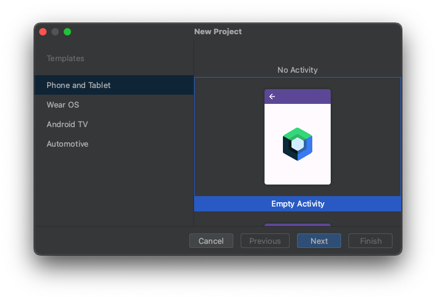
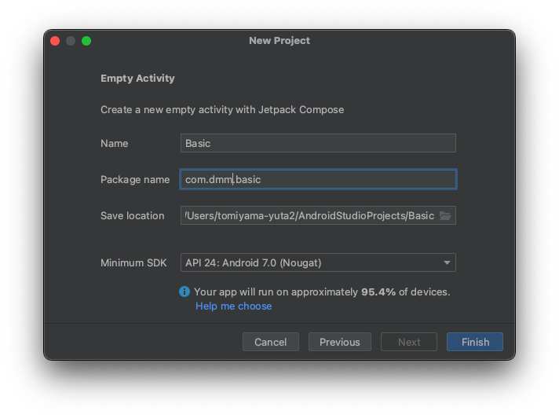
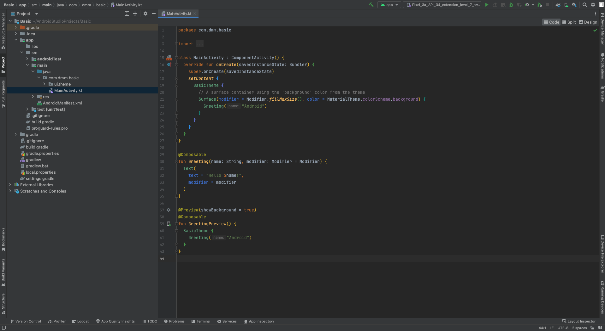

# はじめに
この資料では、Jetpack Composeで開発する上で基本となる知識を解説します。

こちらは必須ではありません。興味のある人だけ見てもらえればと思います。

# プロジェクトのセットアップ

Android Studioの `File` -> `New` -> `New Project` から新しいプロジェクトを作ります。

今回は `Empty Activity` を選びます。

`Name` と `Package name` はなんでもいいのですが、他のプロジェクトにかぶらないようにしましょう。

`Finish` をクリックすればプロジェクトが作成されます。

一旦セットアップは完了です。
