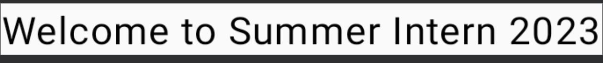
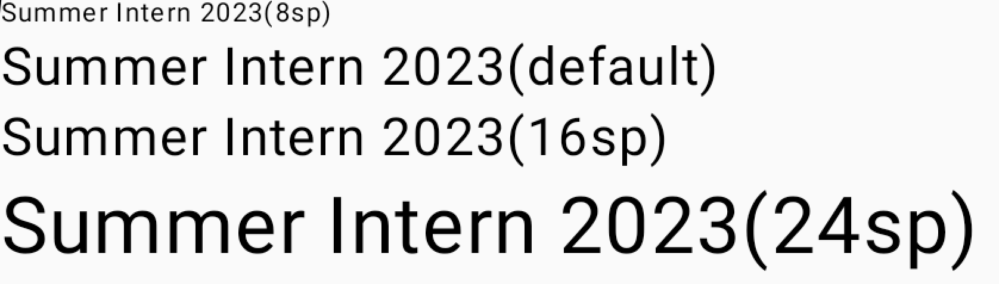

# よく使うコンポーネントについて 〜Text編〜

JetpackComposeでUIを構築するには、コンポーネントを組み合わせることで実現します。

よく使う基本となるコンポーネントについてユースケース別に紹介します

## テキストを表示したい
テキストを表示するには、`Text`コンポーネントを使用します

```kotlin
@Composable
fun GreetingText() {
    Text("Welcome to Summer Intern 2023")
}
```

`Text`コンポーネントに文字列を渡すことによりテキストが表示されるようになります



`Text`コンポーネントには文字列リソースIDを渡すことによってもテキストを表示できるため、ハードコードを避けるためリソースによる指定を推奨します

リソースで定義することで、後から文言を変更したい時にはstrings.xmlの修正のみで済むため修正箇所を局所にできます

e.g.
```kotlin
@Composable
fun GreetingText() {
    Text(stringResource(R.string.greeting))
}
```

```kotlin
# strings.xml

<resources>
    <string name="greeting">Welcome to Summer Intern 2023</string>
</resources>

```

## テキストの見た目を変えたい
`Text`には見た目を設定するためのオプショナルパラメータが複数提供されています

本サンプルでは、テキストの色の変更と文字サイズの変更に触れます


### テキストの色を変える
色を変えるには`color`パラメータを指定します

使用できるColorクラスの定義については[Colorクラスのソース](https://cs.android.com/androidx/platform/frameworks/support/+/androidx-main:compose/ui/ui-graphics/src/commonMain/kotlin/androidx/compose/ui/graphics/Color.kt;l=115?q=%20androidx.compose.ui.graphics.Color&ss=androidx%2Fplatform%2Fframeworks%2Fsupport&hl=ja)をご参照ください

```kotlin
@Composable
fun GreetingText() {
    Text(
        "Welcome to Summer Intern 2023",
        color = Color.Red
    )
}
```


### テキストの文字サイズを変える
文字サイズを変更するには`fontSize`を指定します

```kotlin
@Composable
fun InternTitleText() {
    Column{
        Text(
            "Summer Intern 2023(8sp)",
            fontSize = 8.sp
        )
        Text("Summer Intern 2023(default)")
        Text(
            "Summer Intern 2023(16sp)",
            fontSize = 16.sp
        )
        Text(
            "Summer Intern 2023(24sp)",
            fontSize = 24.sp
        )
    }
}
```


## テキストを編集したい
編集可能なテキストボックスを実現するためには、`TextField`を使用します

サンプルでは以下の3つの引数を渡すことでTextFieldを構築します

- value : 表示したいテキストをStringで渡します。編集によって値が更新された際に反映されるよう、`remember`を使用します
- onValueChange : 値が変更された際に発火するリクエストイベントです。以下のサンプルでは変更後のテキストをそのまま`text`変数に格納しています
- label: TextFieldの内側に表示されるオプショナルなテキストです

```kotlin
@Composable
fun SimpleFilledTextFieldSample() {
    var text by remember { mutableStateOf("Welcome Summer") }

    TextField(
        value = text,
        onValueChange = { text = it },
        label = { Text("Greet Label") }
    )
}
```

非フォーカス時


フォーカス時


本サンプルで紹介できなかった便利なパラメータやテキストのフォント変更なども可能なので、[developers guide](https://developer.android.com/jetpack/compose/text?hl=ja)もぜひご覧ください