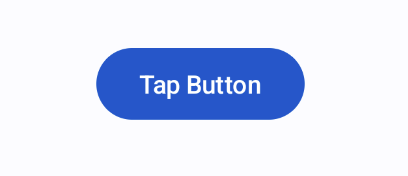
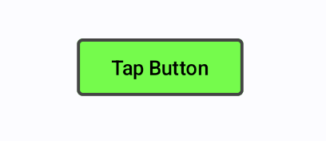

# よく使うコンポーネントについて 〜Button編〜

JetpackComposeでUIを構築するには、コンポーネントを組み合わせることで実現します。

よく使う基本となるコンポーネントについてユースケース別に紹介します

## ユーザの入力イベントを受け取りたい
ユーザからの操作を受け付け、クリックイベントを検知するには`Button`コンポーネントを使用します

```kotlin
@Composable
fun ButtonSample() {
    Button(
        onClick = { Log.d("Button", "Clicked") },
    ){
        Text("Tap Button")
    }
}
```


上記の例では、ボタンをクリックするとアクションとしてログの出力を行います

ユーザからの入力をトリガーとして各処理を行うことで、インタラクティブな機能を提供することができます

## ボタンの見た目を変える
デフォルトの見た目からボタンを変更したい場合、ボタン作成時に以下のような値を設定することで見た目を変えることが可能です

- `shape` : ボタンの枠組みの形を指定
- `border` : ボタンの枠組みの色を指定
- `colors` : `ButtonDefaults.buttonColors()`を渡してボタンの色とテキストの色を指定。

上記のパラメータを指定したプレビューがこちらになります

```kotlin
@Composable
fun ButtonSample() {
    Button(
        onClick = { Log.d("Button", "Clicked") },
            shape = MaterialTheme.shapes.extraSmall, // 枠の形を指定
            border = BorderStroke(2.dp, Color.DarkGray), // 枠の色を指定
            colors = ButtonDefaults.buttonColors(
                containerColor = Color.Green, // ボタンの色を指定
                contentColor = Color.Black // 表示するテキストの色を指定
        )
    ){
        Text("Tap Button")
    }
}
```



また、ボタンにはテキストだけではなくアイコンを追加することも可能です

```kotlin
@Composable
fun ButtonSample() {
    Button(
        onClick = { Log.d("Button", "Clicked") },
    ){
        Icon(
            Icons.Filled.CheckCircle,
            contentDescription = null,
            modifier = Modifier.size(ButtonDefaults.IconSize)
        )
        Spacer(Modifier.size(ButtonDefaults.IconSpacing))
        Text("Tap Button")
    }
}
```


マテリアルデザイン準拠のアイコンが提供されています

他のアイコンも使いたい方はGoogle Fontsの[アイコン一覧](https://fonts.google.com/icons)をご参照ください