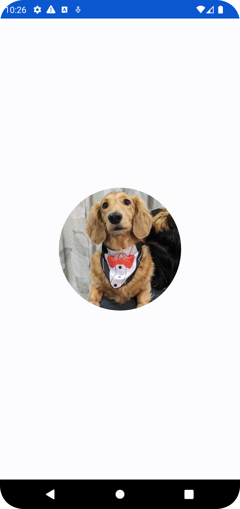
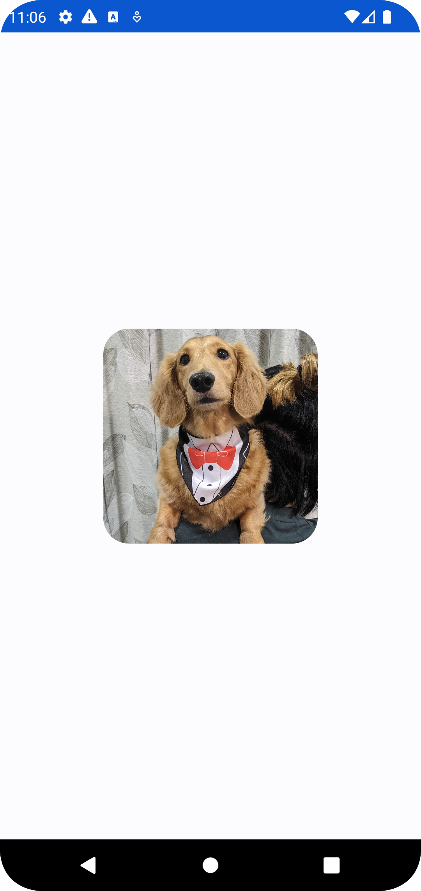

# よく使うコンポーネントについて 〜Image編〜

JetpackComposeでUIを構築するには、コンポーネントを組み合わせることで実現します。

よく使う基本となるコンポーネントについてユースケース別に紹介します

## 画像を表示したい
アプリ上で画像を表示するには`Image`コンポーネントを使用します

サンプルでは以下のパラメータを渡して`Image`を構築します

- `painter` : 描画する画像リソースを指定
- `contentDescription` : 描画する画像の説明文を指定。目が不自由な方向けのユーザー補助機能で読み上げられる

```kotlin
@Composable
fun ImageSample() {
    Image(
        painter = painterResource(id = R.drawable.image_sample_dog),
        contentDescription = "サンプル画像 ダックスフンド"
    )
}
```


上記の例では、アプリ内にバンドルしている画像ファイルを画面一杯に表示しています

しかし、画像をそのままアプリ上で表示する機会よりも、装飾をして画像を表示したいことの方が多いと思います

以降では、画像の装飾の仕方について紹介します


## 画像を装飾して表示したい
表示する画像をカスタマイズするには、`modifier`を使用します。

`modifier`はコンポーネントの装飾・拡張に関する様々なパラメータを持つことができるクラス関数であり、`Image`のみならず前述で触れた`Text`や`Button`にも使用できます。

`Image`に指定することで、画像サイズの変更や画像に枠組みを付けるなどができます。


### 画像サイズの変更

以下のサンプルでは、画像の横幅を200dp、画像の枠組みを1dpの黒で指定します

```kotlin
@Composable
fun ImageSample() {
    val imageModifier = Modifier
        .size(200.dp)
        .border(BorderStroke(1.dp, Color.Black))

    Image(
        painter = painterResource(id = R.drawable.image_sample_dog),
        contentDescription = "サンプル画像 ダックスフンド",
        modifier = imageModifier
    )
}
```


これで画面一杯ではなく、横幅を指定することができました。
しかし、モバイル端末は様々な画面サイズがあるため、固定値による指定では端末によって画像の見え方が変わってしまうことがあります。

そのようなケースに対応するためには、画像サイズを割合(%)で指定することができます

以下のサンプルでは、画像の枠組みはそのままで横幅を端末全体の50%で指定します

```kotlin
@Composable
fun ImageSample() {
    val imageModifier = Modifier
        .fillMaxWidth(0.5f) // 1fが画面全体の100%
        .border(BorderStroke(1.dp, Color.Black))

    Image(
        painter = painterResource(id = R.drawable.image_sample_dog),
        contentDescription = "サンプル画像 ダックスフンド",
        modifier = imageModifier
    )
}
```


## 画像の切り抜き
画像を切り抜くには、前述の`modifier`と`contentScale`を使用します

以下のサンプルでは、`contentScale`で画像を丸く切り抜くように指定します

```kotlin
@Composable
fun ImageSample() {
    val imageModifier = Modifier
        .size(200.dp)
        .clip(CircleShape)

    Image(
        painter = painterResource(id = R.drawable.image_sample_dog),
        contentDescription = "サンプル画像 ダックスフンド",
        modifier = imageModifier,
        contentScale = ContentScale.Crop,
    )
}
```




また、切り抜いた画像の角のサイズを指定することもできます

`modifier`のclipに`RoundedCornerShape`を指定します

```kotlin
@Composable
fun ImageSample() {
    val imageModifier = Modifier
        .size(200.dp)
        .clip(RoundedCornerShape(24.dp))

    Image(
        painter = painterResource(id = R.drawable.image_sample_dog),
        contentDescription = "サンプル画像 ダックスフンド",
        modifier = imageModifier,
        contentScale = ContentScale.Crop,
    )
}
```




他にも画像自体をぼかして加工したりすることも可能です

指定可能な値が他にもあるので、気になるかたは[Android Delopers](https://developer.android.com/jetpack/compose/graphics/images/customize?hl=ja)をご参照ください