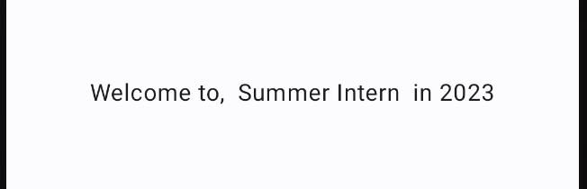

# よく使うコンポーネントについて 〜Row/Column編〜

JetpackComposeでUIを構築するには、コンポーネントを組み合わせることで実現します。

よく使う基本となるコンポーネントについてユースケース別に紹介します

## 複数のコンポーネントを配置したい
アプリ上で複数のコンポーネントを配置するには、配置方法のガイダンスを指定する必要があります

まず初めに、配置方法を指定せずに複数の`Text`を表示してみます

```kotlin
@Composable
fun LayoutSample() {
    Text("Welcome to, ", color = Color.Red)
    Text("Summer Intern ", color = Color.Blue)
    Text("in 2023", color = Color.Green)
}
```


上記の通り、配置方法を指定しないと各コンポーネントが重なって表示されてしまいます。

これを避けるため、配置方法のガイダンスの指定方法に触れていきます

### 複数のコンポーネントを水平方向に配置する
複数コンポーネントを水平方向(横並び)に配置するには、`Row`を使用します

```kotlin
@Composable
fun LayoutSample() {
    Row {
        Text("Welcome to")
        Text("Summer Intern")
        Text("in 2023")
    }
}
```


複数の`Text`が水平方向に配置されるようになりました。

しかしこれでは`Text`同士に隙間がないため、見辛い印象を受けます。

`Text`同士の間隔を調整したい場合は、`Row`に対して`horizontalArrangement`を指定します。以下のサンプルでは、アイテム間を`8dp`開けるように指定しています

```kotlin
@Composable
fun LayoutSample() {
    Row(
        horizontalArrangement = Arrangement.spacedBy(8.dp)
    ) {
        Text("Welcome to,",)
        Text("Summer Intern")
        Text("in 2023")
    }
}
```


これでアイテム間に余白が生まれました

### 複数のコンポーネントを垂直方向に配置する
複数コンポーネントを垂直に配置するには、`Column`を使用します

```kotlin
@Composable
fun LayoutSample() {
    Column {
        Text("Welcome to, ")
        Text("Summer Intern ")
        Text("in 2023")
    }
}
```


複数の`Text`が垂直方向に配置されるようになりました。

ここで、アイテムを中央揃えにしたいと思います

`Column`に対して`horizontalAlignment`を指定します。
以下のサンプルで、中央揃えになるよう指定しています

```kotlin
@Composable
fun LayoutSample() {
    Column(
        horizontalAlignment = Alignment.CenterHorizontally
    ) {
        Text("Welcome to,")
        Text("Summer Intern")
        Text("in 2023")
    }
}
```


今回のサンプルでは、少ないコンポーネントでの配置方法について触れました。


要素が多い・複数種類のコンポーネントを配置したいなど高度なレイアウトについては、

Android Developerの[レイアウト](https://developer.android.com/jetpack/compose/layouts/basics?hl=ja)をご参照ください