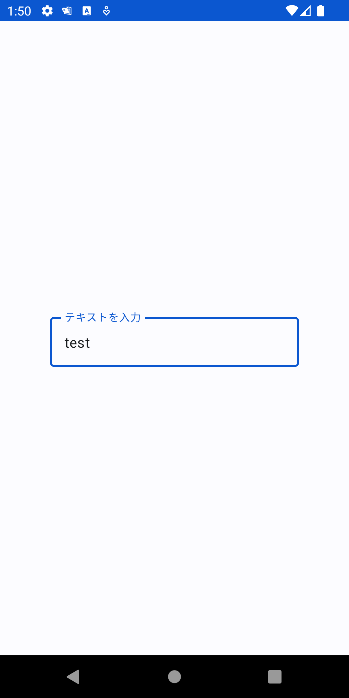
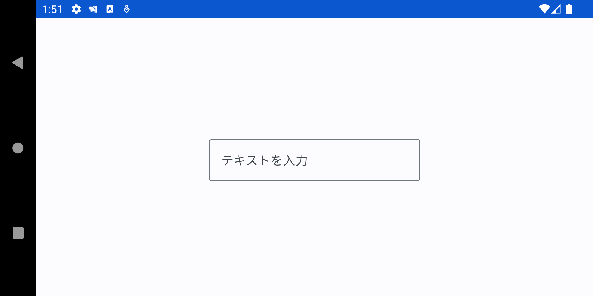
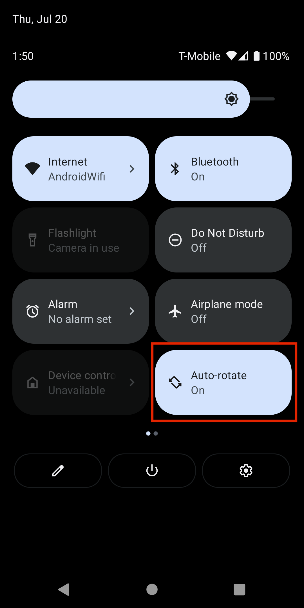
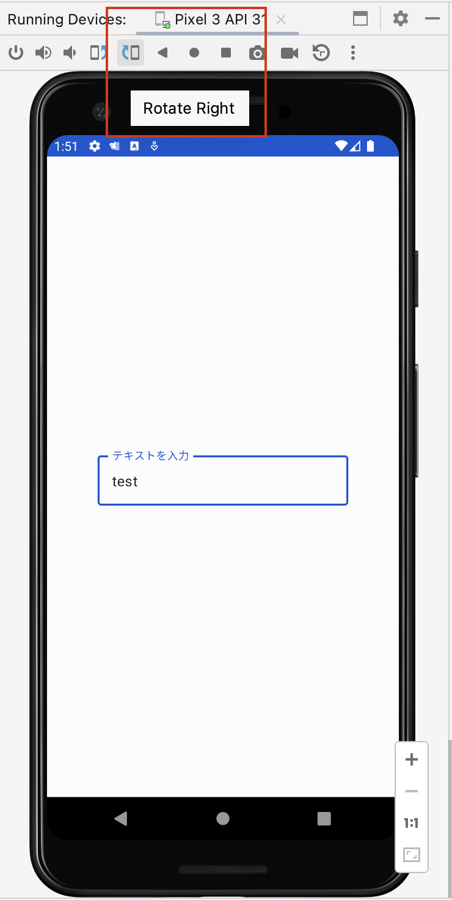

# ViewModelについて

Activityは、システムによって破棄・再生成が開発者の意図しないタイミングで発生することがあります。

その際、破棄されるタイミングで必要なデータを保持し再生成のタイミングで復元するような処理を実装しないと、画面の状態が初期化するなど、ユーザー体験を損ねてしまいます。

テキストフィールドの入力で実際に試してみましょう。
下記は入力可能なテキストフィールドを使用するサンプル実装になります。


```kotlin
class MainActivity : ComponentActivity() {

    override fun onCreate(savedInstanceState: Bundle?) {
        super.onCreate(savedInstanceState)
        setContent {
            PlayGroundTheme {
                // A surface container using the 'background' color from the theme
                Surface(
                    modifier = Modifier.fillMaxSize(),
                    color = MaterialTheme.colorScheme.background
                ) {
                    EditText()
                }
            }
        }
    }
}

@OptIn(ExperimentalMaterial3Api::class)
@Composable
fun EditText() {
    var text by remember { mutableStateOf("") }
    OutlinedTextField(
        value = text,
        onValueChange = { text = it },
        label = { Text("テキストを入力") },
        singleLine = true,
        modifier = Modifier.wrapContentSize()
    )
}
```

これでビルドし、一度適当な文字列を入力してボタンを押してセットしたあと、画面回転させてみましょう。

<div align="center">

|画面回転前|画面回転後|
|-|-|
|||

</div>

画面回転後はセットした文字列が消えているのがわかると思います。これは、画面回転でActivityが破棄・再生成されているからです。

これを画面回転でもテキストを保持するようにするには、いくつか方法がありますがViewModelを使うと簡単にできます。

ViewModelは、UIに表示するデータに関する責務を持ちます。データの所有権をActivityからViewModelに切り出すことにより、画面の破棄・再生性に対応するだけでなくロジックの複雑さを軽減させることにも繋がります。

### (補足)エミュレータ上での画面回転の方法
画面回転させるためには端末の画面回転をAUTOに設定して、デバイス操作で画面をRotateさせます。

<div align="center">

|回転設定|画面回転|
|-|-|
|||

</div>


## ViewModelの導入

ViewModel自体は特に依存を追加しなくても使えますが、Kotlinから使う上で便利になるKotlin拡張を導入しましょう。 `app/build.gradle` の `dependencies` ブロックに以下を追加します。

```gradle
dependencies {
    ...
    implementation 'androidx.lifecycle:lifecycle-viewmodel-compose:2.5.1'
}
```

## ViewModelをActivityに追加する

先程の画面をViewModelを使う形に書き換えてみましょう。

まずはViewModelを実装します。

```kotlin
class MainViewModel : ViewModel() {
    private val _textStateFlow = MutableStateFlow("")
    val textStateFlow: StateFlow<String> = _textStateFlow.asStateFlow()

    fun onTextChange(text: String) {
        _textStateFlow.update { text }
    }
}
```

表示させるテキストを `StateFlow` で保持しています。 `MutableStateFlow` はprivateにし、publicなプロパティは変更不可能な `StateFlow` にしています。更新は `onTextChange` メソッド経由で行うようにしています。

次に、Activity側の実装です。

ViewModelのインスタンス生成や保持をよしなにやってくれる `viewModel()` という拡張関数がコンポーザブル関数に提供されているので、それを使い今回実装したViewModelを取得します。


```kotlin
class MainActivity : ComponentActivity() {

    override fun onCreate(savedInstanceState: Bundle?) {
        super.onCreate(savedInstanceState)
        setContent {
            PlayGroundTheme {
                // A surface container using the 'background' color from the theme
                Surface(
                    modifier = Modifier.fillMaxSize(),
                    color = MaterialTheme.colorScheme.background
                ) {
                    EditText()
                }
            }
        }
    }
}

@OptIn(ExperimentalMaterial3Api::class)
@Composable
fun EditText(viewModel: MainViewModel = viewModel()) {
    val text by viewModel.textStateFlow.collectAsState()

    OutlinedTextField(
        value = text,
        onValueChange = viewModel::onTextChange,
        label = { Text("テキストを入力") },
        singleLine = true,
        modifier = Modifier.wrapContentSize()
    )
}
```

これでビルドして起動すると、画面回転してもテキストが消えないことが確認できると思います。
