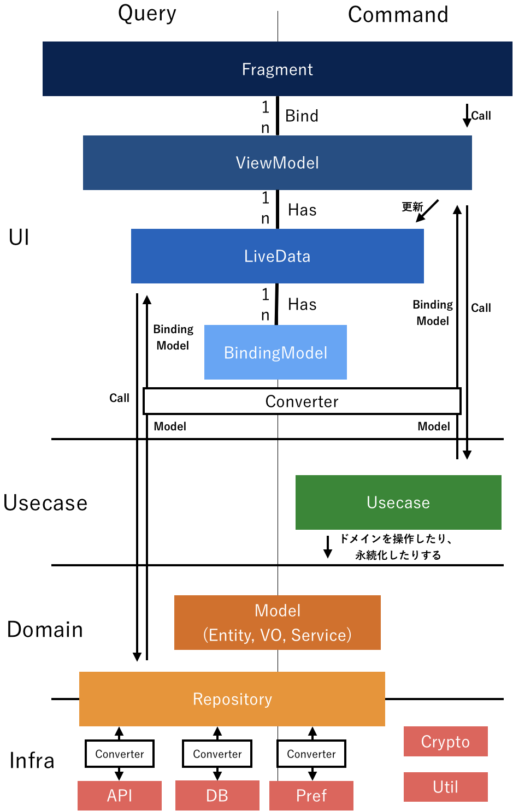
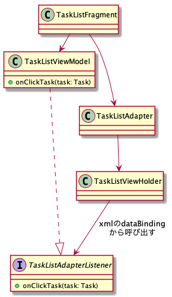

# 推奨アーキテクチャ

推奨アーキテクチャとしてレイヤー化アーキテクチャを採用します。



※図内の `Model` は `Entity` や `ValueObject` や `DomainService` の総称です。それぞれの説明は後述します。

`Query（データの読み取り）` の場合と `Command（データを操作して何かする）` の場合で設計を変えています。

**データの読み取りをして表示するだけの機能（Query）** は、JetPackにおける `ViewModel` や `LiveData` を用いることで、ライフサイクルをあまり意識することなく容易に実装できるようになりました。
自分らで実装する必要があるのは `Repository` などのデータソースから取得してそれを `LiveData` にセットするだけです。

ただし、ユーザーイベントを受け取り、 **データを操作して何かしらを行う操作（Command）** は、上記のようには行きません。
何かしらの一連の操作を行って、フィードバックをUIに送ることを `UseCase` 層が引き受けるようにします。
`UseCase` は主にドメインを操作して、永続化することを行うことが多くなります。

データの読み取りも一連の操作の１つとみなして `UseCase` から取得するようにすれば、Queryの機能もCommandを同様に書くことができるようになります。
ただ、この `UseCase` は `Repository` のメソッドをコールするだけで冗長なものとなるので不要と判断し省くようにします。

## 各レイヤーについて

### Domain層
domainレイヤーでは言語化された事業ドメインをそのままコードに落とし込むことだけに専念します。

#### パッケージ構成
データ構造（どれが親でどれが子供か）を、そのままパッケージで表現しましょう。 
例えば〈作品〉が複数の〈エピソード〉を持っている場合は、下記のようになります。

```
domain
└── work
    └── episode
```

#### 各クラスの役割

##### Entity

`Entity` はエリック・エヴァンスのドメイン駆動設計で、このように説明されています。

```
同一性によって定義されるオブジェクトはエンティティと呼ばれる。
- エリック・エヴァンスのドメイン駆動設計 p89
```

例えば、とある一問の問題文と選択肢を持っているテストエンティティを考えます。
問題文`question`と選択肢を`choiceList`メンバーにもっています。
このテストは解答というメソッドを持つべきと判断したので、それを実装すると下記のようになります。

```kotlin
class Test(
        id: TestId,
        val question: String,
        val choiceList: List<Choice>
) : Entity<TestId>(id) {

    fun answer(choiceId: ChoiceId): Boolean =
      choiceList.first { it.id == choiceId }.isCorrect

}
```

このようにして、属性と振る舞いを与えていきます。

##### ValueObject

`ValueObject`はこのように説明されています。

```
あるモデル要素について、その属性しか関心の対象とならないのであれば、その様子を値オブジェクトとして分類すること。
値オブジェクトに、自分が与える属性の意味を表現させ、関係した機能を与えること。
値オブジェクトを不変なものとして扱うこと。
同一性を与えず、エンティティを維持するために必要となる複雑な設計を避けること。
- エリック・エヴァンスのドメイン駆動設計 p97
```

`data class` で、全プロパティを `val` にすることでこのほとんどを実現できます。

下記が例です。

```
data class Document(
        val name: String,
        val url: URL
)

data class Email(val value: String) {
    fun validate(): Boolean = {...}
}

data class Password(val value: String) {
    fun validate(): Boolean = {...}
}
```

`Entity`との決定的な違いは、 `Entity`は属性が変わっても `Identifier` によって同一かどうかを判断します。
`ValueObject`は属性が全てで、一つでも属性が違えば別のものと判断されるモデルです。

##### DomainService

`DomainService`はこのように説明されています。

```
ドメインにおける重要なプロセスや変換処理が、エンティティや値オブジェクトの自然な責務でない場合、その操作はサービスとして宣言される独立したインタフェースとしてモデルに追加すること。
モデルの言語を用いてインタフェースを定義し、操作名が必ずユビキタス言語の一部になるようにすること。
サービスには状態を持たせないこと。
- エリック・エヴァンスのドメイン駆動設計 p105
```

`DomainService`は`Entity`にも`ValueObject`にもできない、純粋な振る舞いそのものをモデリングしたい場合に作ります。
例えば、 **ログイン処理** などがそれになったりします。

```
interface LoginService {
    suspend fun login(
            email: Email,
            password: Password
    ): Token
}
```

真っ先に作るのではなく本当に`Entity`や`ValueObject`の振る舞いのではないのか？をしっかり考えて、それでも違う場合にのみ作りましょう。
そうしないとドメインモデル貧血症に陥ってしまいます。

##### Repository

```
クライアントをモデルに集中させ、あらゆるオブジェクトの格納とアクセスをリポジトリに委譲すること。
- エリック・エヴァンスのドメイン駆動設計 p151
```

リポジトリはオブジェクトの永続化および永続化されたオブジェクトの検索の窓口を提供し、
クライアントからはメモリ上にあるコレクションのように扱うことができるように実装します。
特定の永続化の技術から独立させるため、domainレイヤーでは`interface`の定義のみとします。

```kotlin
  interface TaskRepository {
    suspend fun findByTaskId(taskId: TaskId): Task?
  }
```


### UI層
`ui` パッケージ配下に、各 `Activity` や `Fragment` をそれぞれパッケージを切ってその配下に配置する。

```
ui
├── tasklist
|   ├── TaskListActivity
|   ├── TaskListFragment
|   ├── TaskListViewModel
|   ├── TaskListAdapter
|   └── ...
|
├── taskdetail
|   ├── TaskDetailActivity
|   ├── TaskDetailFragment
|   ├── TaskDetailViewModel
|   ├── TaskDetailLiveData
|   └── ...
|   
└── createtask
    ├── CreateTaskActivity
    ├── CreateTaskFragment
    ├── CreateTaskViewModel
    └── ...
```

#### 各クラスの役割

##### Activity

責務: 画面遷移を管理する （Fragmentを管理する）  
説明:
- 実際は `NavHostFragment` に全て委譲することになるので、 navigation まわりのセットアップくらいに収める。
- 複雑なことはしないようにする
- navigation については [【Android】Google IO 2018で新発表された navigation についての詳細レポート](https://inside.dmm.com/entry/2018/05/25/android-navigation) をみてください。
- ViewModelへのイベント伝搬はdataBindingを用いる

##### Fragment

責務: ユーザーに情報を表示する  
説明:
- ViewModelへのイベント伝搬はdataBindingを用いる
- ユーザーアクションはViewModelに委譲する

##### ViewModel

責務: イベント管理  
説明:
- 1Fragmentに対して複数のViewModelを持って良い。適切にスコープを分けること。
- LiveDataの管理を行う（これが Fragmentで監視される）
- UseCaseの実行とそのフィードバックをLiveDataに反映する
- ActivityやFragmentからイベントを受け取りハンドリングする

##### LiveData

責務: Viewに表示するデータの置き場  
説明:
- Viewに表示するデータを監視できるようにする
- onActiveで `ReadOnlyRepository` から最新をフェッチする

##### BindingModel

責務: Viewに表示するデータの型  
説明:
- data classにして、すべて immutableにする（valにする）

### UseCase層
#### パッケージ構成

`ui` のパッケージ構成に従う。

```
usecase
├─ tasklist
|  └── CreateTaskUseCase
├─ createtask
|  └── CreateTaskUseCase
└─ edittask
   └── UpdateTaskUseCase
```

#### UseCase

`UseCase` では副作用を伴う業務手順をロジックに落とし込みます。

例えば、ログインのユースケースでは下記のような業務手順が必要になります。

1. emailとpasswordを受け取る
1. emailのvalidate
1. passwordのvalidate
1. login処理
1. accessTokenを保存
1. accessTokenを返却

これをプログラムに落とすと下記のようになります。

```kotlin
class LoginUseCase @Inject constructor(
  private val loginService: LoginService,
  private val accessTokenRepository: AccessTokenRepository
): LoginUseCaseImpl {

  override suspend fun execute(
      email: Email,
      password: Password
  ): LoginUseCaseResult {
    if(!email.validate()) {
      return LoginUseCaseResult.InvalidEmail()
    }
    
    if(!password.validate()) {
      return LoginUseCaseResult.InvalidPassword()
    }
    
    val accessToken = loginService.execute()
    accessTokenRepository.store(accessToken)
    
    return LoginUseCaseResult.Success(accessToken)
  }
}
```

このようにドメインを操作（validateしたり）して、永続化する（accessTokenの保存など）処理になることが多いです。
またUseCaseの戻り値は必ずResultとして値を返すようにします。
ResultのFailureは、UseCase層での関心事(バリデーションなど)で起きうるエラーを定義し、UseCase層以外の関心事(ネットワークエラーなど)に関してはOtherErrorとして定義します。

```kotlin
sealed class LoginUseCaseResult {
  class Success(val value: String): LoginUseCaseResult()
  sealed class Failure: LoginUseCaseResult() {
    object InvalidEmail: Failure()
    object InvalidPassword: Failure()
    class OtherError(val throwable: Throwable): Failure()
  }
}
```


### Infra層

純粋な技術的関心ごとをここで実装します。
また domainレイヤーで定義した `interface`の実装などもここに配置します。

#### パッケージ構成

```
infra
├── domain
│   └── task
│         └── TaskRepositoryImpl
└── prefs
      └── TagPreference
```

Repositoryの実装ですが、利用する側に実行スレッドを意識させないように `withContext(Dispatchers.IO)` でラップします。
```kotlin
class TaskRepositoryImpl(
  private val api
): TaskRepository {
  override suspend fun findByTaskId(taskId: TaskId): Task? = withContext(Dispatchers.IO) {
    ...
  } 
}
```

## ViewからViewModelへのイベント通知について

ViewからViewModelのイベント通知はDataBindingを利用しましょう。
Google純正の[BindingAdapter](https://android.googlesource.com/platform/frameworks/data-binding/+/refs/tags/android-9.0.0_r50/extensions/baseAdapters/src/main/java/android/databinding/adapters)に多くのListenerが定義されています。

```xml
<?xml version="1.0" encoding="utf-8"?>
<layout xmlns:android="http://schemas.android.com/apk/res/android">

  <data>

    <variable
      name="task"
      type="com.example.TaskBindingModel" />

    <variable
      name="viewModel"
      type="com.example.TaskViewModel" />
  </data>

  <androidx.constraintlayout.widget.ConstraintLayout
    android:layout_width="match_parent"
    android:layout_height="wrap_content"
    android:onClick="@{() -> viewModel.onClickTask(task)}" />
```

```kotlin
// ViewModel
fun onClickTask(task: TaskBindingModel) { ... }
```

### RecyclerViewのAdapterからViewModelのイベント通知
RecyclerViewからViewModelにイベントを伝えるためにInterfaceを定義し、それを介してイベントを伝えます。



Listener
```kotlin
interface TaskListAdapterListener {
  fun onClickTask(task: TaskBindingModel)
}
```

RecyclerViewのAdapter
```kotlin
class TaskListAdapter(
  val listener:TaskListAdapterListener
): ListAdapter<...>(...) {
  override fun onBindViewHolder(holder: TaskViewHolder, position: Int) {
    holder.bind(
      getItem(position), 
      listener
    )
  }
}
```

リストアイテムのxml
```xml
<?xml version="1.0" encoding="utf-8"?>
<layout xmlns:android="http://schemas.android.com/apk/res/android" >

  <data>

    <variable
      name="task"
      type="com.example.TaskBindingModel" />

    <variable
      name="listener"
      type="com.example.TaskListAdapterListener" />
  </data>

  <androidx.constraintlayout.widget.ConstraintLayout
    android:layout_width="match_parent"
    android:layout_height="wrap_content"
    android:onClick="@{() -> listener.onClickTask(task)}">
    ...
```

ViewHolder
```kotlin
class TaskViewHolder(
  private val binding: ViewTaskBinding
) : RecyclerView.ViewHolder(binding.root) {

  fun bind(
    task: TaskBindingModel?,
    listener: TaskListAdapterListener
  ) {
    binding.task = task
    binding.listener = listener
    binding.executePendingBindings()
  }
}
```

ViewModel
```kotlin
class TaskViewModel: TaskListAdapterListener {
  override fun onClickTask(task: TaskBindingModel) {
    ...
  }
}
```

Fragment
```kotlin
class TaskListFragment {
  override fun onCreateView(...) {
    val binding: FragmentTaskListBinding
    val viewModel: TaskListViewModel = ...
    val adapter = TaskListAdapter(viewModel)
    binding.taskListRecyclerView.adapter = adapter    
  }
}
```

## モジュール間の連携について

モジュール間の連携では `HostService` というのを設けるようにします。
外部モジュールから見える `ui`と同様の位置にいます。
### Host Service
あるモジュールのModelが他の多くのモジュールから利用される場合は、変換層を1つ1つに持たせるということはせずに、 `Open Host Service` として外部モジュールに公開します。

#### 例

たとえば、 認証を責務にもつ `auth` モジュールがあるとします。
このとき他のモジュールで `AccessToken` が必要になることがあります。
そのために `auth` モジュールは下記のような `Service` を実装します。

```kotlin
interface GetAccessTokenService {
  suspend fun execute(): String
}
```

注意点として、このサービスの実装である `GetAccessTokenServiceImpl` は外のモジュールから見えないように `internal` 指定にすること、また返り値はプリミティブなもの or DTOをつくりましょう。
